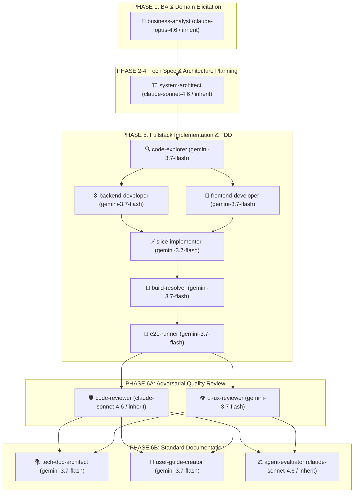

# Universal Agent Development Workflow

## Unified Pipeline: BA Skill Pack (Analysis) + Speckit (Planning) + Superpowers (Execution)

**Core Principle:**

- **Control Plane (Governance):** BA Skill Pack gates all work with a signed-off domain baseline. Speckit handles technical architecture and planning. Multi-agent delegation executes code through strict verifiable gates.
- **Data Plane (Execution & Shared Language):** `CONTEXT.md` maintains ubiquitous project terminology. `adr/` captures immutable architectural decisions. Atomic skills in `.agents/skills/engineering/` and `.agents/skills/productivity/` provide model-agnostic capabilities.

---

### Pipeline for New Features (Multi-Agent Lifecycle)

---

#### Phase 1: Business Analysis & Domain Elicitation (8-Stage BA Pipeline)

- **MANDATORY**: Start every new feature or significant change with `intake-classifier`. This is the entry point to the BA pipeline — never skip straight to elicitation, spec, or code.
- **Protocol routing by complexity** (decided by `intake-classifier`):
  - **Micro-Task / Fast-Fix**: Surgical changes (< 30 lines, bug fixes, typos, single config tweaks). **Bypasses BA ceremony & `.specify/features/<slug>/` folder**. Fast-track flow: Reproduce -> Failing Test / Assert -> Surgical Fix -> Verification -> Single-line Conventional Commit.
  - **Spike**: Research note only. No feature folder, no downstream stages.
  - **Bounded Task**: Stages 1 → 2 (interactive, 2–3 questions) → 4 (light) → 5 (light) → 6 (user-stories only) → 7 → 8. Stage 3 skipped.
  - **Full Feature / Epic**: All 8 stages at full depth with interactive interview at Stage 2.
- **Stage descriptions**:
  1. `intake-classifier` — classifies complexity with measurable signals; creates `.specify/features/<slug>/` folder.
  2. `elicitation-interview` — **🛑 MANDATORY INTERACTIVE CUSTOMER INTERVIEW GATE**:
     - The AI / BA subagent **MUST PAUSE** and conduct a live, interactive interview with the User (2–3 questions per batch regarding Problem/Pain points and the 6 Domain Pillars: RBAC, State Machine, Business Rules/Formulas, Workflows/Edge Cases, Data/Privacy, UX/NFRs) using direct chat or `ask_question`. Delegates deep questioning mechanics to `grilling` (`.agents/skills/productivity/grilling`).
     - **Strict Zero-Hallucination & Zero-Silent-Assumption Policy**: AI is STRICTLY FORBIDDEN from inventing or hallucinating business rules, default configurations, or edge-case behaviors. If something is unknown or ambiguous, AI MUST ask the customer directly. Never proceed autonomously to Stages 3–8 without the user answering the elicitation interview.
     - Records confirmed answers and explicit `ASM-` IDs to `01-elicitation.md`. Updates `CONTEXT.md` inline with newly clarified terminology.
  3. `gap-analysis` — (Full Feature only) self-inspects existing code/schema; documents AS-IS, TO-BE, and 4 gap categories including transition/migration requirements.
  4. `domain-modeling` — produces RBAC matrix, Mermaid state diagrams, numbered `BR-<SLUG>-###` business rules (with mandatory anti-abuse pass for reward/credit rules), ERD, i18n/a11y/observability NFRs. Updates `CONTEXT.md` inline and records load-bearing decisions in `adr/`.
  5. `risk-contradiction-scanner` — analytical scan for logic contradictions, state deadlocks, backward-compatibility breaks; builds `RISK-` register; consolidates all `ASM-` entries; locks scope with MoSCoW (must include explicit Won't-Have).
  6. `spec-writer` — compiles BRD / PRD / SRS (`REQ-<SLUG>-###` with mandatory **Derived from** traceability) / User Stories (`US-<SLUG>-###` with Given-When-Then happy + edge-case scenarios).
  7. `spec-validator` — adversarial IEEE 29148 quality check (8 criteria per REQ/US); builds requirement traceability matrix; loops back to `spec-writer` on failure.
  8. `handover` — verifies all exit gates; marks `baseline.md` as `SIGNED-OFF v1.0`; produces dev-facing Handover Brief; hands off to `speckit-specify`. _(Note: `handover` is the BA exit gate, distinct from `handoff` which compacts session context)._
- **STRICT RULE**: Zero code or spec before `handover` completes and `baseline.md` is `SIGNED-OFF`. No silent business assumptions. Any post-sign-off scope change bumps version in `CHANGELOG.md` — never edits signed-off content in place.
- **Working files**: `.specify/features/<feature-slug>/`
  - `test-plan.md` is created in **Phase 5 (before coding)** from `spec/user-stories.md` using the template at `.specify/templates/test-plan.md`.

#### Phase 2: Specify

- Use `speckit-specify` to create official spec in `.specify/features/<feature-name>/spec.md`
- Input: Approved domain decisions & business rules from Phase 1. (Fulfills the role of `to-spec`).

#### Phase 3: Plan

- Use `speckit-plan` to generate `plan.md`, `data-model.md`, `contracts/`
- Enforce API versioning (`/api/v1/...`) and structured DTO contracts.
- **Architecture & Deep Module Design**: Apply `codebase-design` principles (Ousterhout Deep Modules, Seam Discipline, Leverage & Locality). Keep public interfaces minimal and hide implementation complexity; avoid shallow pass-through wrappers and anemic services.

#### Phase 4: Tasks

- Use `speckit-tasks` to generate detailed `tasks.md` with dependency ordering.
- Apply `codebase-design` seam discipline to sequence tasks along independent testable boundaries.

#### Phase 5: Implement

- Use `implementation-orchestrator` or `subagent-driven-development` to execute tasks from speckit.
- Decompose implementation into vertical slices (Data → Logic → API → UI) and delegate each slice to a scoped subagent.
- Enforce independent adversarial review in a fresh context with no visibility into the implementer's reasoning.
- Follow TDD (Red → Green → Refactor):
  1. **Write `test-plan.md` first** — create `.specify/features/<slug>/test-plan.md` from the template at `.specify/templates/test-plan.md`. Map every `US-<SLUG>-###` scenario to a `TC-###` test case.
  2. **Write failing tests** (Red) — implement test files based on `test-plan.md`.
  3. **Write minimum code to pass** (Green).
  4. **Refactor** — clean up without breaking tests.
- **Systematic Bug Diagnosis**: When investigating complex defects, regressions, or flaky tests, strictly follow `diagnosing-bugs` (6-Phase Gated Loop).
- **Prototyping**: If a design, layout, or state machine choice is genuinely uncertain, invoke `prototype` to build a throwaway HTML mockup before committing to production code.

#### Phase 6: Quality Verification, Review, Tech Docs & Delivery

- **Step 1: Quality Gates & Adversarial Review**:
  - Run `speckit-analyze` to check spec/plan/task alignment.
  - Run `code-reviewer` agent: executes dual passes (Pass A: Standards & Security, Pass B: Spec & Domain Fidelity).
  - Run `ui-design-review` (for UI slices): executes dual passes (Pass A: Design System & Anti-AI-Slop, Pass B: Spec & UX Fidelity).
  - **Architecture & Hotspot Review**: When auditing structural quality, refactoring candidates, or high-churn areas, run `improve-codebase-architecture` (Scan hotspots → Generate interactive HTML report → Conduct interactive design grilling → Record ADR in `adr/`).
  - Enforce **Bug Severity Gates**: `Critical` bugs strictly block completion / release. Zero `Critical` bugs permitted.
- **Step 2: Technical Documentation & User Guides (MANDATORY immediately after review)**:
  - Create `docs/features/<feature-slug>/README.md` using the standard feature documentation template.
  - Update `docs/features/README.md` index table with the new feature entry.
  - If the feature changes architecture (new entity, new service, new API contract) — update `docs/architecture/` and create an ADR in `adr/`.
  - Maintain Diataxis quadrants (Tutorial, How-To, Reference, Explanation).
  - Generate user-facing visual guide with real Playwright screenshots via `user-guide-with-screenshots` into `docs/user-guides/<slug>.md`.
  - Keep `AGENTS.md` / `CONTRIBUTING.md` / governance files synchronized.
- **Step 3: Verification Evidence & Delivery**:
  - Run `verification-before-completion` with passing test evidence.
  - Validate database migrations, rollback strategy, and update `.specify/features/<slug>/CHANGELOG.md`.

---

## Failure-Mode Index (A9)

When encountering friction or uncertainty, look up the symptom below to immediately identify the correct skill:

| Symptom / Friction                                                  | Root Cause                      | Target Skill & Path                                                    |
| ------------------------------------------------------------------- | ------------------------------- | ---------------------------------------------------------------------- |
| _"I don't understand what was just proposed / jargon feels dense"_  | Terminology misalignment        | `wait-what` (`productivity/wait-what`)                                 |
| _"Unsure which skill, command, or lifecycle phase to run next"_     | Framework navigation hesitation | `route` (`productivity/route`)                                         |
| _"Feature scope is vague; too many hidden design branches"_         | Incomplete elicitation          | `grilling` (`productivity/grilling`)                                   |
| _"Ambitious effort with unclear path / too large for one session"_  | Fog of War / unmapped decisions | `wayfinder` (`engineering/wayfinder`)                                  |
| _"A critical requirement depends on external team input"_           | Cross-stakeholder dependency    | `to-questionnaire` (`productivity/to-questionnaire`)                   |
| _"Debating between two UI layouts or state machine models"_         | Abstract speculation            | `prototype` (`engineering/prototype`)                                  |
| _"Git merge or rebase produced messy conflicts"_                    | Git branch divergence           | `resolving-merge-conflicts` (`engineering/resolving-merge-conflicts`)  |
| _"Bug reproduced but root cause is unknown or flaky"_               | Guess-and-check debugging       | `diagnosing-bugs` (`engineering/diagnosing-bugs`)                      |
| _"Modules feel shallow, coupled, or leaky cross-imports"_           | Architectural erosion           | `improve-codebase-architecture` / `setup-deep-modules`                 |
| _"Session ended; want to optimize agent environment or rule bloat"_ | Feedback loop missing           | `retro` (`productivity/retro`)                                         |
| _"Agent context window is filling up or session is ending"_         | Memory bloat & drift            | `handoff` (`productivity/handoff`)                                     |
| _"Writing new system skills, rules, or instructions"_               | Unfocused agent documentation   | `writing-for-agents` (`engineering/writing-for-agents`)                |
| _"Starting a new repo or onboarding project from scratch"_          | Manual configuration burden     | `/skill-setup` (`engineering/command-skill-setup` / `setup-workspace`) |
| _"Reviewing code or catching regressions before merge"_             | Unstructured code review        | `code-reviewer` (dual pass: Standards + Spec)                          |

---

## Mandatory Tech Skills & Reference Matrix

**CRITICAL: Before writing ANY code or documentation, AI MUST read the corresponding reference BEFORE execution.**

| Context / Area                                             | MANDATORY Skill / Reference                                  | Group / Location                            |
| ---------------------------------------------------------- | ------------------------------------------------------------ | ------------------------------------------- |
| **Project Shared Language (Ubiquitous Language)**          | `CONTEXT.md` (MUST read before any work)                     | Root `CONTEXT.md`                           |
| **Architecture Decisions & Enduring Constraints**          | `adr/` (MUST read before proposing architectures)            | Root `adr/`                                 |
| **Project Design System & Tokens**                         | Project design documentation (e.g. `DESIGN.md` / tokens)     | Target Project UI Root                      |
| **New feature intake & complexity classification**         | `intake-classifier`                                          | `engineering/intake-classifier`             |
| **Business value & 6-pillar domain elicitation**           | `elicitation-interview` (delegates to `grilling`)            | `engineering/elicitation-interview`         |
| **Deep interactive interview primitive**                   | `grilling`                                                   | `productivity/grilling`                     |
| **Throwaway design & UI prototype exploration**            | `prototype`                                                  | `engineering/prototype`                     |
| **Async stakeholder questionnaire generation**             | `to-questionnaire`                                           | `productivity/to-questionnaire`             |
| **Plain-language re-pitch with project vocabulary**        | `wait-what`                                                  | `productivity/wait-what`                    |
| **Authoring documentation optimized for AI agents**        | `writing-for-agents`                                         | `engineering/writing-for-agents`            |
| **Session context compaction for agent handoff**           | `handoff` (≠ handover)                                       | `productivity/handoff`                      |
| **Hunk-by-hunk git conflict resolution by intent**         | `resolving-merge-conflicts`                                  | `engineering/resolving-merge-conflicts`     |
| **Intelligent skill and workflow router**                  | `route`                                                      | `productivity/route`                        |
| **One-time repository onboarding & self-configuration**    | `/skill-setup` / `setup-workspace`                           | `engineering/command-skill-setup`           |
| **AS-IS / TO-BE / gap analysis (Full Feature)**            | `gap-analysis`                                               | `engineering/gap-analysis`                  |
| **RBAC, state machines, business rules, ERD**              | `domain-modeling` (syncs `CONTEXT.md` & `adr/`)              | `engineering/domain-modeling`               |
| **Risk register, contradiction scan, MoSCoW**              | `risk-contradiction-scanner`                                 | `engineering/risk-contradiction-scanner`    |
| **Spec documents (BRD, PRD, SRS, user stories)**           | `spec-writer`                                                | `engineering/spec-writer`                   |
| **IEEE 29148 quality gate & traceability matrix**          | `spec-validator`                                             | `engineering/spec-validator`                |
| **Baseline sign-off & dev handover gate**                  | `handover` (≠ handoff)                                       | `engineering/handover`                      |
| **Technical Specification (equiv. to-spec)**               | `speckit-specify`                                            | `engineering/speckit-specify`               |
| **Architecture Plan & Contract DTOs**                      | `speckit-plan`                                               | `engineering/speckit-plan`                  |
| **Granular Task Decomposition**                            | `speckit-tasks`                                              | `engineering/speckit-tasks`                 |
| **Session retrospective & environment tuning**             | `retro`                                                      | `productivity/retro`                        |
| **Decision tickets map for large ambiguous efforts**       | `wayfinder`                                                  | `engineering/wayfinder`                     |
| **Automated deep module & seam enforcement (Polyglot)**    | `setup-deep-modules`                                         | `engineering/setup-deep-modules`            |
| **Module design, service interfaces, seams & leverage**    | `codebase-design`                                            | `engineering/codebase-design`               |
| **Feature execution, slice delegation & review**           | `implementation-orchestrator`                                | `engineering/implementation-orchestrator`   |
| **Bug diagnosis, regressions, test failures & anomalies**  | `diagnosing-bugs`                                            | `engineering/diagnosing-bugs`               |
| **Architectural audit, hotspot scan & visual HTML report** | `improve-codebase-architecture`                              | `engineering/improve-codebase-architecture` |
| **Environment setup, secrets capture, cloud provisioning** | `wizard`                                                     | `engineering/wizard`                        |
| **Technical documentation, feature README, architecture**  | `technical-documentation` (Agent: `tech-doc-architect`)      | `engineering/technical-documentation`       |
| **UI Design: Landing, Marketing, Public surfaces**         | `frontend-design` + `design-taste-frontend` + `ui-taste-pro` | `engineering/`                              |
| **UI Design: In-App, Dashboard, Data-bearing screens**     | `frontend-design` + `design-taste-product` + `ui-taste-pro`  | `engineering/`                              |
| **UI Animation, Motion, Micro-interactions**               | `motion-design`                                              | `engineering/motion-design`                 |
| **UI visual review & component QA (Dual Pass)**            | `ui-design-review`                                           | `engineering/ui-design-review`              |
| **User guide / end-user docs with real screenshots**       | `user-guide-with-screenshots` (Agent: `user-guide-creator`)  | `engineering/user-guide-with-screenshots`   |
| **Backend & REST API design patterns**                     | `api-design`                                                 | `engineering/api-design`                    |
| **E2E test, Playwright test**                              | `e2e-testing`                                                | `engineering/e2e-testing`                   |
| **Git branch, commit, merge workflow**                     | `git-workflow`                                               | `engineering/git-workflow`                  |
| **Command: Resume project development from roadmap**       | `/command-continue-project`                                  | `engineering/command-continue-project`      |
| **Command: Automated modular commit & push**               | `/command-git-push`                                          | `engineering/command-git-push`              |
| **Command: Generate end-user guide with real screenshots** | `/command-user-guide`                                        | `engineering/command-user-guide`            |
| **Command: Adaptive project onboarding & skill setup**     | `/command-skill-setup` (alias: `/skill-setup`, `/setup`)     | `engineering/command-skill-setup`           |

---

## Corporate Governance & Code Quality Rules

- **Zero Code Before Approved Spec**: Never write code or create mockups without an approved domain baseline and specification.
- **Mandatory Automatic Subagent Delegation (STRICT)**: The orchestrator AI MUST NOT execute implementation slices or documentation directly in the primary context. Once Gate 2 (Technical Plan & Tasks) is approved, the orchestrator MUST automatically decompose tasks and dispatch dedicated subagents (`backend-developer`, `frontend-developer`, `ui-ux-reviewer`, `tech-doc-architect`, `user-guide-creator`) via `invoke_subagent`.
- **Subagent Transparency & Notification Protocol (MANDATORY)**: Whenever a subagent is dispatched or finishes, the AI MUST explicitly notify the user in chat with a clear announcement block specifying: (1) Subagent Name & Role, (2) Active Model Name, (3) Exact Task Scope, and (4) Output Artifact / Report Link.
- **Design System & Anti-AI-Slop Gate (STRICT)**: All UI must strictly adhere to clean design geometry, intentional palettes, 1px hairline borders, explicit typography hierarchy, and stable outer anchor hover physics. Generic AI slop (unrequested multi-color gradients, floating blurred neon orbs, heavy glassmorphism, fake pricing tiers) is strictly forbidden.
- **Dual-Pass Adversarial Review Gate**:
  - Code review must run dual independent passes: (Pass A: Standards & Security; Pass B: Spec & Acceptance Criteria Fidelity).
  - UI review must run dual passes: (Pass A: Design System & Anti-AI-Slop; Pass B: Spec & UX Fidelity).
- **Bug Severity Gate**: No feature branch can be merged or marked complete with unresolved `Critical` bugs. Zero `Critical` bugs permitted.
- **Post-Review Documentation Gate**: Every delivered feature must have technical documentation updated/created by `tech-doc-architect` before closing the task.
- **User Guide Gate**: Every feature with a UI must have a user-facing guide with verified real screenshots saved to `docs/user-guides/<slug>.md` before the feature is considered done.
- **Immutable Data Patterns**: Create new copies, do not mutate state directly.
- **KISS, DRY, YAGNI**: Avoid over-engineering and speculative features.
- **Code Limits**: File < 800 lines, function < 50 lines.
- **Boundary Validation**: Validate all inputs at boundaries via DTOs and schema validators.
- **Error Handling**: Handle errors explicitly, never swallow silently.
- **Data Privacy**: Strictly anonymize test data; never use real production credentials in dev.
- **Traceability**: All scope changes must be documented in the feature's Change Log.
- **Git Commit Governance (Strict Human-In-The-Loop Gate)**:
  - **Zero Autonomous Git Execution**: AI is STRICTLY FORBIDDEN from running `git add`, `git commit`, or `git push` autonomously. Staging, committing, and pushing can ONLY be executed when the user explicitly runs `/command-git-push`, or when the AI explicitly proposes the exact git changes to the user and receives explicit approval.
  - **Modular Commits**: Break down commits into granular, logical parts (Spec/Docs -> Shared Types -> Backend API -> Frontend UI -> Feature Docs).
  - **Single-Line English Commits**: Strictly single-line Conventional Commits in English (e.g. `feat(scope): concise description`).
  - **Branch Reuse Priority**: Always prioritize existing active branches for related work, fixes, or refinements.
