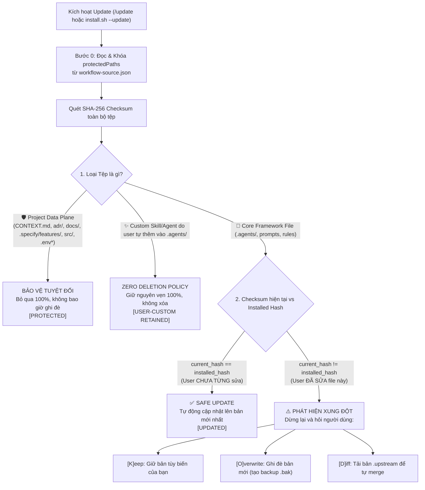

# 🔄 Hướng Dẫn Cập Nhật & Nâng Cấp Thông Minh (Smart Update & 3-Way Hash Engine)

> **Mục tiêu**: Giải thích nguyên lý vận hành và hướng dẫn chi tiết cách cập nhật framework lên phiên bản mới nhất mà tuyệt đối không làm mất dữ liệu dự án, không ghi đè mã nguồn và bảo toàn 100% custom code/skills của bạn.

---

## 🛡️ Kiến Trúc Động Cơ 3-Way Hash (3-Way Hash Engine)

Bộ cập nhật hoạt động dựa trên cơ chế đối chiếu mã băm **SHA-256 ba chiều** (Installed Hash vs Upstream Hash vs Current Local Hash) kết hợp với danh sách khóa bảo vệ tuyệt đối (`protectedPaths`):



---

## ⚡ 3 Cách Kích Hoạt Cập Nhật

### 1. Trực tiếp trong AI Editor (Khuyên dùng & Nhanh nhất)

Mở ô chat trong bất kỳ AI Editor nào (Antigravity IDE, Cursor, Claude Code, Windsurf) và gõ:

```text
/update
```

Agent sẽ tự động gọi kỹ năng [`command-update`](../skills/engineering/command-update/SKILL.md), đối chiếu checksum và áp dụng bản cập nhật mới nhất.

### 2. Qua dòng lệnh Terminal One-Liner (macOS / Linux / Git Bash)

Mở terminal tại thư mục dự án và chạy:

```bash
curl -fsSL https://raw.githubusercontent.com/ahauy/universal-agents-workflow/main/install.sh | bash -s -- --update
```

_(Nếu bạn đã clone thư mục tool cục bộ: `./install.sh --update`)_.

### 3. Qua PowerShell (Windows)

```powershell
irm https://raw.githubusercontent.com/ahauy/universal-agents-workflow/main/install.ps1 | iex -ArgumentList "-Update"
```

> [!TIP]
> Sau khi cập nhật qua CLI hoặc PowerShell, mở AI Editor và gõ `/skill-setup` để Agent nạp lại cấu hình và quy tắc tương thích mới nhất vào phiên làm việc.

---

## 📊 Bảng Phân Định Ranh Giới Dữ Liệu

| Nhóm Tệp                                          | Danh Sách Đường Dẫn                                                                                                                                                                                                                            | Cơ Chế Bảo Vệ Khi Cập Nhật                                                                          |
| :------------------------------------------------ | :--------------------------------------------------------------------------------------------------------------------------------------------------------------------------------------------------------------------------------------------- | :-------------------------------------------------------------------------------------------------- |
| **Project Data Plane**<br/>_(Dữ liệu dự án)_      | `CONTEXT.md`, `PRODUCT_BACKLOG_ROADMAP.md`, `CHANGELOG.md`, `UPGRADE_NOTICE.md`, `adr/` (trừ template), `docs/features/`, `docs/user-guides/`, `docs/architecture/`, `docs/RUN_AND_TEST.md`, `.specify/features/`, `src/`, `.env*`, `*.local*` | 🛡️ **Bảo vệ tuyệt đối**: Bỏ qua 100%, không bao giờ bị chạm vào hay ghi đè.                         |
| **User Customizations**<br/>_(Tùy biến của bạn)_  | Bất kỳ custom skill/agent/rule nào do user tự tạo thêm trong `.agents/`                                                                                                                                                                        | 👤 **Zero Deletion Policy**: Giữ nguyên vẹn 100%, không bao giờ bị xóa.                             |
| **Framework Core Files**<br/>_(Mã lõi Framework)_ | `.agents/skills/`, `.agents/agents/`, `.agents/scripts/`, `AGENTS.md`, `GEMINI.md`, `CLAUDE.md`, `.cursorrules`, `.windsurfrules`, `.specify/templates/`, `.specify/workflows/`                                                                | 🔄 **3-Way Hash Checksum**: Tự động update nếu chưa sửa; hỏi xác nhận nếu bạn đã có sửa đổi cục bộ. |

---

## 🛠️ Xử Lý Khi Có Xung Đột (Conflict Handling)

Nếu bạn đã từng chỉnh sửa trực tiếp một file lõi của framework (ví dụ sửa prompt trong `.agents/agents/backend-developer.md`), khi update hệ thống sẽ phát hiện `current_hash != installed_hash` và hiển thị 3 lựa chọn:

- **`[K]eep`**: Giữ nguyên file tùy biến hiện tại của bạn, bỏ qua bản cập nhật từ upstream.
- **`[O]verwrite`**: Ghi đè file mới từ upstream, đồng thời tự động tạo bản sao lưu `.bak` (ví dụ `backend-developer.md.bak`) để bạn không bị mất code cũ.
- **`[D]iff`**: Tải bản mới về với đuôi `.upstream` (ví dụ `backend-developer.md.upstream`) để bạn tự so sánh và gộp thủ công bằng công cụ diff.
