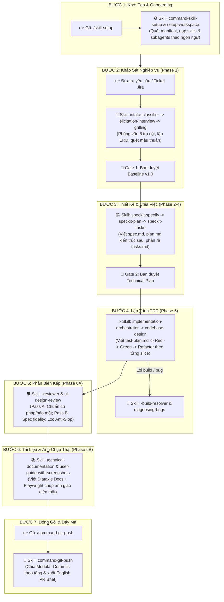

# 🛠️ Quy Trình Làm Việc Từng Bước Với Universal Agents Workflow (Step-by-Step Practical Workflow)

> **Mục tiêu**: Cẩm nang hướng dẫn thao tác thực tế từng bước trong suốt vòng đời dự án: bạn cần gõ lệnh gì, AI sẽ tự động kích hoạt những kỹ năng nào, hành động cụ thể ra sao và các cổng kiểm soát (Gates) ở đâu.

---



---

### 🔹 Bước 1: Khởi Tạo & Onboarding Dự Án (Onboard & Detect Stack)

- **Thao tác của bạn**: Mở terminal/chat và gõ lệnh:
  ```bash
  /skill-setup
  ```
- **Kỹ năng AI kích hoạt**: [`command-skill-setup`](../skills/engineering/command-skill-setup/SKILL.md) $\rightarrow$ [`setup-workspace`](../skills/productivity/setup-workspace/SKILL.md).
- **Hành động cụ thể của AI**:
  1. Tự động quét các tệp manifest trong dự án (`Package.swift`, `go.mod`, `pyproject.toml`, `package.json`, `Cargo.toml`).
  2. Đối chiếu với `.agents/catalog.json` và hiển thị danh mục các kỹ năng, quy tắc cú pháp và subagents chuyên biệt cần nạp.
  3. Hỏi bạn về chế độ quản lý Git (`local`, `stealth`, `team`, `hybrid`) để cấu hình `.gitignore` tự động.
- **Kết quả đầu ra**: Thư mục `.agents/` được cấu hình đầy đủ, không có tệp thừa.

---

### 🔹 Bước 2: Khảo Sát & Phỏng Vấn Nghiệp Vụ (Phase 1: BA Pipeline)

- **Thao tác của bạn**: Cung cấp mô tả tính năng mới (ví dụ: paste nội dung Ticket Jira, Linear hoặc ý tưởng của bạn).
- **Kỹ năng AI kích hoạt**: [`intake-classifier`](../skills/engineering/intake-classifier/SKILL.md) $\rightarrow$ [`elicitation-interview`](../skills/engineering/elicitation-interview/SKILL.md) (kèm [`grilling`](../skills/productivity/grilling/SKILL.md)) $\rightarrow$ [`domain-modeling`](../skills/engineering/domain-modeling/SKILL.md) $\rightarrow$ [`spec-writer`](../skills/engineering/spec-writer/SKILL.md) $\rightarrow$ [`spec-validator`](../skills/engineering/spec-validator/SKILL.md) $\rightarrow$ [`handover`](../skills/engineering/handover/SKILL.md).
- **Hành động cụ thể của AI**:
  1. **`intake-classifier`** phân loại:
     - Nếu là task nhỏ (< 30 dòng, sửa bug/typo): Chuyển thẳng sang **Fast-Track** (đi thẳng tới Bước 4 TDD).
     - Nếu là tính năng chuẩn/epic: Tạo thư mục `.specify/features/<slug>/`.
  2. **`elicitation-interview`** (🛑 **Customer Gate Bắt Buộc**): AI **dừng lại phỏng vấn bạn** 2-3 câu hỏi mỗi đợt xoay quanh 6 trụ cột nghiệp vụ: Phân quyền RBAC, Máy trạng thái, Luật tính toán/nghiệp vụ, Kịch bản biên (Edge cases), Dữ liệu & Phi chức năng NFRs. _(AI tuyệt đối không được tự ý bịa đặt luật)_.
  3. **`domain-modeling`**: Xây dựng ma trận RBAC, biểu đồ Mermaid, đặt mã luật `BR-###`.
  4. **`spec-writer`** & **`spec-validator`**: Biên soạn User Stories chuẩn `Given-When-Then` và kiểm định theo chuẩn IEEE 29148.
- **🛑 Cổng kiểm soát (Gate 1 — Baseline Signed-Off)**: AI trình bản tóm tắt Baseline và yêu cầu bạn duyệt: _"Đồng ý ký duyệt Baseline v1.0"_.

---

### 🔹 Bước 3: Đặc Tả Kỹ Thuật & Lập Kế Hoạch (Phase 2-4: SpecKit Planning)

- **Thao tác của bạn**: Sau khi ký duyệt Baseline, ra lệnh: _"Tiến hành thiết kế kỹ thuật và lập kế hoạch tasks"_.
- **Kỹ năng AI kích hoạt**: [`speckit-specify`](../skills/engineering/speckit-specify/SKILL.md) $\rightarrow$ [`speckit-plan`](../skills/engineering/speckit-plan/SKILL.md) (kèm [`codebase-design`](../skills/engineering/codebase-design/SKILL.md)) $\rightarrow$ [`speckit-tasks`](../skills/engineering/speckit-tasks/SKILL.md) $\rightarrow$ [`speckit-analyze`](../skills/engineering/speckit-analyze/SKILL.md).
- **Hành động cụ thể của AI**:
  1. **`speckit-specify`**: Chuyển đổi yêu cầu thành `spec.md` chứa định dạng DTOs, API contracts và data schema.
  2. **`speckit-plan`**: Tạo `plan.md`, áp dụng nguyên lý Deep Modules (giao diện đơn giản, che giấu chi tiết phức tạp).
  3. **`speckit-tasks`**: Phân rã công việc thành `tasks.md` theo thứ tự độc lập có thể kiểm thử riêng biệt (Seam Discipline).
  4. **`speckit-analyze`**: Quét đối chiếu chéo đảm bảo kế hoạch khớp 100% với spec.
- **🛑 Cổng kiểm soát (Gate 2 — Tech Plan Approved)**: Bạn xem lại và phê duyệt `plan.md` cùng `tasks.md`.

---

### 🔹 Bước 3.5: Dựng Khung Kiến Trúc Hệ Thống (P3→P5 Bridge: Scaffold Architecture)

- **Thao tác của bạn**: Sau khi phê duyệt `plan.md`, ra lệnh: _"Dựng khung thư mục và kiến trúc cho feature này"_.
- **Kỹ năng AI kích hoạt**: [`scaffold-architecture`](../skills/engineering/scaffold-architecture/SKILL.md).
- **Hành động cụ thể của AI**:
  1. Đọc `CONTEXT.md`, `plan.md`, `data-model.md` để hiểu stack và domain.
  2. **🛑 Hỏi user xác nhận blueprint** — luôn hỏi, không tự chọn:
     - **A — C4 Layered** (`controllers/ → services/ → repositories/`): REST APIs, backend TypeScript/Go/Python.
     - **B — Hexagonal / Ports & Adapters** (`domain/ → ports/ → adapters/`): Microservices, domain-first, Rust/Java.
     - **C — Feature-Based Modules** (`features/<name>/`): Flutter, React Native, fullstack apps.
  3. Sinh thư mục và seed các file nền (`shared/types/`, `shared/errors/`, entry index).
  4. Ghi `adr/ADR-ARCH-001-architecture-blueprint.md` (nếu chưa tồn tại).
  5. Cập nhật **Module Map** trong `CONTEXT.md`.
- **Kết quả**: `backend-developer` và `frontend-developer` có sẵn scaffold để điền code — không bắt đầu từ màn hình trắng.

---

### 🔹 Bước 4: Lập Trình Chuẩn TDD Theo Lát Cắt (Phase 5: Implementation)

- **Thao tác của bạn**: Ra lệnh: _"Bắt đầu code theo task"_ (hoặc gõ `/command-continue-project` nếu làm theo roadmap).
- **Kỹ năng AI kích hoạt**: [`implementation-orchestrator`](../skills/engineering/implementation-orchestrator/SKILL.md) $\rightarrow$ [`api-design`](../skills/engineering/api-design/SKILL.md) / [`frontend-design`](../skills/engineering/frontend-design/SKILL.md) $\rightarrow$ `<lang>-build-resolver`.
- **Hành vi cụ thể của AI**:
  1. Tự động chia việc thành các lát cắt dọc: **Data $\rightarrow$ Logic $\rightarrow$ API $\rightarrow$ UI**.
  2. Triển khai theo chu trình **TDD (Test-Driven Development)**:
     - Tạo `test-plan.md` ánh xạ từng kịch bản User Story sang Test Case (`TC-###`).
     - **🔴 Red**: Viết kiểm thử trước (chạy fail).
     - **🟢 Green**: Viết lượng mã tối thiểu để kiểm thử chuyển sang màu xanh (pass).
     - **🔵 Refactor**: Tối ưu hóa mã nguồn mà không làm gãy test.
  3. **Khi gặp lỗi biên dịch / build**: AI tự động gọi **`<lang>-build-resolver`** (ví dụ `swift-build-resolver`, `go-build-resolver`) chẩn đoán đúng lệnh và sửa lỗi tối thiểu.
  4. **Khi gặp bug hóc búa / flaky test**: Tự động kích hoạt [`diagnosing-bugs`](../skills/engineering/diagnosing-bugs/SKILL.md) theo chu trình 6 pha tìm root cause khoa học.

---

### 🔹 Bước 5: Phản Biện Chất Lượng Độc Lập (Phase 6A: Dual-Pass Review)

- **Thao tác của bạn**: AI tự động chuyển sang bước này ngay khi toàn bộ test của Phase 5 vượt qua.
- **Kỹ năng AI kích hoạt**: `<lang>-reviewer` (hoặc `code-reviewer`) & [`ui-design-review`](../skills/engineering/ui-design-review/SKILL.md) (kèm [`ui-taste-pro`](../skills/engineering/ui-taste-pro/SKILL.md)).
- **Hành vi cụ thể của AI**:
  1. **Code Review Độc Lập (2 Lượt)**:
     - _Pass A_: Kiểm tra quy chuẩn cú pháp, bảo mật, memory leak (`[weak self]`, unwrap `!`, race conditions).
     - _Pass B_: Đối chiếu độ khớp mã nguồn với User Stories ban đầu.
  2. **UI Review Độc Lập (Nếu có giao diện)**:
     - Kích hoạt **`ui-taste-pro`**: Quét sạch AI-slop (cấm gradient neon, chỉ dùng 1px hairline border, hover physics ổn định).
     - Đảm bảo đạt chuẩn tiếp cận quốc tế [`frontend-a11y`](../skills/engineering/frontend-a11y/SKILL.md) (WCAG 2.1 AA).
- **🛑 Cổng chất lượng (Bug Severity Gate)**: Nghiêm cấm merge hoặc bàn giao nếu còn tồn tại lỗi mức `Critical`.

---

### 🔹 Bước 6: Biên Soạn Tài Liệu & Hướng Dẫn Kèm Ảnh Thật (Phase 6B: Delivery)

- **Thao tác của bạn**: Gõ `/command-user-guide <slug>` (hoặc AI tự động kích hoạt sau review).
- **Kỹ năng AI kích hoạt**: [`technical-documentation`](../skills/engineering/technical-documentation/SKILL.md) $\rightarrow$ [`user-guide-with-screenshots`](../skills/engineering/user-guide-with-screenshots/SKILL.md) $\rightarrow$ [`verification-before-completion`](../skills/engineering/verification-before-completion/SKILL.md).
- **Hành vi cụ thể của AI**:
  1. **`technical-documentation`**: Tạo tài liệu kỹ thuật chuẩn Diataxis tại `docs/features/<slug>/README.md`.
  2. **`user-guide-with-screenshots`**: Tự động mở trình duyệt Playwright, chụp ảnh màn hình thật của giao diện và xuất tài liệu tại `docs/user-guides/<slug>.md`.
  3. **`verification-before-completion`**: Lưu vết kết quả kiểm thử thực tế và cập nhật `CHANGELOG.md`.

---

### 🔹 Bước 7: Đóng Gói Modular Commits & Đẩy Lên Git (Ship It)

- **Thao tác của bạn**: Gõ lệnh:
  ```bash
  /command-git-push
  ```
  _(hoặc `/push`, `/ship`)_
- **Kỹ năng AI kích hoạt**: [`command-git-push`](../skills/engineering/command-git-push/SKILL.md).
- **Hành vi cụ thể của AI**:
  1. Kiểm tra cổng tài liệu (User Guide Gate) đối với các thay đổi UI.
  2. Tự động chia nhỏ thay đổi thành các **Modular Commits** theo tầng:
     - `docs(spec)`: Hồ sơ BA & đặc tả
     - `feat(shared-types)`: Contracts & DTOs
     - `feat(api)`: Backend & Logic
     - `feat(ui)`: Frontend giao diện
     - `docs`: Tài liệu kỹ thuật & User Guide
  3. Đẩy an toàn lên remote branch (`git push origin <branch>`), tự động xử lý rebase conflict nếu có.
  4. Xuất sẵn bản mô tả **Pull Request bằng tiếng Anh** để bạn copy thẳng lên GitHub.

---

### 💡 Hộp Công Cụ Hỗ Trợ & Cứu Hộ Khi Gặp Khúc Mắc

| Tình Huống / Khúc Mắc                            | Bạn Nên Gõ Gì?                        | Kỹ Năng Kích Hoạt                                                      | Giá Trị Thực Tế                                                                   |
| :----------------------------------------------- | :------------------------------------ | :--------------------------------------------------------------------- | :-------------------------------------------------------------------------------- |
| **Không biết bước tiếp theo nên làm gì?**        | `/route` (hoặc `bước tiếp theo?`)     | [`route`](../skills/productivity/route/SKILL.md)                       | Trợ lý định hướng gợi ý chính xác lệnh hoặc skill cần chạy kế tiếp.               |
| **AI giải thích quá hàn lâm, khó hiểu?**         | `/wait-what` (hoặc `nói dễ hiểu hơn`) | [`wait-what`](../skills/productivity/wait-what/SKILL.md)               | Ép AI diễn giải lại bằng ngôn ngữ đời thường, lược bỏ jargon.                     |
| **Cần lấy ý kiến từ khách hàng/stakeholder?**    | `tạo khảo sát cho client`             | [`to-questionnaire`](../skills/productivity/to-questionnaire/SKILL.md) | Xuất bảng câu hỏi cấu trúc rõ ràng để gửi bất đồng bộ.                            |
| **Bài toán quá lớn, mờ mịt chưa biết bắt đầu?**  | `lập bản đồ quyết định`               | [`wayfinder`](../skills/engineering/wayfinder/SKILL.md)                | Phân rã mục tiêu lớn thành Decision Tickets giải quyết từng phần.                 |
| **Sắp hết giờ làm việc / đầy context window?**   | `/handoff` (hoặc `bàn giao ca`)       | [`handoff`](../skills/productivity/handoff/SKILL.md)                   | Nén và đóng gói toàn bộ trạng thái phiên làm việc để phiên sau tiếp quản mượt mà. |
| **Xong một tính năng muốn tối ưu hóa workflow?** | `/retro` (hoặc `hồi cứu`)             | [`retro`](../skills/productivity/retro/SKILL.md)                       | Phân tích những điểm chưa mượt để tự động tinh chỉnh rules và skills.             |
