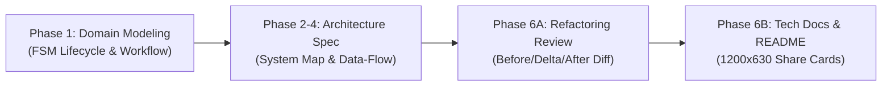

# Archify — Verifiable Interactive Architecture & System Maps

Archify transforms codebase structures, finite state machines, and system descriptions into polished, deterministic, interactive HTML maps and standard 1200×630 share cards.

Instead of writing fragile Mermaid syntax or raw HTML/CSS, AI agents emit **typed JSON Intermediate Representation (IR)**. Archify validates this JSON against strict schemas and compiles it into self-contained HTML/SVG artifacts.

> **CRITICAL:** All CLI commands use `node bin/archify.mjs` from `~/.agents/skills/archify/`.
> There is NO global `npx archify` command. The `bin/archify.mjs` file is the runtime.

---

## Availability Check (Run First — Always)

Before using any Archify command, the agent **MUST** check if Archify CLI is installed:

```bash
node ~/.agents/skills/archify/bin/archify.mjs doctor 2>/dev/null && echo "ARCHIFY_READY" || echo "ARCHIFY_NOT_INSTALLED"
```

### If `ARCHIFY_READY`:

Proceed with the full Archify workflow (validate → deliver → visual-check) as documented below.

### If `ARCHIFY_NOT_INSTALLED` — Graceful Fallback:

1. **Inform the user** clearly:

   > "Archify is not installed on this machine. Falling back to Mermaid diagrams. To unlock interactive HTML maps and 1200×630 share cards, run: `/skill-setup` and choose to install Archify when prompted, or manually: `npx -y skills add tt-a1i/archify --skill archify --global --copy --yes`"

2. **Produce a Mermaid diagram** as fallback — use the appropriate diagram type:
   - Architecture → `graph LR` or `graph TD`
   - Sequence → `sequenceDiagram`
   - State Machine / Lifecycle → `stateDiagram-v2`
   - Workflow → `flowchart TD`
   - Dataflow → `graph LR`

3. **Do NOT block or error** — Mermaid diagrams are a valid, complete deliverable when Archify is unavailable. Continue the pipeline normally.

> **Note for repo maintainers:** Archify is an **external optional tool** — it is NOT bundled in this repo. See [catalog.json](../../../optional-stack-skills/catalog.json) for the `archify` entry with `install_command`.

---

## Why Archify over Static Mermaid?

| Feature                  | Static Mermaid                                    | Archify (`tt-a1i/archify`)                                           |
| :----------------------- | :------------------------------------------------ | :------------------------------------------------------------------- |
| **Reliability**          | Prone to syntax errors with nested quotes/symbols | **Schema-validated typed JSON IR** (100% deterministic)              |
| **Interactivity**        | Static image/SVG                                  | **Zoom/pan, node search, semantic lens, route probe**                |
| **Reach & Blast Radius** | None                                              | **Trace upstream/downstream authored reach in 1 click**              |
| **Architecture Diffing** | Side-by-side static blocks                        | **Before / Delta / After snapshot diffing** (Added/Removed/Rerouted) |
| **Story Playback**       | None                                              | **Step-by-step guided story chapter animation**                      |
| **Documentation Assets** | Manual screenshotting                             | **Direct 1200×630 Hero Share Card & PNG/SVG export**                 |
| **Source Grounding**     | Text labels only                                  | **Direct commit & file path linkage via `--repo-root`**              |

---

## Supported Diagram Types

Archify supports 5 specialized diagram types:

1. **`architecture`**: Layered system design, microservices, boundaries, gateways, databases, third-party services.
2. **`workflow`**: Business workflows, approval pipelines, multi-step orchestration, CI/CD stages.
3. **`sequence`**: Chronological service-to-service communication, RPC/REST calls, latency annotations, request-response paths.
4. **`dataflow`**: Data ingestion pipelines, event streams (Kafka/RabbitMQ), caching invalidation, ETL flows.
5. **`lifecycle`**: Finite state machines (FSM), entity lifecycle states (e.g. `PENDING` -> `ACTIVE` -> `SUSPENDED` -> `ARCHIVED`), rollback paths, terminal states.

---

## When to Invoke in Universal Agent Workflow



- **Phase 1 (BA & Domain Modeling)**:
  - Produce interactive **`lifecycle`** maps for complex entity states.
  - Produce **`workflow`** maps for business processes and approval sequences.
- **Phase 2 & 3 (Spec & Plan / System Architect)**:
  - Generate comprehensive **`architecture`** maps in `docs/architecture/` linked to actual code packages.
  - Generate **`sequence`** and **`dataflow`** diagrams for API transactions and caching layers.
- **Phase 6A (Architecture Review & `improve-codebase-architecture`)**:
  - Compare architecture refactorings using **Snapshot Diffing (Before / Delta / After)** via `node bin/archify.mjs compare architecture`.
- **Phase 6B (Technical Documentation & `tech-doc-architect`)**:
  - Export canonical **1200×630 PNG Share Cards** for `README.md` and `docs/features/<slug>/README.md`.
  - Embed self-contained HTML viewers into project documentation.

---

## Core JSON IR Structure

Every Archify specification uses `schema_version: 1` (integer, not string). All meta fields live in a `meta` object:

```json
{
  "schema_version": 1,
  "diagram_type": "architecture",
  "meta": {
    "title": "Order Processing System",
    "output": "docs/architecture/system-map.html",
    "quality_profile": "showcase",
    "views": [
      {
        "id": "request-path",
        "label": "Primary request path",
        "focus": ["client", "gateway", "order-service", "db"],
        "note": "Follow the request from edge to durable state."
      }
    ]
  },
  "components": [
    {
      "id": "client",
      "type": "external",
      "label": "Web Client",
      "sublabel": "React 19 + Vite",
      "pos": [40, 200],
      "size": [130, 60]
    },
    {
      "id": "gateway",
      "type": "backend",
      "label": "API Gateway",
      "sublabel": "NestJS + Fastify",
      "pos": [240, 200],
      "size": [130, 60],
      "repo_link": "apps/api/src/main.ts"
    },
    {
      "id": "order-service",
      "type": "backend",
      "label": "Order Service",
      "sublabel": "CQRS Deep Module",
      "pos": [440, 200],
      "size": [130, 60],
      "repo_link": "apps/api/src/modules/order",
      "tag": "Deep Module"
    },
    {
      "id": "db",
      "type": "database",
      "label": "PostgreSQL",
      "sublabel": "primary :5432",
      "pos": [640, 200],
      "size": [130, 60]
    }
  ],
  "connections": [
    {
      "id": "c1",
      "from": "client",
      "to": "gateway",
      "label": "HTTPS / GraphQL",
      "variant": "emphasis"
    },
    {
      "id": "c2",
      "from": "gateway",
      "to": "order-service",
      "label": "gRPC / Internal"
    },
    {
      "id": "c3",
      "from": "order-service",
      "to": "db",
      "label": "Prisma Pool",
      "variant": "dashed"
    }
  ],
  "cards": [
    {
      "dot": "emerald",
      "title": "Request Path",
      "items": ["HTTPS edge, gRPC internal, Prisma persistence"]
    }
  ]
}
```

**Key schema facts (compared to common mistakes):**

| Field              | CORRECT                                   | WRONG (do not use)           |
| ------------------ | ----------------------------------------- | ---------------------------- |
| `schema_version`   | `1` (number)                              | `"2.16.0"` (string)          |
| Meta wrapper       | `"meta": { "title": ... }`                | `"title"` at top-level       |
| Architecture nodes | `"components"` array                      | `"nodes"` array              |
| Node type field    | `"type": "backend"`                       | `"role": "backend"`          |
| Tech label         | `"tag": "NestJS"` (string)                | `"tags": ["NestJS"]` (array) |
| Views/chapters     | `"meta.views"` with `"focus"`             | `"chapters"` with `"steps"`  |
| Lifecycle nodes    | `"states"` array                          | `"nodes"` array              |
| Lifecycle edges    | `"transitions"` array                     | `"connections"` array        |
| Dataflow edges     | `"flows"` array                           | `"connections"` array        |
| Workflow edges     | `"edges"` array                           | `"connections"` array        |
| Preset field       | `"meta.visual_preset"` (omit for default) | `"preset"` at top-level      |
| Tier/rank          | Does not exist                            | `"tier"` (invented)          |
| Semantic lenses    | Does not exist                            | `"lenses"` (invented)        |

---

## CLI Commands & Workflows

> **IMPORTANT:** All commands use `node bin/archify.mjs` from inside the installed skill at `~/.agents/skills/archify/`.
> There is no global `npx archify` command. The skill is a self-contained Node.js package.

### 1. Installation

```bash
npx -y skills add tt-a1i/archify --skill archify --global --copy --yes
# Installs to: ~/.agents/skills/archify/
```

### 2. Health Check

```bash
node bin/archify.mjs doctor
node bin/archify.mjs demo /tmp/archify-demo
```

### 3. Validation (during authoring)

```bash
# validate <TYPE> <file.json> --quality showcase --json
node bin/archify.mjs validate architecture docs/architecture/system-map.json --quality showcase --json
node bin/archify.mjs validate lifecycle docs/architecture/feature-lifecycle.json --quality showcase --json
node bin/archify.mjs validate workflow docs/architecture/ba-pipeline.json --quality showcase --json
```

### 4. Delivery (final HTML + SHA-256 receipt)

```bash
# deliver <TYPE> <input.json> <output.html> --quality showcase --json
node bin/archify.mjs deliver architecture \
  docs/architecture/system-map.json \
  docs/architecture/system-map.html \
  --quality showcase --json

# After delivery, collect visual evidence:
node bin/archify.mjs visual-check docs/architecture/system-map.html --json
```

### 5. Architecture Snapshot Diff (Before / Delta / After)

```bash
# compare architecture <base.json> <head.json> [output.html] --json
node bin/archify.mjs compare architecture \
  docs/architecture/snapshots/v1-shallow.json \
  docs/architecture/snapshots/v2-deep.json \
  /tmp/architecture-diff.html --json
```

### 6. Scenario Guide & Brand Discovery

```bash
node bin/archify.mjs guide "multi-agent feature lifecycle" --json
node bin/archify.mjs brands "NestJS" --json
```

---

## Preset Styles

Archify provides 4 fine-tuned visual themes (set via `meta.visual_preset` — **omit by default**, renderer opens in `classic`):

1. **`signal-flow`**: High-contrast dark obsidian canvas with illuminated directional pulses. Best for microservice networks and event streaming.
2. **`blueprint`**: Technical blueprint grid with crisp hairline borders. Ideal for enterprise domain models and ERDs.
3. **`classic`** (default): Minimalist monochrome canvas with subtle charcoal lines. Clean and distraction-free.
4. **`editorial`**: Modern slate-gray enterprise interface with balanced neutral tones for executive summaries.

> Set `meta.visual_preset` only when user explicitly requests a visual style. Omit for the default `classic` preset.

---

## Guidelines for AI Subagents

1. **Always use `node bin/archify.mjs`**: Never use `npx archify`. The CLI is local to the skill.
2. **`schema_version: 1`**: Always a number, never a string.
3. **`meta` wrapper**: All diagram metadata (`title`, `output`, `quality_profile`, `views`) goes inside `"meta": {}`.
4. **`components` for architecture**: Not `nodes`. Other types use their own arrays (`states`, `participants`, `nodes` for dataflow).
5. **`tag` is a string**: Single string per node (`"tag": "NestJS"`), not an array.
6. **`meta.views` replaces chapters**: Use `focus[]` array of node IDs.
7. **Validate before deliver**: Run `validate` after every candidate edit; `deliver` once for final acceptance.
8. **Showcase quality profile**: Set `"quality_profile": "showcase"` in `meta`. Showcase requires 9 artifact checks.
9. **Ground nodes in code**: Use `repo_link` with relative paths to enable source navigation.
10. **Add `cards`**: Include 2-3 cards summarizing key architecture decisions.

---

## Reference Documents

- [JSON Schema Reference](./references/json-schemas.md) — Complete specifications for all 5 diagram types.
- [CLI Manual & Export Options](./references/cli-usage.md) — Command-line flags, options, and CI automation.
- [Examples](./examples/) — Fully validated JSON IR examples for all 5 diagram types.
