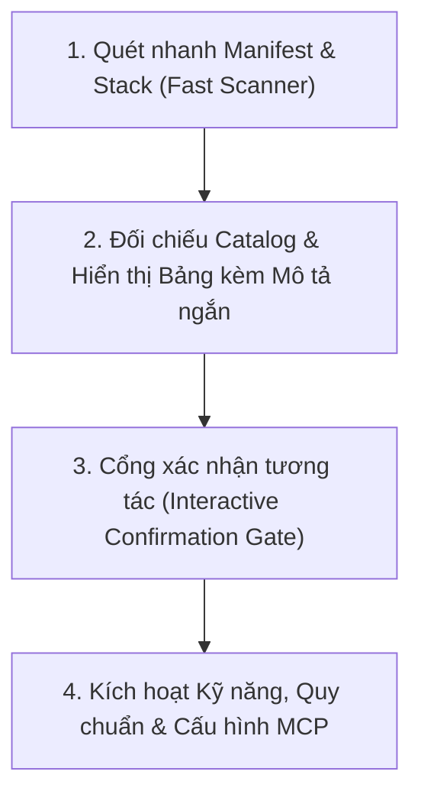

# Command: Adaptive Project Setup (/skill-setup)

This command skill automatically inspects the target codebase, detects active programming languages, frameworks, ORMs, and container tools, matches them against the **Curated Skill Catalog** ([optional-stack-skills/catalog.json](../../../optional-stack-skills/catalog.json)), and presents an interactive selection table with a **concise summary** for each skill before activation.

---

## 4-Step Execution Loop



---

### Step 1: Quét nhanh Manifest & Công nghệ (Fast Manifest Scanner)

Quét thư mục gốc của dự án để phát hiện các dấu hiệu công nghệ (detection markers) mà không tốn token đọc sâu:

1. **Ngôn ngữ lập trình**:
   - Go: `go.mod`, `main.go`
   - Python: `pyproject.toml`, `requirements.txt`, `Pipfile`, `poetry.lock`, `setup.py`
   - Rust: `Cargo.toml`
   - TypeScript/Node: `tsconfig.json`, `package.json`
2. **Frameworks & Thư viện**:
   - NestJS: `nest-cli.json`, chuỗi `@nestjs/core` trong `package.json`
   - React / Next.js: `next.config.*`, chuỗi `"react"` hoặc `"next"` trong `package.json`
   - Tailwind CSS: `tailwind.config.*`, chuỗi `"tailwindcss"` trong `package.json`
3. **Cơ sở dữ liệu & DevOps**:
   - Prisma: `prisma/schema.prisma`
   - PostgreSQL: Chuỗi `"postgres"` trong `docker-compose.yml`, `package.json` (`pg`), hoặc `requirements.txt` (`psycopg2`)
   - Docker: `Dockerfile`, `docker-compose.yml`, `compose.yaml`
4. **Hệ thống Git & Code Intelligence**:
   - Kiểm tra thư mục `.git/` để sẵn sàng cho `code-review-graph` MCP Server.

---

### Step 2: Đối chiếu Catalog & Hiển thị Bảng kèm Mô tả Ngắn

Đọc [optional-stack-skills/catalog.json](../../../optional-stack-skills/catalog.json). Với mỗi mục phù hợp với kết quả quét ở Bước 1, trích xuất:

- **Tên Kỹ năng / Công cụ (`name`)**
- **Phân loại (`category`)**
- **Mức độ khuyến nghị (`recommendation`)**: `Recommended` (Khuyên dùng) hoặc `Optional` (Tùy chọn)
- **Mô tả ngắn gọn (Concise Summary - `short_description`)**: Giải thích cô đọng 1–2 câu giá trị thiết thực của kỹ năng.

#### Định dạng xuất ra bắt buộc:

Agent **BẮT BUỘC** hiển thị bảng Markdown trực quan theo mẫu sau cho người dùng:

```markdown
### 🔍 Kết quả phân tích Tech Stack dự án:

- **Ngôn ngữ chính**: [Ví dụ: TypeScript / Go]
- **Frameworks**: [Ví dụ: React, Next.js, Tailwind]
- **Database & DevOps**: [Ví dụ: PostgreSQL, Docker]

### 📦 Danh sách kỹ năng & công cụ đề xuất:

| Kỹ năng / Công cụ     | Phân loại    | Trạng thái        | Mô tả nội dung ngắn gọn (Concise Summary)                                                                                                                      |
| :-------------------- | :----------- | :---------------- | :------------------------------------------------------------------------------------------------------------------------------------------------------------- |
| **go-patterns**       | Language     | 🎯 Khuyên dùng    | Chuẩn hóa boundary `internal/`, interface tối giản phía consumer, structured error wrapping, và chống anemic domain.                                           |
| **go-rules**          | Language     | 🎯 Khuyên dùng    | Quy chuẩn coding style Go: đặt tên, an toàn concurrency, table-driven unit test, và defer cleanup.                                                             |
| **go-depguard**       | Boundary     | 🎯 Khuyên dùng    | File cấu hình Golangci-lint kiểm soát ranh giới gói, ngăn chặn import trái phép giữa các tầng kiến trúc.                                                       |
| **docker-patterns**   | DevOps       | 🎯 Khuyên dùng    | Tiêu chuẩn container production: distroless base image, non-root user, multi-stage caching và healthcheck.                                                     |
| **code-review-graph** | Intelligence | 💡 Tùy chọn (MCP) | Dựng đồ thị Tree-sitter + SQLite cục bộ cho phép subagent (code-explorer, code-reviewer) tra cứu caller/callee và blast-radius với chi phí token giảm tới 26x. |
```

---

### Step 3: Cổng xác nhận tương tác (Interactive Confirmation Gate)

Agent dừng lại và hỏi người dùng bằng câu hỏi trực tiếp hoặc qua tương tác chat:

1. **Xác nhận kích hoạt các kỹ năng được đề xuất**:
   - Người dùng có thể chấp nhận toàn bộ, hoặc yêu cầu bỏ bớt / thêm kỹ năng khác từ catalog.
2. **Kích hoạt công cụ `code-review-graph` MCP Server**:
   - Hỏi người dùng: _"Bạn có muốn kích hoạt `code-review-graph` MCP Server để hỗ trợ subagent phân tích quan hệ hàm/class và giảm token review không?"_

---

### Step 4: Kích hoạt & Đồng bộ Dự án (Activation & Injection)

Sau khi người dùng xác nhận, agent tiến hành thiết lập tự động:

1. **Sao chép / Kích hoạt Kỹ năng**:
   - Sao chép các thư mục kỹ năng tương ứng từ `optional-stack-skills/` vào `.agents/skills/engineering/<skill-id>/`.
   - Sao chép các tệp quy chuẩn vào `.agents/rules/<rule-id>.md`.
   - Sao chép các tệp cấu hình linter (như `depguard.yaml`, `.importlinter.ini`, `dependency-cruiser.config.cjs`) ra thư mục gốc nếu chưa có.
2. **Cấu hình `code-review-graph` MCP (Nếu người dùng chọn Có)**:
   - Cập nhật `.agents/mcp_config.json`:
     ```json
     {
       "mcpServers": {
         "playwright": {
           "command": "npx",
           "args": ["-y", "@playwright/mcp@latest"]
         },
         "code-review-graph": {
           "command": "uvx",
           "args": ["code-review-graph", "serve"],
           "type": "stdio"
         }
       }
     }
     ```
   - Hướng dẫn người dùng lệnh khởi chạy đầu tiên:
     ```bash
     uvx code-review-graph index
     ```
3. **Cập nhật `CONTEXT.md`**:
   - Điền thông tin tech stack, frameworks, package manager vào bảng **Components & Services Overview** trong `CONTEXT.md`.
4. **Thông báo hoàn tất**:
   - Báo cáo danh sách các kỹ năng đã được kích hoạt thành công.
   - Gợi ý bước tiếp theo (ví dụ: chạy `/continue` hoặc bắt đầu Phase 1 BA pipeline với `intake-classifier`).
