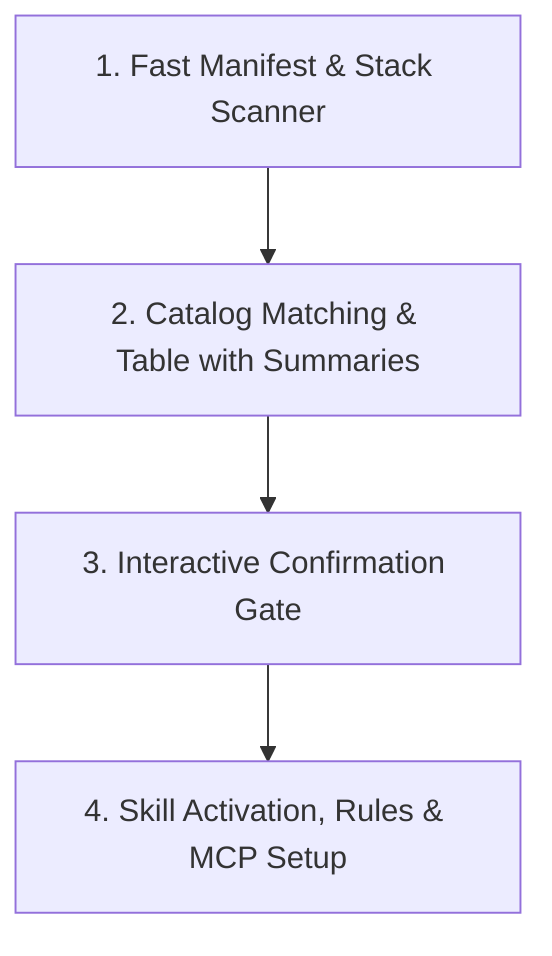

# Command: Adaptive Project Setup (/skill-setup)

This command skill automatically inspects the target codebase, detects active programming languages, frameworks, ORMs, and container tools, matches them against the **Curated Skill Catalog** ([.agents/catalog.json](../../catalog.json)), and presents an interactive selection table with a **concise summary** for each skill before activation.

---

## 4-Step Execution Loop



---

### Step 1: Fast Manifest & Stack Scanner

Scan the project root directory to identify technology detection markers with zero excessive token reading overhead:

1. **Programming Languages**:
   - Flutter / Dart: `pubspec.yaml`, `*.dart`, `.flutter-plugins`
   - Swift / Apple: `Package.swift`, `project.yml`, `*.xcodeproj`, `*.xcworkspace`, `*.swift`
   - Go: `go.mod`, `main.go`
   - Python: `pyproject.toml`, `requirements.txt`, `Pipfile`, `poetry.lock`, `setup.py`
   - Rust: `Cargo.toml`
   - TypeScript/Node: `tsconfig.json`, `package.json`
2. **Frameworks & Libraries**:
   - NestJS: `nest-cli.json`, `@nestjs/core` string in `package.json`
   - React / Next.js: `next.config.*`, `"react"` or `"next"` string in `package.json`
   - Tailwind CSS: `tailwind.config.*`, `"tailwindcss"` string in `package.json`
3. **Databases & DevOps**:
   - Prisma: `prisma/schema.prisma`
   - PostgreSQL: `"postgres"` string in `docker-compose.yml`, `package.json` (`pg`), or `requirements.txt` (`psycopg2`)
   - Docker: `Dockerfile`, `docker-compose.yml`, `compose.yaml`
4. **Git System & Code Intelligence**:
   - Check `.git/` directory to prepare for `code-review-graph` MCP Server.

---

### Step 2: Match Catalog & Display Table with Concise Summaries

Read [.agents/catalog.json](../../catalog.json). For each entry matching the scan results from Step 1, extract:

- **Skill / Tool Name (`name`)**
- **Category (`category`)**
- **Recommendation Level (`recommendation`)**: `Recommended` or `Optional`
- **Concise Summary (`short_description`)**: A succinct 1–2 sentence explanation of the skill's concrete value.

#### Mandatory Output Format:

The Agent **MUST** display a clean, visual Markdown table to the user following this format:

```markdown
### 🔍 Project Tech Stack Analysis:

- **Primary Language(s)**: [e.g., TypeScript / Go]
- **Frameworks**: [e.g., React, Next.js, Tailwind]
- **Database & DevOps**: [e.g., PostgreSQL, Docker]

### 📦 Recommended Skills & Tooling:

| Skill / Tool          | Category     | Status            | Concise Summary                                                                                                                                                        |
| :-------------------- | :----------- | :---------------- | :--------------------------------------------------------------------------------------------------------------------------------------------------------------------- |
| **go-patterns**       | Language     | 🎯 Recommended    | Enforces Go idioms: internal/ package boundaries, minimal consumer-defined interfaces, structured error wrapping, and anti-anemic domain models.                       |
| **go-rules**          | Language     | 🎯 Recommended    | Coding standards for Go: naming conventions, concurrency safety, table-driven unit testing, and defer cleanup rules.                                                   |
| **go-depguard**       | Boundary     | 🎯 Recommended    | Golangci-lint boundary checker configuration preventing unauthorized cross-package imports and keeping domain packages isolated.                                       |
| **docker-patterns**   | DevOps       | 🎯 Recommended    | Production container standards: distroless base image, non-root user, multi-stage caching, and healthcheck.                                                            |
| **code-review-graph** | Intelligence | 💡 Optional (MCP) | Builds local Tree-sitter + SQLite code graph allowing subagents (code-explorer, code-reviewer) to query caller/callee and blast-radius with up to 26x token reduction. |
```

> [!NOTE]
> If no technology markers match (e.g. Swift/iOS, Kotlin/Android, C/C++), the agent informs the user that no optional language skills are required, keeping the project 100% clean with zero unused skill directories.

---

### Step 3: Interactive Confirmation Gate

The Agent pauses and asks the user using direct questions or interactive chat:

1. **Confirm activation of recommended skills**:
   - The user can accept all, or request to drop/add specific skills from the catalog.
2. **Activate `code-review-graph` MCP Server**:
   - Ask user: _"Would you like to activate the `code-review-graph` MCP Server to enable subagents to analyze function/class call graphs and reduce token usage during reviews?"_
3. **Install `Archify` CLI (optional external tool)**:
   - First, check if Archify is already installed:
     ```bash
     node ~/.agents/skills/archify/bin/archify.mjs doctor 2>/dev/null && echo "INSTALLED" || echo "NOT_INSTALLED"
     ```
   - If **INSTALLED**: Inform user Archify is already available — no action needed.
   - If **NOT_INSTALLED**: Ask user:
     _"Would you like to install **Archify** — an interactive architecture diagram tool that generates validated HTML maps and 1200×630 share cards from typed JSON IR? It installs globally to `~/.agents/skills/archify/`. Without it, agents fall back to standard Mermaid diagrams."_
     - If Yes → run in Step 4: `npx -y skills add tt-a1i/archify --skill archify --global --copy --yes`
     - If No → agents will use Mermaid fallback automatically (no action needed)
4. **Git Management Mode for Universal Agents Workflow in this project**:
   - Ask user how they wish Git to handle the workflow files:
     - **🌐 1) Team Mode (Shared)**: Track all in Git to share rules, skills, and configs with the team on GitHub/GitLab (no additions to `.gitignore`).
     - **🔒 2) Local-Only Mode (Private)**: Automatically add `.agents/`, `.specify/`, `CONTEXT.md`, and rules to `.gitignore` to keep the remote repo 100% clean.
     - **🕶️ 3) Stealth Mode (Private Local)**: Add workflow files to `.git/info/exclude` (leaves the repository's `.gitignore` untouched).
     - **⚖️ 4) Hybrid Mode (Shared Docs, Private Engine)**: Track `CONTEXT.md`, `adr/`, `.specify/` in Git; ignore `.agents/` and rules in `.gitignore`.

---

### Step 4: Activation & Injection

Once confirmed by the user, the agent performs automated setup:

1. **Copy / Activate Skills**:
   - Resolve source repository path from `.agents/workflow-source.json` (or central workflow clone).
   - Copy ONLY the selected skill directories into `.agents/skills/engineering/<skill-id>/`.
   - Copy rule files to `.agents/rules/<rule-id>.md`.
   - Copy linter configuration files (`depguard.yaml`, `.importlinter.ini`, `dependency-cruiser.config.cjs`) to workspace root if not already present.
   - **Important**: The target repository NEVER contains an `optional-stack-skills/` directory. All activated skills live cleanly inside `.agents/skills/engineering/`.
2. **Install Archify CLI (if user selected Yes in Step 3)**:
   - Run the official install command:
     ```bash
     npx -y skills add tt-a1i/archify --skill archify --global --copy --yes
     ```
   - Verify installation succeeded:
     ```bash
     node ~/.agents/skills/archify/bin/archify.mjs doctor
     ```
   - Report to user: ✅ Archify installed at `~/.agents/skills/archify/` — use `node bin/archify.mjs` from that directory.
   - If install fails: Report failure clearly and inform user they can retry manually. Agents will use Mermaid fallback in the meantime.
3. **Automated Setup for `code-review-graph` MCP (if selected Yes)**:
   - **Prerequisite Check**: Check if Astral's `uv` / `uvx` is installed:
     ```bash
     which uvx || which uv
     ```
   - **If `uv` is NOT found**, prompt or execute the standard installation:
     - **macOS / Linux**: `curl -LsSf https://astral.sh/uv/install.sh | sh` (or `brew install uv`)
     - **Windows PowerShell**: `powershell -c "irm https://astral.sh/uv/install.ps1 | iex"`
   - **Run Official Auto-Configuration & Graph Build**: The agent executes the official one-command setup followed by the graph build:
     ```bash
     uvx code-review-graph install -y
     uvx code-review-graph build
     ```
     _`install -y` automatically configures MCP servers across all detected AI tools (Antigravity, Cursor, Windsurf, Claude Code) and adds `.code-review-graph/` to `.gitignore`._
     _`build` parses the codebase with Tree-sitter and creates the local SQLite AST graph (`.code-review-graph/graph.db`)._
   - **Workspace MCP Verification**: Ensure `.agents/mcp_config.json` also has the server registered:
     ```json
     {
       "mcpServers": {
         "playwright": {
           "command": "npx",
           "args": ["-y", "@playwright/mcp@latest"]
         },
         "code-review-graph": {
           "command": "uvx",
           "args": ["code-review-graph", "serve"],
           "type": "stdio"
         }
       }
     }
     ```
4. **Configure Git Tracking Mode (based on Step 3 selection)**:
   - **Local-Only Mode**: Append the following block to `.gitignore`:
     ```gitignore
     # --- Universal Agents Workflow (Local-Only Mode) ---
     .agents/
     .specify/
     adr/
     CONTEXT.md
     GEMINI.md
     CLAUDE.md
     AGENTS.md
     .cursorrules
     .windsurfrules
     ```
   - **Stealth Mode**: Append the block above to `.git/info/exclude` to keep `.gitignore` untouched.
   - **Hybrid Mode**: Append the following block to `.gitignore`:
     ```gitignore
     # --- Universal Agents Workflow (Hybrid Mode: Private Engine) ---
     .agents/
     GEMINI.md
     CLAUDE.md
     AGENTS.md
     .cursorrules
     .windsurfrules
     ```
   - **Team Mode**: Only ignore temporary log files: `.agents/scripts/hooks/*.log`.
5. **Update `CONTEXT.md`**:
   - Populate detected tech stack, frameworks, and package managers in the **Components & Services Overview** table in `CONTEXT.md`.
6. **Completion Notification**:
   - Report the list of successfully activated skills.
   - Report the applied Git tracking mode.
   - Suggest the next action (e.g., run `/continue` or initiate Phase 1 BA pipeline via `intake-classifier`).
