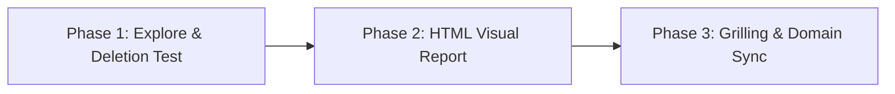

# Improve Codebase Architecture

Surface architectural friction and propose **deepening opportunities**: refactors that consolidate shallow, fragmented modules into deep modules with simple interfaces and robust implementations. The goal is maximized testability, AI-navigability, and developer velocity.

## Core Architectural Vocabulary

Use these specific terms throughout all reviews, cards, and discussions:

- **Module**: A coherent unit of code exposing an interface and hiding implementation details.
- **Interface**: The public surface area (functions, methods, types) through which consumers interact with a module.
- **Implementation**: The internal logic, data structures, and mechanics hidden behind the interface.
- **Depth**: The ratio of internal capability to interface complexity. Deep modules have simple interfaces hiding significant complexity; shallow modules have interfaces nearly as complex as their implementations.
- **Seam**: A deliberate boundary where two modules meet, enabling substitution or independent evolution.
- **Adapter**: Code that bridges two incompatible interfaces or connects external infrastructure to a domain seam. ("One adapter = hypothetical seam; two adapters = real seam.")
- **Leverage**: The multiplier achieved when a small, stable interface unlocks large capability across many call sites.
- **Locality**: Co-locating state, invariants, and related logic so changes and bugs remain confined to a single module rather than leaking across files.

## When to Activate

- User explicitly invokes codebase architectural review, refactoring analysis, or asks to find code smells/friction.
- Auditing high-churn git hotspots to reduce ongoing maintenance friction.
- Evaluating structural cohesion before starting major feature additions or domain expansion.
- Identifying opportunities to simplify fragmented controller/service/repository passthroughs or sprawling frontend hook hierarchies.

---

## 3-Phase Process

### Phase 1: Explore

**Scope before scanning (YAGNI)**: Deepening pays highest dividends in actively evolving code. Target areas of actual friction and change:

1. **Check Target Scope**:
   - If the user specified a module, directory, or subsystem (e.g. `apps/api/src/modules/billing` or `apps/web/src/features/quiz`), focus there directly.
   - Otherwise, examine recent churn in git history (`git log --oneline -n 50` or `git log --stat -n 30`) to identify files frequently modified together.

2. **Read Project Context & ADRs**:
   - Read `CONTEXT.md` for domain terminology and bounded contexts.
   - Read architectural decision records in `adr/` or `docs/adr/` to understand existing constraints and avoid re-litigating settled trade-offs.

3. **Walk Codebase for Architectural Smells**:
   Inspect the code looking for concrete friction patterns:
   - **Shallow Modules & Passthroughs**: Controllers, services, or wrappers that merely forward calls to repositories/helpers with zero transformation.
   - **Feature Envy & Shotgun Surgery**: Logic where understanding or modifying a single business capability requires jumping across 4–8 small files.
   - **Extracted Pure Functions without Locality**: Utility helpers extracted solely to get 100% unit test coverage, while the real orchestration bugs occur in untested call sites.
   - **Leaky Seams**: Modules exposing internal ORM entities, raw database errors, or internal component state directly to outer layers.

   - **Sprawling Frontend State**: React components driven by 5+ interrelated custom hooks where a single deep state machine or reducer module would encapsulate all transitions.

4. **Apply the Deletion Test**:
   For any suspected shallow module, evaluate:

   > _"If this module is deleted and absorbed into its consumer or neighbor, does complexity concentrate into a unified deep module with a cleaner interface, or does it merely scatter?"_
   - **Concentrates into cleaner interface** → High-confidence deepening candidate.
   - **Scatters or tangles unrelated concepts** → Leave boundary intact.

5. **Done Criteria**: Identify 2–5 strong, concrete candidates with exact file paths, identified friction, and target module interfaces.

---

### Phase 2: Present Candidates as an HTML Report

Generate a standalone, interactive visual report saved to the operating system's temp directory so no artifacts clutter the git working tree.

1. **Generate Report File**:
   - Resolve temp directory from `$TMPDIR`, `/tmp`, or `%TEMP%`.
   - Write file to `<tmpdir>/architecture-review-<timestamp>.html`.
   - Open the file immediately (`open <path>` on macOS, `xdg-open <path>` on Linux, `start <path>` on Windows).
   - Output the absolute path clearly to the user.

2. **Report Design & Layout**:
   - **Tech Stack**: Tailwind CSS CDN + Mermaid JS CDN (ESM import).
   - **Structure**:
     - **Header**: Repository name, scan timestamp, and visual legend (Solid box = Module, Dashed line = Seam, Red line = Leakage, Dark card = Deep Module).
     - **Candidate Cards**: One `<article>` per candidate containing:
       - **Title**: Action-oriented name (e.g., _"Collapse WordStreak Quiz Engine Pipeline"_).
       - **Badge Row**: Recommendation strength badge (`Strong` = emerald, `Worth exploring` = amber, `Speculative` = slate) + dependency classification tag (`in-process`, `local-substitutable`, `ports & adapters`, `mock`).
       - **Files**: Monospaced paths of all affected files.
       - **Problem**: 1–2 sentences pinpointing the exact architectural friction.
       - **Solution**: 1–2 sentences defining the proposed deepened interface.
       - **Wins**: Crisp bullet points highlighting **Leverage**, **Locality**, and interface simplification.
       - **Before / After Diagram**: Side-by-side visual comparison (Mermaid flowchart/sequence or custom CSS boxes).
       - **ADR Callout**: Warning notice if the proposal revisits an existing ADR, stating why it is now justified.
     - **Top Recommendation**: Prominent card highlighting the highest-leverage candidate to tackle first.

3. **Guidance Reference**: Consult [HTML-REPORT.md](HTML-REPORT.md) for complete HTML templates, CSS classes, badge color schemes, and Mermaid diagram templates.

4. **Done Criteria**: HTML report generated, opened in default browser, and prompt user: _"Which candidate would you like to explore?"_

---

### Phase 3: Grilling Loop

When the user selects a candidate, engage in an architectural grilling dialogue to refine the proposal before writing code.
Delegate the questioning mechanics to the `grilling` primitive (`.agents/skills/productivity/grilling`).

1. **Grill the Design**:
   - **Define the Public Interface**: What is the minimal surface area needed by consumers?
   - **Define the Implementation Boundaries**: What logic, state, and dependencies get hidden inside?
   - **Evaluate Seams & Adapters**: Are seams justified by multiple adapters (e.g., database repository in production vs in-memory mock in integration tests)?
   - **Test Surface Strategy**: How does testing transition from fragile unit tests of shallow wrappers to end-to-end unit tests against the deep module's public interface?
   - **Design-It-Twice**: If multiple interface shapes are viable, draft two contrasting designs (e.g., fluent builder vs options object vs state machine) and compare trade-offs.

2. **Domain Synchronization (`CONTEXT.md`)**:
   - When a deepened module introduces or clarifies a domain concept, update `CONTEXT.md` immediately.
   - Use precise domain language from `CONTEXT.md` in all code and naming.

3. **ADR Recording**:
   - Record the chosen architecture decision or an enduring constraint rejection as an ADR:
     > _"Would you like to record this decision as an ADR in `adr/` (using `adr/adr-template.md`) so future reviews won't re-suggest it?"_
   - Record only load-bearing, permanent decisions; skip temporary scheduling or prioritization rejections.

4. **Done Criteria**: Selected candidate has a finalized module interface design, updated `CONTEXT.md` glossary entries (if terms changed), recorded ADR in `adr/` if load-bearing, and user consensus to proceed with implementation or task planning.
