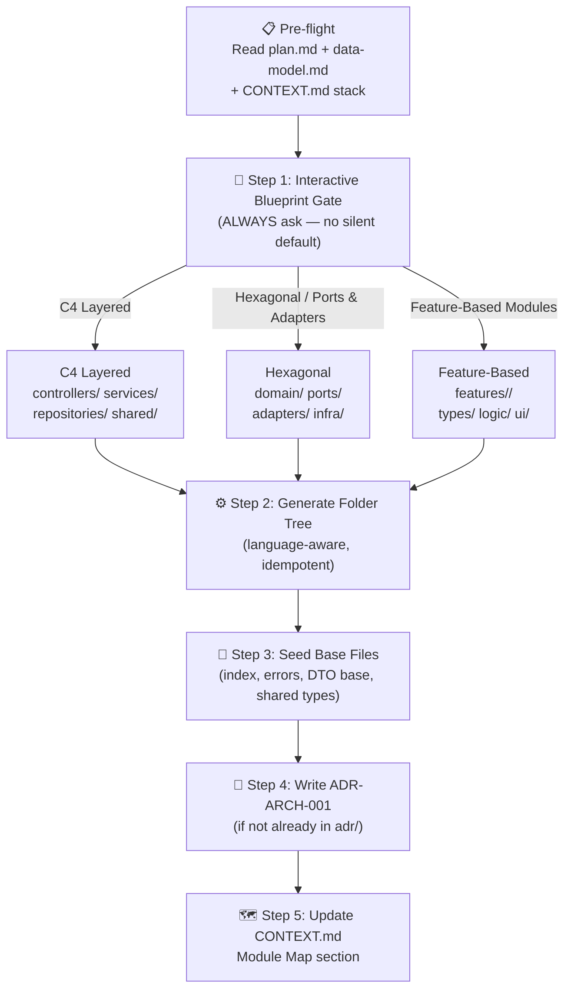

# Scaffold Architecture

Generate the **initial directory skeleton, seeded base files, and architectural records** for a feature or project, closing the gap between a finished `plan.md` and the first line of implementation code. Running this skill ensures that `backend-developer`, `frontend-developer`, and `slice-implementer` never start from a blank screen.

## When to Activate

- `plan.md`, `data-model.md`, and `contracts/` are all ready (speckit-plan complete).
- No consistent folder structure exists yet for this feature or new project.
- You are onboarding a new language pack into an existing project.
- The user asks to "set up the project structure" or "scaffold the feature".

**Do NOT activate** if a robust folder structure already exists and modules are already seeded — re-running is idempotent but wasteful.

---

## Pre-flight Checks

Before scaffolding:

1. **Read `CONTEXT.md`** — extract `tech-stack`, `module-map` (if any), and domain terminology.
2. **Read `PRODUCT_BACKLOG_ROADMAP.md` YAML frontmatter** — confirm active tech stack (language, backend, frontend, infra).
3. **Read `.specify/features/<slug>/plan.md`** — extract: modules list, layer responsibilities, key entities, API endpoints.
4. **Read `.specify/features/<slug>/data-model.md`** — extract entities and relationships.
5. **Check `adr/`** — if `ADR-ARCH-001` already exists, skip Step 4 (ADR creation). If a different architecture pattern was previously decided, respect it.

---

## 5-Step Workflow



---

## Step 1: Interactive Blueprint Gate (MANDATORY — Always Ask)

Present the user with the three blueprint options using the **Mandatory Recommendation & Trade-off Format**:

```markdown
**Question: Which architecture blueprint should we use for this project/feature?**

- **Why it matters**: The folder structure establishes seam boundaries that are hard to change later. All subagents (backend-developer, frontend-developer) will follow this layout.

| Option | Blueprint                                                                | Best for                                                       | Trade-off                                                                    |
| ------ | ------------------------------------------------------------------------ | -------------------------------------------------------------- | ---------------------------------------------------------------------------- |
| A      | **C4 Layered** (controllers/ → services/ → repositories/ → shared/)      | REST APIs, backend-heavy projects, TypeScript/Node, Go, Python | Clear layer separation; can become anemic if services are thin pass-throughs |
| B      | **Hexagonal / Ports & Adapters** (domain/ → ports/ → adapters/ → infra/) | Microservices, domain-logic-first, Java/Kotlin, C#, Rust       | Maximum testability & swap-ability; steeper learning curve                   |
| C      | **Feature-Based Modules** (features/<name>/ with types/, logic/, ui/)    | Flutter, fullstack, React Native, feature-heavy apps           | Colocation of related code; can blur layer boundaries without discipline     |

Reply with **A**, **B**, or **C** to confirm the blueprint.
```

**Wait for user reply.** Do NOT proceed until confirmed. Do NOT assume a default.

---

## Step 2: Generate Folder Tree (Language-Aware)

Read the active language from `CONTEXT.md` / `PRODUCT_BACKLOG_ROADMAP.md` frontmatter and apply the corresponding template.

### Blueprint A — C4 Layered

Read template: `.agents/skills/engineering/scaffold-architecture/templates/c4-layered.md`

### Blueprint B — Hexagonal / Ports & Adapters

Read template: `.agents/skills/engineering/scaffold-architecture/templates/hexagonal.md`

### Blueprint C — Feature-Based Modules

Read template: `.agents/skills/engineering/scaffold-architecture/templates/feature-based.md`

**Idempotency rule**: Before creating any directory or file, check if it already exists. If it exists, **skip silently** (do not overwrite). Report a summary of what was created vs. skipped at the end.

---

## Step 3: Seed Base Files

Seed the following language-specific base files. Use the exact paths from the chosen blueprint. All seeded files must be **minimal stubs** — enough to define types/interfaces but containing no implementation logic.

### TypeScript / Node.js

```typescript
// shared/types/index.ts — Domain type exports
export type ID = string;
export type Timestamp = Date;

// shared/errors/domain-errors.ts — Typed domain errors
export class DomainError extends Error {
  constructor(
    message: string,
    public readonly code: string,
  ) {
    super(message);
    this.name = "DomainError";
  }
}
export class NotFoundError extends DomainError {
  constructor(entity: string, id: string) {
    super(`${entity} with id '${id}' not found`, "NOT_FOUND");
  }
}
export class ValidationError extends DomainError {
  constructor(message: string) {
    super(message, "VALIDATION_ERROR");
  }
}
```

### Go

```go
// internal/shared/errors.go
package shared

import "fmt"

type DomainError struct {
    Code    string
    Message string
}

func (e *DomainError) Error() string {
    return fmt.Sprintf("[%s] %s", e.Code, e.Message)
}

func NotFoundError(entity, id string) *DomainError {
    return &DomainError{Code: "NOT_FOUND", Message: fmt.Sprintf("%s with id '%s' not found", entity, id)}
}

func ValidationError(msg string) *DomainError {
    return &DomainError{Code: "VALIDATION_ERROR", Message: msg}
}
```

### Python

```python
# shared/errors.py
class DomainError(Exception):
    def __init__(self, message: str, code: str):
        super().__init__(message)
        self.code = code

class NotFoundError(DomainError):
    def __init__(self, entity: str, entity_id: str):
        super().__init__(f"{entity} with id '{entity_id}' not found", "NOT_FOUND")

class ValidationError(DomainError):
    def __init__(self, message: str):
        super().__init__(message, "VALIDATION_ERROR")
```

### Flutter / Dart

```dart
// lib/shared/errors/domain_error.dart
class DomainError implements Exception {
  final String code;
  final String message;

  const DomainError({required this.code, required this.message});

  @override
  String toString() => '[$code] $message';
}

class NotFoundError extends DomainError {
  NotFoundError({required String entity, required String id})
      : super(code: 'NOT_FOUND', message: '$entity with id \'$id\' not found');
}

class ValidationError extends DomainError {
  ValidationError(String message)
      : super(code: 'VALIDATION_ERROR', message: message);
}
```

### Swift

```swift
// Sources/Shared/DomainError.swift
public enum DomainError: LocalizedError {
    case notFound(entity: String, id: String)
    case validationError(String)

    public var errorDescription: String? {
        switch self {
        case .notFound(let entity, let id):
            return "[\(entity)] with id '\(id)' not found"
        case .validationError(let msg):
            return "Validation error: \(msg)"
        }
    }
}
```

### Rust

```rust
// src/shared/errors.rs
use thiserror::Error;

#[derive(Error, Debug)]
pub enum DomainError {
    #[error("NOT_FOUND: {entity} with id '{id}' not found")]
    NotFound { entity: String, id: String },

    #[error("VALIDATION_ERROR: {0}")]
    Validation(String),
}
```

---

## Step 4: Write ADR-ARCH-001

If `adr/ADR-ARCH-001-architecture-blueprint.md` does NOT already exist, create it using the template at `.agents/skills/engineering/scaffold-architecture/templates/adr-arch-001-template.md`.

Fill in:

- **Decision**: The blueprint chosen in Step 1 (A, B, or C)
- **Context**: Project name from `CONTEXT.md`, tech stack, feature being scaffolded
- **Consequences**: Positive/negative trade-offs from the blueprint table in Step 1

---

## Step 5: Update CONTEXT.md — Module Map

Append or update a `## Module Map` section in `CONTEXT.md`:

```markdown
## Module Map

> Generated by scaffold-architecture on <date>. Blueprint: <A|B|C — name>.

| Module          | Responsibility                         | Public Interface | Depends On        |
| --------------- | -------------------------------------- | ---------------- | ----------------- |
| `<module-name>` | <single-line description from plan.md> | `<entry file>`   | <list of modules> |
```

Extract module names and responsibilities directly from `plan.md`'s Component Architecture section. Do not invent modules not present in the plan.

---

## Completion Report

After all 5 steps, output a structured summary:

```markdown
## 🏗️ Scaffold Architecture — Complete

**Blueprint**: <A|B|C — name>
**Language**: <detected stack>
**Feature**: <slug>

### Created

- <list of new directories>
- <list of new seed files>

### Skipped (already existed)

- <list>

### Records Updated

- `adr/ADR-ARCH-001-architecture-blueprint.md` — <created|already existed>
- `CONTEXT.md` → Module Map — <updated|appended>

### Next Step

Run `implementation-orchestrator` (or dispatch `code-explorer` → `backend-developer` → `frontend-developer`) using `tasks.md`.
```

---

## Done When

- [ ] Blueprint confirmed interactively by user
- [ ] Folder structure generated (language-appropriate)
- [ ] Base files seeded (shared types, domain errors)
- [ ] ADR-ARCH-001 created or confirmed existing
- [ ] CONTEXT.md Module Map updated
- [ ] Completion report delivered
