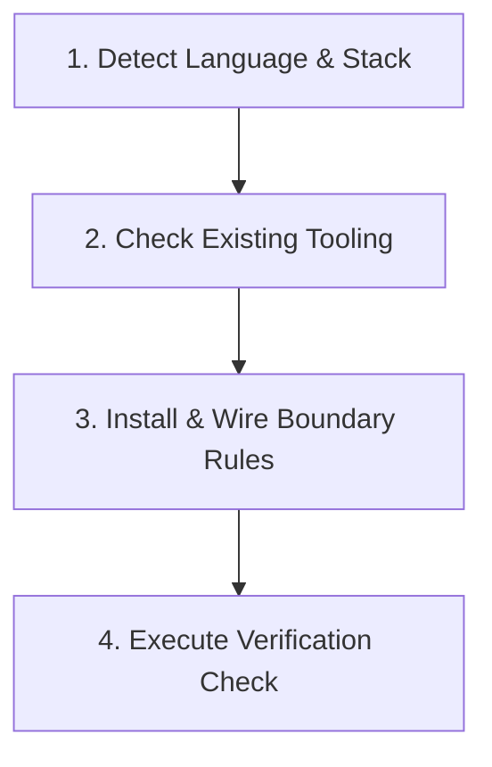

# Setup Deep Modules (Polyglot Architectural Seams)

Make packages and modules in this repository **deep modules**: a lot of functionality behind a compact, well-defined public interface (John Ousterhout, _A Philosophy of Software Design_).

This skill inspects your project's technology stack, installs the appropriate boundary-checking tool, copies the recommended configuration from `optional-stack-skills/languages/<lang>/`, and verifies that the rules enforce strict separation of public interfaces from hidden internal implementation.

---

## The Deep Module Architecture

Across all languages, a deep module satisfies:

1. **Public Interface (Entry Points)**: External modules only talk to designated entry-point files/facades.
2. **Hidden Implementation**: Subfolders, internal packages, and private logic cannot be imported from outside.
3. **No Circular Dependencies**: Dependency graph must remain an acyclic directed graph (DAG).
4. **Integration Tests Through Public API**: Tests verify behavior via public entry points, not private internals.

---

## 4-Step Setup Procedure

### Step 1: Detect Language & Stack

Inspect workspace manifests:

- **TypeScript / JavaScript**: `package.json`, `tsconfig.json`
- **Python**: `pyproject.toml`, `requirements.txt`, `Pipfile`
- **Go**: `go.mod`
- **Rust**: `Cargo.toml`
- **Java / Kotlin**: `pom.xml`, `build.gradle`

### Step 2: Wire Matching Language Seam Checker

#### A. TypeScript / JavaScript (`dependency-cruiser`)

- Install `dependency-cruiser` as devDependency (`pnpm add -D dependency-cruiser` or npm/yarn equivalent).
- Copy template from `optional-stack-skills/languages/typescript/dependency-cruiser.config.cjs` to project root.
- Add npm script in `package.json`: `"check:deps": "depcruise src --config .dependency-cruiser.cjs"`.

#### B. Python (`import-linter` or `tach`)

- Install `import-linter` (`poetry add -D import-linter` or `pip install import-linter`).
- Copy `.importlinter.ini` template from `optional-stack-skills/languages/python/.importlinter.ini` to project root.
- Run `lint-imports` to verify layer contracts and forbid direct private submodule imports.

#### C. Go (`internal/` & `depguard`)

- Verify that private implementation resides inside `internal/` packages (native Go compiler enforcement).
- If using `golangci-lint`, merge the rules from `optional-stack-skills/languages/go/depguard.yaml` into `.golangci.yml`.

#### D. Rust (Cargo Workspace & `pub(crate)`)

- Split complex systems into workspace member crates under `crates/`.
- Ensure non-public structs and functions are marked `pub(crate)` or `pub(super)` rather than bare `pub`.
- Run `cargo check` and optionally install `cargo-deny` for dependency boundaries.

#### E. Java / Kotlin (ArchUnit)

- Add ArchUnit dependency to `pom.xml` / `build.gradle`.
- Define an architecture test verifying package containment and prohibiting cross-layer access.

### Step 3: Verify the Rules Bite

Run the verification command for the detected language:

- TS: `npm run check:deps`
- Python: `lint-imports`
- Go: `golangci-lint run`
- Rust: `cargo check`

Confirm with the user that the architectural boundary is active and passing.
