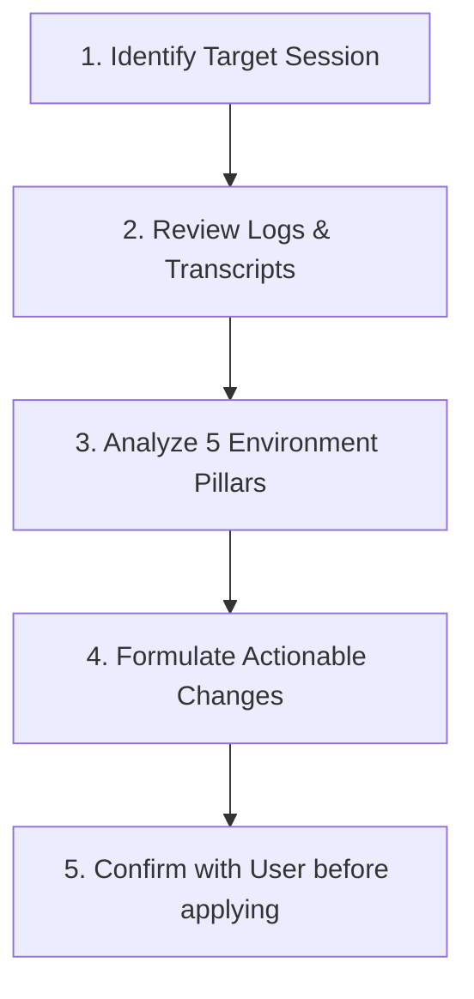

# Session Retrospective (`/retro`)

You are conducting a **retrospective** on a coding session, task, or milestone. Your goal is not to re-evaluate product features, but to **suggest concrete improvements to the coding agent's environment, tooling, and rules** so future sessions run faster, safer, and with zero repetitive friction.

---

## Retrospective Workflow



### 1. Identify Target Session

Ask or identify which session/milestone to review:

- Current active session (default)
- A specific feature implementation (e.g. `.specify/features/<slug>/`)
- A recent git branch or commit range

### 2. Review Transcripts and Execution Trace

Inspect primary sources:

- Files modified in the session (`git log --stat -n 5`, `git status`)
- Test and build output logs
- Tool calls made (searches, bash executions, file views)

### 3. Analyze the 5 Environment Pillars

Examine the session through these 5 lenses (agnostic to any language):

#### 🧭 1. Navigation & Discoverability

- Did the agent struggle to find the right files or understand dependencies?
- Did it perform excessive exploratory searches (`grep_search`, `list_dir`)?
- **Action:** Add navigation pointers in `README.md`, populate shorthand in `CONTEXT.md`, or create an architectural map.

#### 🤖 2. Automated Checks (Hard vs Soft Rules)

- Did the agent introduce a bug, type error, or syntax mistake that had to be caught manually?
- Could this mistake have been caught automatically by compiler, linter, or automated test?
  - **Python:** Add ruff rule, mypy strict check, or pytest assertion.
  - **Go:** Add golangci-lint rule or `go vet` check.
  - **Rust:** Add clippy check or `cargo test` unit test.
  - **TypeScript/Node:** Add ESLint rule or strict tsconfig flag.
- **Action:** Propose adding an automated check rather than relying on human vigilance.

#### 🛡️ 3. Reviewer Rules & Coding Standards

- Did `code-reviewer` or `ui-design-review` miss an anti-pattern during review?
- Is there a newly surfaced domain rule or architectural pattern that should be remembered?
- **Action:** Update `.agents/agents/code-reviewer.md` or append an ADR in `adr/`.

#### 🧹 4. AGENTS.md & GEMINI.md Hygiene (Anti-Bloat)

- Is `AGENTS.md` or `GEMINI.md` accumulating too many ad-hoc rules?
- Are instructions overly verbose, causing unnecessary token burn on every turn?
- **Action:** Move specific language/tool rules into dedicated skill files or automated scripts, keeping `AGENTS.md` lean.

#### ⚡ 5. Tool Economy

- Did the agent call tools inefficiently (e.g. reading 800 lines repeatedly instead of surgical view, or running slow manual commands)?
- **Action:** Suggest workflow shortcuts, slash commands, or helper scripts in `.agents/scripts/`.

---

## Output Report Format

Always output a structured, crisp retrospective summary:

```markdown
# 🏁 Retrospective Report — [Session / Feature Name]

### 📊 Summary

- **Session Focus**: <Brief description of what was built or fixed>
- **Friction Points Observed**: <1-3 key inefficiencies noticed>

### 🛠️ Proposed Environment Improvements

| Pillar              | Issue Observed                         | Proposed Fix                | Target File                   |
| :------------------ | :------------------------------------- | :-------------------------- | :---------------------------- |
| **Navigation**      | Searched 4 times for database client   | Add entry in CONTEXT.md     | `CONTEXT.md`                  |
| **Automated Check** | Missing null check caught in manual QA | Add linter rule             | `.golangci.yml` / `ruff.toml` |
| **AGENTS.md**       | Redundant instruction on formatting    | Delegate to pre-commit hook | `.agents/AGENTS.md`           |

### ❓ Recommendation for User

"Would you like me to apply these improvements to your workspace configuration now?"
```
