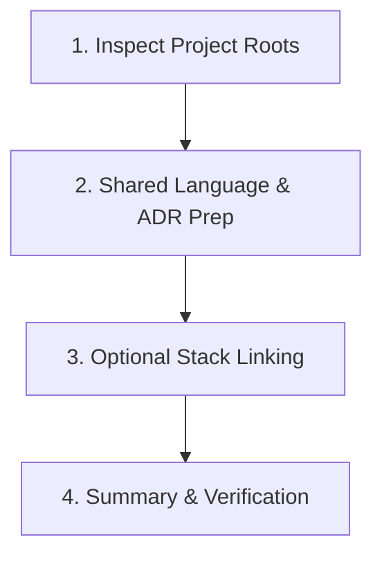

# Setup Workspace — One-Time Repository Onboarding

## Purpose

Instead of manually copy-pasting configuration files, editing hardcoded tech stack tables,
or guessing project setup, `setup-workspace` runs once per repository to discover context
and tailor the Universal Agents Workflow to the target codebase.

---

## 4-Step Discovery Loop

### Step 1: Inspect Project Roots

1. **Manifest Discovery**:
   - Node/TypeScript: `package.json`, `pnpm-workspace.yaml`, `tsconfig.json`
   - Python: `pyproject.toml`, `requirements.txt`
   - Go: `go.mod`
   - Rust: `Cargo.toml`
   - Java/Kotlin: `pom.xml`, `build.gradle`
2. **Git & Issue Tracker**:
   - Detect git remote URL (`git remote -v`).
   - Identify issue tracking convention (GitHub Issues, Linear, Jira, or local markdown).
3. **Testing & Linting Tooling**:
   - Detect test runners (`vitest`, `jest`, `playwright`, `pytest`, `cargo test`).
   - Detect formatting/linting (`biome`, `prettier`, `eslint`, `ruff`).

### Step 2: Initialize Shared Language & ADRs

1. **`CONTEXT.md` Initialization**:
   - If `CONTEXT.md` contains default placeholders, populate the initial components and packages found during Step 1.
   - Seed project-specific terminology from `README.md` and high-level docs.
2. **`adr/` Setup**:
   - Ensure `adr/` exists at workspace root with `adr-template.md`.
   - Seed `adr/0001-record-architecture-decisions.md` if not already present.

### Step 3: Polyglot Stack & Framework Linking

1. Check `optional-stack-skills/` against the detected technology stack:
   - **Language Skills** (`optional-stack-skills/languages/`):
     - Python: `python-patterns`, `.importlinter.ini`
     - Go: `go-patterns`, `depguard.yaml`
     - Rust: `rust-patterns`, `cargo-deny`
     - TypeScript/Node: `typescript-patterns`, `dependency-cruiser.config.cjs`
   - **Framework Skills** (`optional-stack-skills/frameworks/`):
     - NestJS: `nestjs-patterns`
     - Prisma ORM: `prisma-patterns`
     - React / Web UI: `frontend-patterns`, `liquid-glass-design`
2. Prompt the user to link or copy the matching language/framework skills into `.agents/skills/engineering/` (or run `setup-deep-modules` to install boundary enforcement automatically).

### Step 4: Verification & Handoff

Output a clean onboarding report:

- Detected Stack & Package Manager
- Active Branch & Git Remote
- Initialized `CONTEXT.md` and `adr/`
- Recommended first skill to run (e.g. `route`, `intake-classifier`, or `improve-codebase-architecture`).
