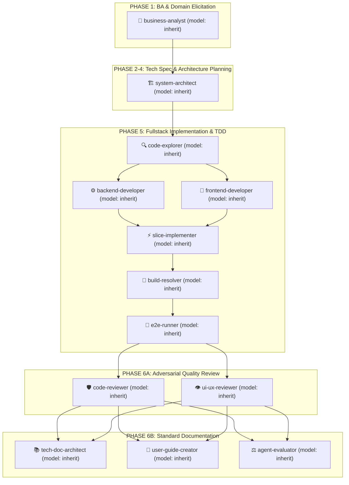

# GEMINI.md

Behavioral guidelines to reduce common LLM coding mistakes. Merge with project-specific instructions as needed.

**Tradeoff:** These guidelines bias toward caution over speed. For trivial tasks, use judgment.

## 1. Think Before Coding

**Don't assume. Don't hide confusion. Surface tradeoffs.**

Before implementing:

- **Zero Speculation & Zero Hallucination**: NEVER invent, fabricate, or silently assume business rules, formulas, error handling, default parameters, or edge cases. If something is unknown, ambiguous, or underspecified, STOP and ask the customer directly.
- **Polyglot & Multi-Language Support**: This workflow is 100% language-agnostic (Python, Go, Rust, Java/Kotlin, C#, PHP, Ruby, TypeScript/JavaScript). Do not force Node.js or pnpm idioms onto non-JS codebases.
- **Fast-Track for Micro-Tasks**: For trivial, surgical fixes (< 30 lines, obvious bug fixes, typos, single config tweaks), `intake-classifier` can route to **Micro-Task Fast-Track**. This bypasses the heavy 8-stage BA pipeline and `.specify/features/<slug>/` folder, proceeding directly to TDD: Reproduce -> Failing Test / Assert -> Surgical Fix -> Verification -> Single-line Conventional Commit.
- State your assumptions explicitly. If uncertain, ask.
- If multiple interpretations exist, present them - don't pick silently.
- If a simpler approach exists, say so. Push back when warranted.
- If something is unclear, stop. Name what's confusing. Ask.

## 2. Simplicity First

**Minimum code that solves the problem. Nothing speculative.**

- No features beyond what was asked.
- No abstractions for single-use code.
- No "flexibility" or "configurability" that wasn't requested.
- No error handling for impossible scenarios.
- If you write 200 lines and it could be 50, rewrite it.

Ask yourself: "Would a senior engineer say this is overcomplicated?" If yes, simplify.

## 3. Surgical Changes

**Touch only what you must. Clean up only your own mess.**

When editing existing code:

- Don't "improve" adjacent code, comments, or formatting.
- Don't refactor things that aren't broken.
- Match existing style, even if you'd do it differently.
- If you notice unrelated dead code, mention it - don't delete it.

When your changes create orphans:

- Remove imports/variables/functions that YOUR changes made unused.
- Don't remove pre-existing dead code unless asked.

The test: Every changed line should trace directly to the user's request.

## 4. Goal-Driven Execution

**Define success criteria. Loop until verified.**

Transform tasks into verifiable goals:

- "Add validation" → "Write tests for invalid inputs, then make them pass"
- "Fix the bug" → "Write a test that reproduces it, then make it pass"
- "Refactor X" → "Ensure tests pass before and after"

For multi-step tasks, state a brief plan:

```
1. [Step] → verify: [check]
2. [Step] → verify: [check]
3. [Step] → verify: [check]
```

Strong success criteria let you loop independently. Weak criteria ("make it work") require constant clarification.

## 5. Strict Design System & Anti-AI-Slop Governance

**MANDATORY FOR ANY FRONTEND / UI WORK:**
Before touching any `.tsx`, `.jsx`, `.css`, or UI mockup, the AI MUST:

1. **Check Project Shared Language & Decisions**:
   - Read [CONTEXT.md](file:///Users/vutuanhau/Documents/PROJECT/Universal-Agents-Workflow/CONTEXT.md) for canonical project terminology and naming conventions.
   - Read [adr/](file:///Users/vutuanhau/Documents/PROJECT/Universal-Agents-Workflow/adr) for settled architectural decision records.
2. **Check Target Project Design System**:
   - Read the repository's design documentation or tokens (e.g. `DESIGN.md`, `MEMORY.md`, or component design tokens in the project) to match exact color palettes, typography, and geometry.

**Strict Anti-AI-Slop Rules:**

- **Zero Generic AI Slop**: Absolutely NO unrequested multi-color gradients (e.g. `bg-gradient-to-r from-purple-500 to-indigo-600`), NO heavy dark-mode glassmorphism, NO floating blurred neon orbs, NO fake pricing tiers or mocked CLI commands.
- **Minimal Canvas & Intentional Palette**: Clean document canvas, 1px hairline borders (`#e5e5e5`/`#d4d4d4`), purposeful CTA geometry (e.g. solid obsidian pills `rounded-full`).
- **Typography Tokens**: Explicit font hierarchy (Display / Heading, Body copy, Monospace code) rather than unstyled defaults.
- **Stable Outer Anchor for Hover**: Never attach hover handlers directly to elements translating on Y-axis. Always use a stable outer anchor to eliminate 60Hz hover jitter.

## 6. Subagent Transparency & Model Notification

**MANDATORY NOTIFICATION ON SUBAGENT EXECUTION:**
Whenever a subagent is dispatched (e.g. for adversarial UI review, technical documentation, slice implementation, or browser automation):

- The agent MUST explicitly display a notification card in chat.
- It MUST indicate the **Subagent Name**, the **Active Model Name** (the model actually serving this session, e.g. the model shown in the IDE status bar), the **Goal**, and the **Final Artifact/Report Link**.

## 7. Mandatory Automatic Subagent Delegation Protocol

**AUTOMATIC MULTI-AGENT LIFECYCLE (MANDATORY & NON-NEGOTIABLE):**
The primary orchestrator agent MUST strictly follow the standard multi-agent execution pipeline without waiting for manual user prompting. Every phase MUST automatically dispatch its dedicated subagents via `invoke_subagent`:



### Strict Orchestrator Invariants & Hard Coding Ban (NON-NEGOTIABLE):

- **Zero Direct Feature Coding by Orchestrator**: The primary orchestrator agent is **STRICTLY PROHIBITED** from calling `write_to_file` or `replace_file_content` directly for any feature code, specifications, database schemas, or unit/E2E test files.
- **Mandatory Delegation via `invoke_subagent`**: All domain elicitation, architecture planning, backend/frontend implementation, code review, and user guide generation MUST be delegated to dedicated subagents spawned via `invoke_subagent`.
- **Model Allocation Matrix**: All subagents declare `model: inherit` and therefore run on the model selected for the current session. Override `model:` in an agent file only with an ID that this harness actually serves, and keep every agent in one phase chain on a reachable model.
  - Deep Domain Elicitation: `business-analyst`.
  - Architecture & Adversarial Review: `system-architect`, `code-reviewer`, `agent-evaluator`.
  - Fast Execution & Testing: `code-explorer`, `backend-developer`, `frontend-developer`, `slice-implementer`, `build-resolver`, `ui-ux-reviewer`, `tech-doc-architect`, `user-guide-creator`.
- **Language Specialization (Zero Conflict / Dynamic Dispatch)**: When specialized stack subagents are present in `.agents/agents/` (e.g., `swift-reviewer`, `swift-build-resolver`, `go-reviewer`, `rust-reviewer`):
  - In **Phase 5**, the orchestrator delegates compilation and build resolution to `<lang>-build-resolver`.
  - In **Phase 6A**, the orchestrator delegates adversarial code inspection to `<lang>-reviewer`.
  - The generic `build-resolver` and `code-reviewer` serve as polyglot fallbacks, ensuring zero naming conflict and zero workflow divergence.
- **Pre-execution Catalog Definition**: Before running any phase, the orchestrator MUST ensure subagents are defined via `define_subagent` with specialized system prompts.

### Protocol Execution Chain:

1. **Phase 1 (BA & Domain Elicitation — 8-Stage Pipeline)**:
   - **Stage 1 (Intake)**: Auto-dispatch `business-analyst` to run `intake-classifier`. If classified as **Micro-Task / Fast-Fix** (< 30 lines, obvious bug fix, typo), bypass the BA folder and elicitation interview, proceeding directly to Phase 5 TDD (Reproduce -> Failing Test -> Surgical Fix -> Verify). For Bounded Task / Full Feature, create `.specify/features/<slug>/`.
   - **🛑 STAGE 2 INTERACTIVE ELICITATION INTERVIEW (MANDATORY CUSTOMER GATE)**:
     - The AI / `business-analyst` **MUST PAUSE** and conduct a live, interactive interview with the User (batched 2–3 questions at a time covering Business Value & the 6 Domain Pillars: RBAC, State Machine, Business Rules/Formulas, Workflows/Edge cases, Data/Privacy, UX/NFRs) using direct chat turns or `ask_question`.
     - **Strict No-Hallucination Policy**: AI is STRICTLY FORBIDDEN from inventing business rules, error behaviors, default parameters, or edge cases. If anything is unknown or ambiguous, AI MUST ask the customer directly. Silent auto-generation of unconfirmed `ASM-` assumptions without user interaction is strictly prohibited.
   - **Stage 3–8 (Domain Modeling to Handover)**: Only after the user confirms elicitation answers, `business-analyst` executes gap analysis, domain modeling, risk scanning, spec writing, IEEE 29148 validation, and handover brief to produce `baseline.md`.
   - **🛑 Confirmation Gate 1**: Present Domain Baseline summary to User for sign-off.
2. **Phase 2–4 (Spec & Architecture)**: Auto-dispatch `system-architect` to produce `spec.md`, `plan.md`, `data-model.md`, `contracts/`, and `tasks.md`. Present Confirmation Gate 2 to User.
3. **Phase 5 (Fullstack Implementation & TDD)**:
   - Auto-dispatch `code-explorer` to inspect existing patterns.
   - Auto-dispatch `backend-developer` & `frontend-developer` in parallel or sequenced slices.
   - Auto-dispatch `slice-implementer` to wire integration.
   - Auto-dispatch `build-resolver` to eliminate type/lint build errors.
   - Auto-dispatch `e2e-runner` to verify test suites.
4. **Phase 6A (Adversarial Review)**:
   - Auto-dispatch `code-reviewer` for adversarial code quality & security review.
   - Auto-dispatch `ui-ux-reviewer` for Anti-AI-Slop, `DESIGN.md`, `MEMORY.md`, and WCAG AA verification.
5. **Phase 6B (Documentation & Sign-off)**:
   - Auto-dispatch `tech-doc-architect` (`docs/features/<slug>/README.md`).
   - Auto-dispatch `user-guide-creator` (`docs/user-guides/<slug>.md`).
   - Auto-dispatch `agent-evaluator` (Final DoD & Quality Scorecard).

---

**These guidelines are working if:** fewer unnecessary changes in diffs, fewer rewrites due to overcomplication, zero generic AI slop in UI, total subagent transparency, automatic subagent delegation for all phases, and clarifying questions come before implementation rather than after mistakes.
