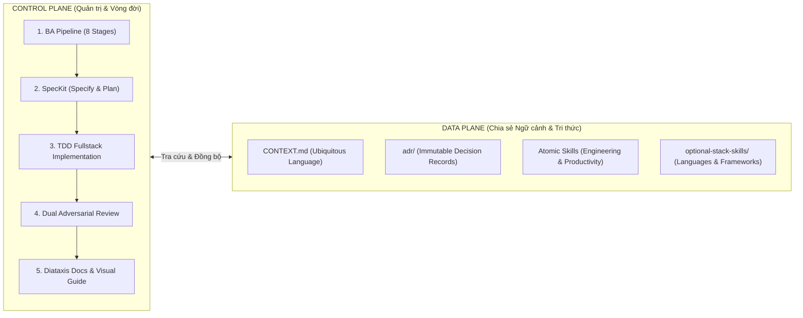
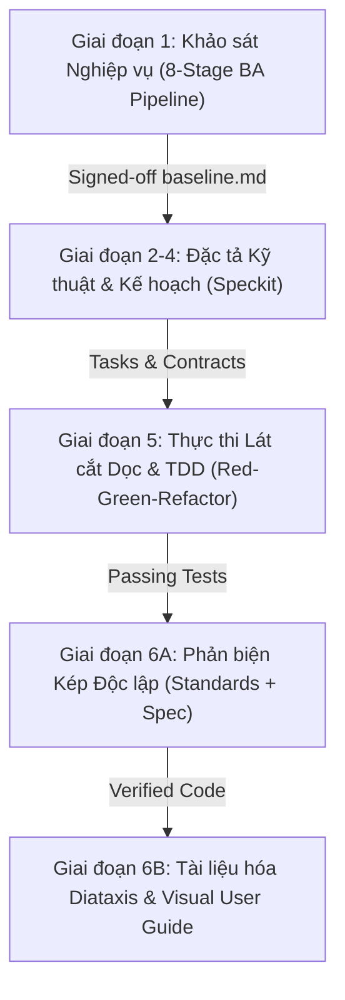

# 🌐 Universal Agentic Development Framework

> **Bộ khung quy trình Multi-Agent & Kỹ năng AI dùng chung cho mọi dự án, mọi ngôn ngữ lập trình (Language & Framework Agnostic).**  
> Kết hợp hài hòa giữa **Control Plane** (Quản trị quy trình BA 8 bước, TDD và Vòng đời Multi-Agent nghiêm ngặt) và **Data Plane** (Ngôn ngữ chung `CONTEXT.md`, Architecture Decision Records `adr/`, cùng bộ kỹ năng nguyên tử phân nhóm `engineering/` và `productivity/`).

---

## 📑 Mục lục

1. [Điểm Nổi Bật Cốt Lõi](#-1-điểm-nổi-bật-cốt-lõi)
2. [Triết lý Kiến trúc: Hai Mặt Phẳng (Two-Plane Architecture)](#-2-triết-lý-kiến-trúc-hai-mặt-phẳng-two-plane-architecture)
3. [Hướng dẫn Cài đặt & Khởi tạo (Quickstart)](#-3-hướng-dẫn-cài-đặt--khởi-tạo-quickstart)
4. [Hướng dẫn Vận hành Thường Nhật (Day-to-Day User Guide)](#-4-hướng-dẫn-vận-hành-thường-nhật-day-to-day-user-guide)
   - [Kịch bản 1: Phát triển tính năng mới (Full Feature / Bounded Task)](#kịch-bản-1-phát-triển-tính-năng-mới-full-feature--bounded-task)
   - [Kịch bản 2: Xử lý nhanh lỗi nhỏ (Micro-Task Fast-Track)](#kịch-bản-2-xử-lý-nhanh-lỗi-nhỏ-micro-task-fast-track)
   - [Kịch bản 3: Thám hiểm dự án lớn trong vùng sương mù (Wayfinder)](#kịch-bản-3-thám-hiểm-dự-án-lớn-trong-vùng-sương-mù-wayfinder)
   - [Kịch bản 4: Hồi cứu & tối ưu hóa sau phiên làm việc (Retro & Handoff)](#kịch-bản-4-hồi-cứu--tối-ưu-hóa-sau-phiên-làm-việc-retro--handoff)
   - [Kịch bản 5: Định tuyến thông minh khi gặp khó khăn (Route & Wait-What)](#kịch-bản-5-định-tuyến-thông-minh-khi-gặp-khó-khăn-route--wait-what)
5. [Cấu trúc Thư mục Dự án](#-5-cấu-trúc-thư-mục-dự-án)
6. [Danh mục 13 Subagents Chuyên Trách](#-6-danh-mục-13-subagents-chuyên-trách)
7. [Khóa Bảo Vệ Cơ Học & Git Guardrails](#-7-khóa-bảo-vệ-cơ-học--git-guardrails)
8. [Bảng Tra Cứu Xử Lý Sự Cố (Failure-Mode Index)](#-8-bảng-tra-cứu-xử-lý-sự-cố-failure-mode-index)

---

## ✨ 1. Điểm Nổi Bật Cốt Lõi

- 🌍 **100% Đa Ngôn Ngữ (Polyglot & Language-Agnostic)**: Hoạt động mượt mà trên Go, Rust, Python, TypeScript/JavaScript, Java/Kotlin, C# .NET, PHP, Ruby. Tự động nhận diện stack qua manifest (`go.mod`, `Cargo.toml`, `pyproject.toml`, `package.json`, `pom.xml`).
- 🛡️ **Zero Hallucination & Zero Silent Assumptions**: Bắt buộc phỏng vấn tương tác 6 trụ cột nghiệp vụ (`grilling`) theo chuẩn IREB/BABOK trước khi viết dòng code nào.
- ⚡ **Quy Chế Fast-Track Cho Micro-Task**: Xử lý các thay đổi nhỏ (< 30 dòng, fix bug hiển nhiên, đổi biến, sửa typo) nhanh chóng, bỏ qua thủ tục BA nặng nề, đi thẳng vào chu trình TDD.
- 🧱 **Kiến Trúc Deep Modules & Seams**: Tuân thủ triết lý của John Ousterhout (_A Philosophy of Software Design_): module sâu, giao diện tối giản, che giấu độ phức tạp, và kiểm soát ranh giới import tự động bằng linter.
- 🎨 **Tiêu Chuẩn Anti-AI-Slop**: Nói không với gradient neon tùy tiện, hiệu ứng hào nhoáng rẻ tiền, hay dark-mode giả tạo; tuân thủ canvas tinh giản, 1px hairline border và hệ thống design token nhất quán.
- 🔒 **Khóa Cứng Git Guardrails**: Hook cơ học tự động chặn đứng `git push --force`, `git reset --hard`, `git clean -fd`, bảo vệ mã nguồn tuyệt đối.
- 🤖 **Đa Nền Tảng (Multi-Harness Ready)**: Định nghĩa đầy đủ metadata trong `openai.yaml`, tương thích với Antigravity, OpenAI Codex, Claude Code, và Cursor.

---

## 📌 2. Triết lý Kiến trúc: Hai Mặt Phẳng (Two-Plane Architecture)



| Mặt phẳng                               | Triết lý                      | Thành phần chính                                                                                                                                                                                                         |
| :-------------------------------------- | :---------------------------- | :----------------------------------------------------------------------------------------------------------------------------------------------------------------------------------------------------------------------- |
| **Control Plane** (Quản trị & Vòng đời) | **Nghiêm ngặt, có kiểm định** | 8-Stage BA Pipeline (IEEE 29148), Vòng đời 13 Subagents chuyên trách, Ma trận phân bổ Model (Opus cho BA, Sonnet cho Kiến trúc/Review, Flash cho Thực thi/Test), TDD-first, Bàn giao qua Gate ký duyệt.                  |
| **Data Plane** (Ngữ cảnh & Tri thức)    | **Tinh gọn, On-Demand**       | `CONTEXT.md` (Ubiquitous Language tránh nhầm lẫn), `adr/` (Lưu vết quyết định kiến trúc dài hạn), Atomic Skills chia theo `engineering/` và `productivity/`, bộ kỹ năng tùy chọn theo stack `optional-stack-skills/`.    |
| **Giao điểm**                           | **Cầu nối 2 mặt phẳng**       | `domain-modeling` tự động cập nhật `CONTEXT.md` inline & đề xuất ADR; `elicitation-interview` ủy quyền cho `grilling`; `code-reviewer` chạy 2 pass độc lập (Standards vs Spec); `AGENTS.md` cung cấp Failure-Mode Index. |

---

## 🚀 3. Hướng dẫn Cài đặt & Khởi tạo (Quickstart)

### Bước 1: Sao chép bộ khung vào Repository mới

Đứng tại thư mục gốc của repository dự án mới của bạn:

```bash
# Giả sử thư mục Universal-Agents-Workflow nằm cạnh dự án của bạn:
cp -r ../Universal-Agents-Workflow/.agents ./
cp -r ../Universal-Agents-Workflow/.specify ./
cp -r ../Universal-Agents-Workflow/adr ./
cp ../Universal-Agents-Workflow/CONTEXT.md ./
cp ../Universal-Agents-Workflow/GEMINI.md ./
```

_(Tùy chọn)_ Nếu dự án dùng ngôn ngữ chuyên biệt, sao chép thêm thư mục stack skills:

```bash
cp -r ../Universal-Agents-Workflow/optional-stack-skills ./
```

### Bước 2: Tự động khởi tạo cấu hình dự án (`setup-workspace`)

Kích hoạt agent trong IDE hoặc gửi lệnh:

> _"Hãy chạy kỹ năng setup-workspace để khởi tạo dự án"_

Agent sẽ tự động:

1. Quét các file manifest (`go.mod`, `Cargo.toml`, `pyproject.toml`, `package.json`, `pom.xml`...).
2. Nhận diện test runner, build tool, git branch và cấu trúc thư mục.
3. Điền sẵn các thuật ngữ cốt lõi vào [CONTEXT.md](file:///CONTEXT.md).
4. Thiết lập thư mục [adr/](file:///adr) sẵn sàng ghi nhận các quyết định kiến trúc.
5. Liên kết các rules và patterns phù hợp từ `optional-stack-skills/` vào dự án.

---

## 🔄 4. Hướng dẫn Vận hành Thường Nhật (Day-to-Day User Guide)

### Kịch bản 1: Phát triển tính năng mới (Full Feature / Bounded Task)

Quy trình 6 giai đoạn tiêu chuẩn dành cho mọi tính năng có nghiệp vụ hoặc logic mới:



1. **Khởi động**: Gửi yêu cầu tính năng cho Agent. Agent tự động điều phối `business-analyst` kích hoạt `intake-classifier`.
2. **🛑 Phỏng vấn tương tác (Stage 2 Gate)**: Agent sẽ **dừng lại** và hỏi bạn 2–3 câu hỏi trắc nghiệm kèm phân tích trade-off và phương án khuyến nghị (`grilling`). Bạn chỉ cần chọn A, B hoặc gõ câu trả lời ngắn.
3. **Ký duyệt Baseline (Gate 1)**: Sau khi hoàn thành mô hình hóa domain, ERD, RBAC, và quét rủi ro, Agent xuất bản `baseline.md v1.0` để bạn ký duyệt.
4. **Lập đặc tả kỹ thuật & Task Graph (Speckit)**: `system-architect` tạo `spec.md`, `plan.md`, `data-model.md`, `contracts/`, và `tasks.md`.
5. **Thực thi TDD**: `slice-implementer` lập trình từng lát cắt dọc:
   - Viết `test-plan.md` trước.
   - Viết test Red $\rightarrow$ Code Green $\rightarrow$ Refactor.
6. **Phản biện độc lập (Dual Pass)**:
   - `code-reviewer`: Pass A (Bảo mật, Standards, Fowler smells) + Pass B (Đối chiếu `spec.md`).
   - `ui-ux-reviewer`: Pass A (Anti-AI-Slop, Design Tokens) + Pass B (4 UX states, WCAG AA).
7. **Tài liệu hóa & Nghiệm thu**: `tech-doc-architect` cập nhật Diataxis docs, `user-guide-creator` chụp ảnh Playwright xuất hướng dẫn sử dụng, `agent-evaluator` chấm điểm chất lượng hoàn tất.

---

### Kịch bản 2: Xử lý nhanh lỗi nhỏ (Micro-Task Fast-Track)

Dành cho các sửa lỗi hiển nhiên, sửa typo, đổi tên biến, hoặc chỉnh cấu hình đơn giản (< 30 dòng):

```
Yêu cầu lỗi nhỏ → intake-classifier nhận diện "Micro-Task"
  → Bỏ qua BA 8 stages & không tạo folder .specify/
  → Tái hiện lỗi (Reproduce)
  → Viết assertion / Failing Test (Red)
  → Sửa mã nguồn (Green)
  → Kiểm tra xác minh (Verify)
  → Commit ngắn gọn (Conventional Commit)
```

Bạn chỉ cần nói:

> _"Sửa lỗi typo trong hàm formatCurrency"_ hoặc _"Fix bug validation số âm ở file checkout.ts"_  
> Agent sẽ tự động đi luồng Fast-track, không làm phiền bạn bằng các thủ tục BA dài dòng.

---

### Kịch bản 3: Thám hiểm dự án lớn trong vùng sương mù (Wayfinder)

Khi bạn có một mục tiêu rất lớn, nhiều nhánh rẽ chưa rõ ràng (> 100k tokens) hoặc cần đưa ra nhiều quyết định mang tính chiến lược:

1. Kích hoạt kỹ năng:
   > _"Hãy dùng wayfinder để lập bản đồ quyết định cho dự án X"_
2. Agent sẽ phân rã mục tiêu thành các **Decision Tickets** lưu trên GitHub Issues, Linear, GitLab, hoặc local markdown (`.specify/wayfinder/`).
3. Vé được phân loại rõ:
   - 👤 **HITL (Human-in-the-loop)**: Cần bạn ra quyết định hướng đi.
   - 🤖 **AFK (Autonomous)**: AI tự nghiên cứu, làm spike hoặc dựng prototype throwaway (`prototype`).
4. Khi các quyết định ở đường biên (_Frontier_) được bạn thông qua, các nhánh đó sẽ tự động chuyển sang luồng BA Pipeline thông thường.

---

### Kịch bản 4: Hồi cứu & tối ưu hóa sau phiên làm việc (Retro & Handoff)

- **Sau khi kết thúc một mốc công việc**: Kích hoạt `/retro`.
  Agent sẽ phân tích 5 trụ cột:
  1. _Navigation_: Các con trỏ điều hướng trong `AGENTS.md` có chuẩn không?
  2. _Automated Checks_: Có linter/test runner nào bị miss không?
  3. _Coding Standards_: Có luật nào cần bổ sung cho Reviewer không?
  4. _Rule Hygiene_: Có luật nào trong `AGENTS.md` bị dài dòng/thừa thãi (Rule Bloat) cần tỉa bớt không?
  5. _Tool Economy_: Lựa chọn công cụ có tiết kiệm token không?
- **Khi context window sắp đầy hoặc chuyển ca**: Kích hoạt `/handoff`.
  Agent sẽ nén toàn bộ ngữ cảnh quan trọng vào một bản tóm tắt ngắn gọn để agent ở phiên sau đọc và làm việc tiếp ngay lập tức mà không bị mất dấu.

---

### Kịch bản 5: Định tuyến thông minh khi gặp khó khăn (Route & Wait-What)

- **Không biết nên dùng skill nào hoặc bước tiếp theo làm gì?**
  > Gõ: _"Tôi muốn làm [X], hãy dùng route chỉ dẫn"_ hoặc hỏi tự nhiên.
- **Agent trả lời toàn thuật ngữ kỹ thuật khó hiểu?**
  > Gõ: _"Hãy dùng wait-what giải thích lại một cách đơn giản"_  
  > Agent sẽ dùng ngôn ngữ mộc mạc và đối chiếu lại với danh pháp trong `CONTEXT.md` để bạn nắm bắt ngay.

---

## 📂 5. Cấu trúc Thư mục Dự án

```
Universal-Agents-Workflow/
├── CONTEXT.md                     # Data Plane: Bảng danh pháp chung (Ubiquitous Language)
├── adr/                           # Data Plane: Architecture Decision Records bất biến
│   └── adr-template.md            # Mẫu chuẩn ghi nhận quyết định kiến trúc
├── GEMINI.md                      # Behavioral Rules: Zero Hallucination, TDD, Anti-AI-Slop, Dual Review
├── README.md                      # Hướng dẫn sử dụng & kiến trúc tổng thể này
├── CHANGELOG-alignment.md         # Lịch sử tiến hóa & kiểm tra căn chỉnh framework
├── optional-stack-skills/         # Kỹ năng & rules chuyên dụng theo ngôn ngữ & framework
│   ├── languages/                 # Python (rules, import-linter), Go (rules, depguard), Rust, TS
│   └── frameworks/                # React (rules), NestJS, Prisma ORM, Liquid Glass Design
├── .specify/                      # Control Plane: Tài liệu đặc tả, kế hoạch & tasks
│   ├── templates/                 # Các mẫu spec, plan, tasks, test-plan, constitution
│   └── workflows/                 # Cấu hình workflow registry
└── .agents/                       # Agent Execution Engine
    ├── AGENTS.md                  # Bản đồ quy trình, ma trận kỹ năng & Failure-Mode Index
    ├── hooks.json                 # Khóa bảo vệ tự động (Git Guardrails, Lockfile Guardian)
    ├── agents/                    # 13 Subagents chuyên trách (Polyglot 100%)
    │   ├── openai.yaml            # Danh mục metadata đa nền tảng (OpenAI Codex, Claude Code, AGY)
    │   ├── business-analyst.md    # BA: Khảo sát nghiệp vụ, phỏng vấn khách hàng (Opus)
    │   ├── system-architect.md    # Kiến trúc sư: Thiết kế API Contract, Data Model (Sonnet)
    │   ├── code-reviewer.md       # Phản biện độc lập 2-Pass: Standards & Spec (Sonnet)
    │   ├── ui-ux-reviewer.md      # Phản biện giao diện Anti-AI-Slop, a11y, 4 states (Flash)
    │   ├── backend-developer.md   # Lập trình backend đa ngôn ngữ, TDD, Deep Modules (Flash)
    │   ├── frontend-developer.md  # Lập trình frontend, design tokens, a11y (Flash)
    │   ├── build-resolver.md      # Khắc phục lỗi compiler, typecheck đa ngôn ngữ (Flash)
    │   ├── tech-doc-architect.md  # Viết tài liệu kỹ thuật chuẩn Diataxis (Flash)
    │   ├── user-guide-creator.md  # Viết hướng dẫn người dùng kèm hình ảnh thực tế (Flash)
    │   └── ...                    # Các subagents lập trình lát cắt, e2e, đánh giá chất lượng
    ├── rules/
    │   └── common/                # Bộ quy tắc clean code, security, git, testing (Universal)
    ├── scripts/                   # Bộ scripts hooks bảo vệ repo, nhận diện context động
    │   └── hooks/                 # git-guardrails.js, pre-push-test.js, package-install-guardian.js
    └── skills/                    # Thư viện kỹ năng nguyên tử
        ├── engineering/           # Kỹ năng kỹ thuật, phân tích, kiến trúc & kiểm thử
        └── productivity/          # Kỹ năng điều phối, phỏng vấn, giải thích & tối ưu môi trường
```

---

## 🤖 6. Danh mục 13 Subagents Chuyên Trách

| Subagent                 | Vai trò chính                                                            |      Giai đoạn      | Model Khuyến nghị   |
| :----------------------- | :----------------------------------------------------------------------- | :-----------------: | :------------------ |
| **`business-analyst`**   | 8-Stage BA Pipeline, phỏng vấn `grilling`, IEEE 29148, ký duyệt Baseline |     **Phase 1**     | `claude-opus-4.6`   |
| **`system-architect`**   | Speckit Specify/Plan/Tasks, API DTO Contracts, Database migrations, ADRs |    **Phase 2–4**    | `claude-sonnet-4.6` |
| **`code-explorer`**      | Thám hiểm mã nguồn có sẵn, vẽ call graph và phân tích dependency         |     **Phase 5**     | `gemini-3.7-flash`  |
| **`backend-developer`**  | Backend đa ngôn ngữ (Go, Rust, Python, TS, Java), TDD, Deep Modules      |     **Phase 5**     | `gemini-3.7-flash`  |
| **`frontend-developer`** | Frontend đa nền tảng, Design Tokens, 4 UX states, WCAG AA, Anti-Slop     |     **Phase 5**     | `gemini-3.7-flash`  |
| **`slice-implementer`**  | Điều phối lát cắt dọc Fullstack tích hợp TDD Red-Green-Refactor          |     **Phase 5**     | `gemini-3.7-flash`  |
| **`build-resolver`**     | Sửa lỗi compiler/typecheck/linkage đa ngôn ngữ với can thiệp tối giản    |     **Phase 5**     | `gemini-3.7-flash`  |
| **`e2e-runner`**         | Kiểm thử Playwright E2E mô phỏng luồng người dùng thực tế                |     **Phase 5**     | `gemini-3.7-flash`  |
| **`code-reviewer`**      | Phản biện code độc lập 2-Pass (Pass A: Standards & Pass B: Spec)         |    **Phase 6A**     | `claude-sonnet-4.6` |
| **`ui-ux-reviewer`**     | Phản biện UI độc lập 2-Pass (Pass A: Anti-AI-Slop & Pass B: UX Flow)     |    **Phase 6A**     | `gemini-3.7-flash`  |
| **`tech-doc-architect`** | Biên soạn tài liệu kỹ thuật theo 4 góc phần tư Diataxis                  |    **Phase 6B**     | `gemini-3.7-flash`  |
| **`user-guide-creator`** | Tạo hướng dẫn sử dụng kèm ảnh chụp thật Playwright có hộp viền đỏ        |    **Phase 6B**     | `gemini-3.7-flash`  |
| **`agent-evaluator`**    | Đánh giá chất lượng 5 trục (Accuracy, Completeness, Clarity, v.v.)       | **Phase 6B / Meta** | `claude-sonnet-4.6` |

---

## 🛡️ 7. Khóa Bảo Vệ Cơ Học & Git Guardrails

Để đảm bảo an toàn tuyệt đối cho codebase của bạn, hệ thống tích hợp các cơ chế khóa cứng (Mechanical Hooks) trong `.agents/hooks.json`:

1. **Git Guardrails (`git-guardrails.js`)**: Chặn đứng ở cấp độ trước khi chạy lệnh shell đối với các lệnh nguy hiểm:
   - `git push --force` / `git push -f`
   - `git reset --hard`
   - `git clean -f` / `git clean -fd`
   - `git branch -D`
   - `git checkout .` / `git restore .`  
     _(Nếu bạn cố ý muốn chạy các lệnh này, đặt biến môi trường: `ALLOW_DESTRUCTIVE_GIT=1`)_.
2. **Ngăn Commit Trực Tiếp Main (`prevent-direct-main-commit.js`)**: Bắt buộc tạo nhánh feature, cấm commit thẳng vào `main`/`master` (vượt qua bằng `ALLOW_MAIN_COMMIT=1`).
3. **Bảo Vệ Lockfile Đa Ngôn Ngữ (`package-install-guardian.js`)**: Tự động nhận diện lockfile của dự án (`Cargo.lock`, `poetry.lock`, `pnpm-lock.yaml`, `package-lock.json`, `yarn.lock`) để chặn cài đặt sai công cụ quản lý gói.
4. **Kiểm Thử Trước Khi Push (`pre-push-test.js`)**: Tự động chạy bài kiểm thử phù hợp với ngôn ngữ dự án (`cargo test`, `go test`, `pytest`, `npm test`, `gradle test`) trước khi cho phép đẩy mã nguồn lên remote.

---

## 🔍 8. Bảng Tra Cứu Xử Lý Sự Cố (Failure-Mode Index)

Khi gặp bất kỳ bế tắc hoặc khó khăn nào trong quá trình làm việc, tra cứu ngay triệu chứng dưới đây để kích hoạt đúng kỹ năng giải quyết:

| Triệu chứng / Cảm giác bế tắc                                    | Nguyên nhân cốt lõi         | Kỹ năng cần gọi                                                       |
| :--------------------------------------------------------------- | :-------------------------- | :-------------------------------------------------------------------- |
| _"Không hiểu vừa đề xuất gì / Thuật ngữ quá dày đặc"_            | Bất đồng danh pháp          | `wait-what` (`productivity/wait-what`)                                |
| _"Không biết nên chạy skill nào hoặc làm bước gì tiếp theo"_     | Do dự điều hướng            | `route` (`productivity/route`)                                        |
| _"Yêu cầu quá mơ hồ; có quá nhiều nhánh thiết kế ngầm"_          | Thiếu khảo sát sâu          | `grilling` (`productivity/grilling`)                                  |
| _"Dự án quá lớn; mờ mịt không biết đi đâu trong 1 phiên"_        | Sương mù dự án (Fog of War) | `wayfinder` (`engineering/wayfinder`)                                 |
| _"Cần quyết định phụ thuộc vào ý kiến phòng ban khác"_           | Phụ thuộc stakeholder       | `to-questionnaire` (`productivity/to-questionnaire`)                  |
| _"Đang tranh cãi giữa 2 phương án layout hoặc state machine"_    | Suy đoán trừu tượng         | `prototype` (`engineering/prototype`)                                 |
| _"Git merge / rebase bị xung đột lộn xộn"_                       | Phân kỳ nhánh Git           | `resolving-merge-conflicts` (`engineering/resolving-merge-conflicts`) |
| _"Tái hiện được bug nhưng không rõ nguyên nhân gốc rễ"_          | Debug đoán mò               | `diagnosing-bugs` (`engineering/diagnosing-bugs`)                     |
| _"Module bị nông, rò rỉ import lung tung hoặc circular imports"_ | Xói mòn kiến trúc           | `setup-deep-modules` (`engineering/setup-deep-modules`)               |
| _"Phiên làm việc kết thúc; muốn tối ưu lại rules và môi trường"_ | Thiếu vòng phản hồi         | `retro` (`productivity/retro`)                                        |
| _"Context window sắp đầy hoặc cần đổi ca làm việc"_              | Trôi dạt bộ nhớ             | `handoff` (`productivity/handoff`)                                    |
| _"Khởi tạo repo mới hoặc đưa dự án mới vào quy trình"_           | Cấu hình thủ công           | `setup-workspace` (`productivity/setup-workspace`)                    |
| _"Cần review code chặt chẽ trước khi merge PR"_                  | Review thiếu cấu trúc       | `code-reviewer` (Dual Pass: Standards + Spec)                         |

---

## 📜 Giấy phép & Tuyên bố Bản quyền

Dự án này được phát triển dưới giấy phép mã nguồn mở MIT License. Tương thích hoàn toàn với hệ sinh thái AI coding agent hiện đại (Antigravity, Claude Code, OpenAI Codex, Cursor).
