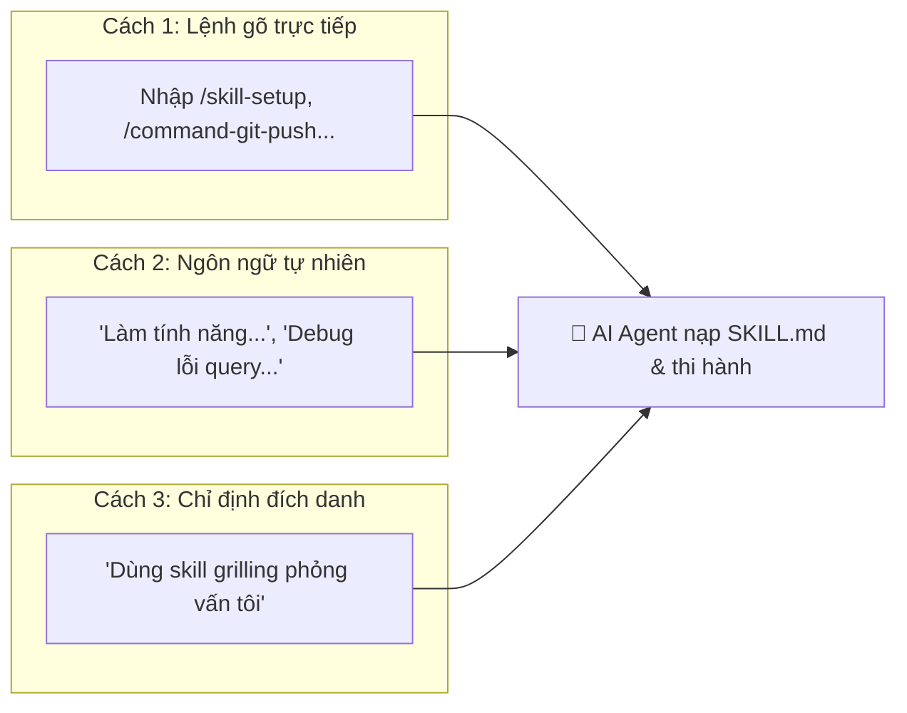
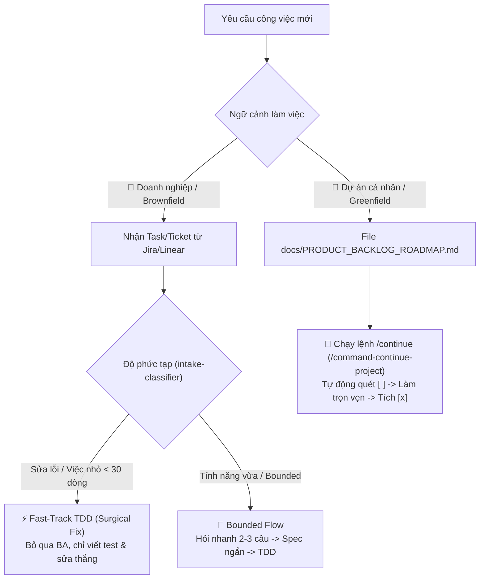
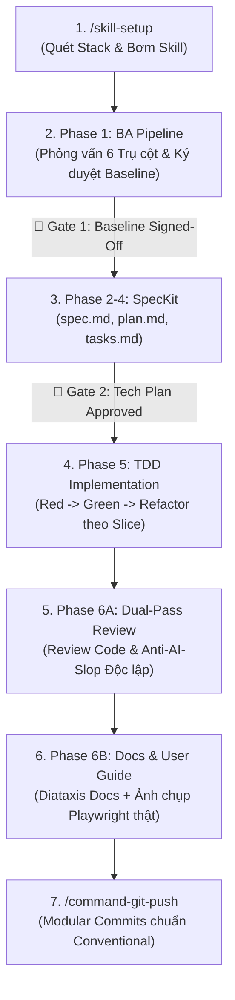

# 🌐 Universal Agentic Development Framework

[](#-t%E1%BB%95ng-quan--%C3%BD-ngh%C4%A9a-d%E1%BB%B1-%C3%A1n)
[](#-v%C3%B2ng-%C4%91%E1%BB%9Di-ph%C3%A1t-tri%E1%BB%83n-chu%E1%BA%A9n-7-b%C6%B0%E1%BB%9Bc)
[](#-tri%E1%BA%BFt-l%C3%BD-ki%E1%BA%BFn-tr%C3%BAc-c%E1%BB%91t-l%C3%B5i)
[](#-tri%E1%BA%BFt-l%C3%BD-ki%E1%BA%BFn-tr%C3%BAc-c%E1%BB%91t-l%C3%B5i)
[](#-kh%C3%B3a-b%E1%BA%A3o-v%E1%BB%87-git-guardrails)

> **Bộ khung quy trình Multi-Agent & Kỹ năng AI cấp doanh nghiệp, hoạt động độc lập với mọi ngôn ngữ lập trình và tương thích với toàn bộ AI Editor hiện đại (Antigravity IDE, Cursor, Claude Code, Windsurf, Copilot).**

---

## 🎯 Ý Nghĩa Cốt Lõi Của Dự Án

Trong phát triển phần mềm với AI, các lập trình viên thường đối mặt với 4 vấn đề lớn:

1. **AI Ảo Tưởng (Hallucination)**: Tự biên tự diễn quy tắc nghiệp vụ và phỏng đoán sai yêu cầu.
2. **Kiến Trúc Rác (AI Slop & Shallow Code)**: Viết code chắp vá, phá vỡ ranh giới module, tạo giao diện màu mè rẻ tiền.
3. **Mất Ngữ Cảnh Dài Hạn**: Quên kiến trúc sau vài lượt chat, không lưu lại vết quyết định kỹ thuật.
4. **Ô Nhiễm Git Repo**: Đẩy hàng trăm file prompt, cấu hình AI cá nhân lên repo chung của công ty.

**Universal Agents Workflow** giải quyết triệt để các vấn đề trên bằng mô hình **Hai Mặt Phẳng (Two-Plane Architecture)**:

- **Control Plane (Quản trị Vòng đời)**: Ép AI tuân thủ quy trình công nghiệp nghiêm ngặt: _Khảo sát nghiệp vụ IREB (BA Pipeline) $\rightarrow$ Đặc tả kỹ thuật (SpecKit) $\rightarrow$ Lập trình kiểm thử trước (TDD) $\rightarrow$ Phản biện độc lập kép (Dual-Pass Review) $\rightarrow$ Đóng gói Modular Commit_.
- **Data Plane (Ngữ cảnh & Tri thức)**: Duy trì từ điển thuật ngữ nhất quán ([CONTEXT.md](CONTEXT.md)), ghi vết quyết định kiến trúc bất biến ([adr/](adr/)), và cơ chế **Scan First** — tự động quét tech stack để chỉ nạp đúng kỹ năng cần thiết, tuyệt đối không làm rác dự án.

---

## 🚀 Hướng Dẫn Bắt Đầu Nhanh (Quickstart)

### Phương Án 1: Tích Hợp Vào Dự Án Đang Có (Brownfield - Khuyên dùng)

Chỉ cần chạy 1 dòng lệnh duy nhất từ thư mục `Universal-Agents-Workflow`:

```bash
./install.sh /duong-dan/toi/du-an-cua-ban
```

Script sẽ tự động sao chép bộ khung và hiển thị menu chọn **Chế độ Quản lý Git**:

```text
? Chọn chế độ quản lý Git cho Universal Agents Workflow trong dự án đích:
  1) 🌐 Team Mode (Shared)                      - Đẩy toàn bộ lên Git, chia sẻ quy chuẩn cho cả team
  2) 🔒 Local-Only Mode (Private .gitignore)     - Thêm toàn bộ workflow vào .gitignore, repo 100% sạch
  3) 🕶️ Stealth Mode (Private .git/info/exclude) - Thêm vào exclude cục bộ, không sửa cả .gitignore repo
  4) ⚖️ Hybrid Mode (Docs on Git, Engine Ignore) - Đẩy CONTEXT/adr/specs, giấu engine AI & skills
```

> [!TIP]
> **Tự động hóa hoàn toàn (Non-interactive cho CI/CD hoặc Script)**:
>
> ```bash
> ./install.sh --target=/duong-dan/du-an --mode=local -y
> ```

#### 🛡️ Bảng So Sánh 4 Chế Độ Git:

| Chế độ                            | Khi nào nên dùng?                                                                         | Ảnh hưởng đến Git Repo                                                                                 |
| :-------------------------------- | :---------------------------------------------------------------------------------------- | :----------------------------------------------------------------------------------------------------- |
| **🌐 Team Mode**                  | Cả team đồng thuận cùng dùng AI framework.                                                | Theo dõi toàn bộ trên Git (chỉ ignore log tạm).                                                        |
| **🔒 Local-Only** _(Khuyên dùng)_ | Bạn dùng cá nhân, **không muốn đồng nghiệp/khách hàng thấy file AI**.                     | Tự động thêm toàn bộ `.agents/`, `.specify/`, `CONTEXT.md`, `GEMINI.md` vào `.gitignore`.              |
| **🕶️ Stealth Mode**               | Repo công ty khắt khe **cấm sửa cả file `.gitignore` chung**.                             | Ghi quy tắc ignore vào `.git/info/exclude` cục bộ trên máy. File `.gitignore` chung không bị chạm vào. |
| **⚖️ Hybrid Mode**                | Chia sẻ tài liệu nghiệp vụ (`CONTEXT.md`, `adr/`, `.specify/`), nhưng **giấu engine AI**. | Theo dõi tài liệu trên Git; tự động ignore `.agents/`, `GEMINI.md`, `CLAUDE.md`.                       |

> [!IMPORTANT]
> **Nguyên tắc "Scan First - Zero Clutter"**: Bộ khung **KHÔNG BAO GIỜ** copy thư mục chứa toàn bộ ngôn ngữ thừa (`optional-stack-skills`) vào dự án của bạn. Script sẽ quét codebase trước, nếu là dự án Swift/iOS thì giữ sạch 100%; nếu là Go/Python/TypeScript thì chỉ copy duy nhất kỹ năng của ngôn ngữ đó vào `.agents/skills/engineering/`!

---

### Phương Án 2: Khởi Tạo Dự Án Mới Toanh (Greenfield)

```bash
git clone https://github.com/ahauy/universal-agents-workflow.git my-new-project
cd my-new-project
rm -rf .git && git init && git branch -M main
```

Sau đó mở dự án trong AI Editor (Antigravity IDE, Cursor, Claude Code, Windsurf) và bắt đầu làm việc.

---

## 🎮 Cách Sử Dụng Bộ Kỹ Năng Trong AI Editor

Bạn có thể kích hoạt các kỹ năng theo 3 cách cực kỳ trực quan:



1. **Gõ lệnh trực tiếp vào khung chat (Khuyên dùng)**:
   - Gõ `/skill-setup` $\rightarrow$ Quét Tech Stack và kích hoạt bộ kỹ năng tương thích.
   - Gõ `/command-git-push` $\rightarrow$ Tự động kiểm tra chất lượng, chia Modular Commits và push an toàn.
   - Gõ `/command-continue-project` $\rightarrow$ Tự động quét Roadmap và làm tiếp User Story kế tiếp.
   - Gõ `/route` $\rightarrow$ Hỏi Agent xem trong tình huống hiện tại nên đi bước nào tiếp theo.
   - Gõ `/wait-what` $\rightarrow$ Yêu cầu Agent giải thích lại thuật ngữ bằng ngôn ngữ đời thường.
2. **Kích hoạt tự nhiên (Model-Invoked - Không cần nhớ lệnh)**:
   - _"Thiết kế API thanh toán qua Stripe"_ $\rightarrow$ Agent tự nạp `api-design`.
   - _"Hàm này bị crash khi chạy concurrency, tìm nguyên nhân"_ $\rightarrow$ Agent tự nạp `diagnosing-bugs`.
   - _"Giao diện này nhìn ổn chưa?"_ $\rightarrow$ Agent tự nạp `ui-design-review`.
3. **Gọi đích danh kỹ năng**:
   - _"Dùng skill `grilling` để phỏng vấn sâu tôi về tính năng này trước khi code."_
   - _"Chạy `setup-deep-modules` để thiết lập linter ranh giới module."_

---

## 🎯 2 Kịch Bản Vận Hành Thực Tế: Doanh Nghiệp vs Dự Án Cá Nhân

Framework tự động điều chỉnh độ sâu của quy trình dựa trên ngữ cảnh làm việc của bạn:



### 🏢 Kịch Bản 1: Doanh Nghiệp (Nhận từng Task/Ticket lẻ từ Jira, Linear...)

Trong môi trường công ty, bạn **không cần và không nên** tạo file roadmap trong repo vì công ty đã quản lý tiến độ trên Jira/Linear.

1. **Cách giao việc**: Dán trực tiếp nội dung/mã Ticket vào khung chat:
   - _Fix bug nhỏ_: `"Fix bug JIRA-892: Hàm export invoice bị crash khi customer_id = null."`
   - _Task tính năng_: `"Làm task JIRA-405: Thêm trường tax_code vào form checkout và validate định dạng MST Việt Nam."`
2. **Cơ chế xử lý tự động**:
   - **Với Micro-Task / Bug Fix (< 30 dòng - chiếm 70% công việc)**: AI kích hoạt **Fast-Track**, bỏ qua mọi thủ tục BA, đi thẳng vào TDD: _Viết test đỏ $\rightarrow$ Sửa đúng dòng code cần sửa $\rightarrow$ Test xanh $\rightarrow$ Tạo 1 single-line commit_.
   - **Với Bounded Task (30–200 dòng)**: AI chỉ hỏi bạn 2–3 câu làm rõ edge case, tạo spec ngắn rồi code.
3. **Bảo vệ Repo công ty (100% Clean PR)**:
   - Chọn chế độ Git **`local`** hoặc **`stealth`** khi cài đặt. Toàn bộ file của framework (`.agents/`, `.specify/`, prompts) đều được ẩn hoàn toàn.
   - Khi bạn tạo Pull Request, repo công ty **chỉ chứa code sản phẩm và unit test sạch sẽ chuẩn senior**, tuyệt đối không có "rác" AI.

---

### 🚀 Kịch Bản 2: Dự Án Cá Nhân (Xây dựng từ đầu theo Roadmap)

Khi xây dựng sản phẩm cá nhân hoặc MVP từ đầu, bạn làm chủ toàn bộ sản phẩm và có file lộ trình rõ ràng.

1. **Chuẩn bị Roadmap**: Tạo file `docs/PRODUCT_BACKLOG_ROADMAP.md` với danh sách checklist:
   ```markdown
   # Product Roadmap

   - [x] US-001: Đăng ký tài khoản qua Email/Password
   - [ ] US-002: Đăng nhập và tạo JWT Token
   - [ ] US-003: Quên mật khẩu và gửi OTP qua Email
   ```
2. **Kích hoạt tự động hóa toàn diện**: Gõ lệnh `/command-continue-project` (hoặc `/continue`, `/next`).
3. **AI tự động vận hành trọn gói**:
   - Quét roadmap tìm User Story `[ ]` đầu tiên chưa làm.
   - Chạy đầy đủ vòng đời: Phỏng vấn nghiệp vụ $\rightarrow$ Đặc tả SpecKit $\rightarrow$ TDD Implementation $\rightarrow$ Khởi chạy Playwright chụp ảnh màn hình thật lưu vào `docs/user-guides/`.
   - Tự động đánh dấu `[x]` vào User Story vừa hoàn tất và tạo commit chuẩn.

---

| Tiêu Chí           | 🏢 Doanh Nghiệp (Task Lẻ)                                           | 🚀 Dự Án Cá Nhân (Roadmap)                                                       |
| :----------------- | :------------------------------------------------------------------ | :------------------------------------------------------------------------------- |
| **Nguồn yêu cầu**  | Ticket từ Jira / Linear / Redmine / Asana.                          | File `docs/PRODUCT_BACKLOG_ROADMAP.md`.                                          |
| **Cách kích hoạt** | Paste nội dung Ticket vào chat kèm mã task.                         | Gõ `/command-continue-project` (hoặc `/continue`).                               |
| **Thủ tục**        | Tối giản, ưu tiên **Fast-Track** để giải quyết nhanh.               | Đầy đủ từ A đến Z (BA $\rightarrow$ Spec $\rightarrow$ TDD $\rightarrow$ Guide). |
| **Chế độ Git**     | Dùng **`local`** hoặc **`stealth`** (giấu sạch file AI).            | Dùng **`team`** (theo dõi cả roadmap & spec trên Git).                           |
| **Commit Message** | Gắn kèm Ticket ID: `fix(invoice): handle null customer (JIRA-892)`. | Gắn kèm Story ID: `feat(auth): implement US-002 login JWT`.                      |

---

## 🔄 Vòng Đời Phát Triển Chuẩn 7 Bước (End-to-End Pipeline)

Mọi tính năng quan trọng đều được vận hành qua 7 bước chuẩn công nghiệp với các cổng kiểm soát (Gates) nghiêm ngặt:



| Bước  | Tên Giai Đoạn               | Kỹ Năng / Subagent Đảm Nhiệm                               | Đầu Ra Bắt Buộc (Artifacts)                                                |
| :---: | :-------------------------- | :--------------------------------------------------------- | :------------------------------------------------------------------------- |
| **1** | **Onboarding Stack**        | `/skill-setup`, `setup-workspace`                          | `.agents/catalog.json`, skills chuyên biệt cho stack.                      |
| **2** | **Nghiệp Vụ (BA Pipeline)** | `intake-classifier`, `elicitation-interview`, `grilling`   | `.specify/features/<slug>/baseline.md` (**Ký duyệt v1.0**).                |
| **3** | **Đặc Tả & Thiết Kế**       | `speckit-specify`, `speckit-plan`, `speckit-tasks`         | `spec.md`, `plan.md`, `data-model.md`, `tasks.md`.                         |
| **4** | **Lập Trình TDD**           | `code-explorer`, `backend-developer`, `frontend-developer` | `test-plan.md`, Unit Tests đỏ $\rightarrow$ xanh, Code tối giản.           |
| **5** | **Phản Biện Độc Lập**       | `code-reviewer`, `ui-design-review`                        | Báo cáo kiểm tra chuẩn bảo mật, spec fidelity & Anti-AI-Slop.              |
| **6** | **Tài Liệu Hóa**            | `tech-doc-architect`, `command-user-guide`                 | `docs/features/<slug>/README.md`, `docs/user-guides/<slug>.md` (Ảnh thật). |
| **7** | **Đóng Gói & Đẩy Mã**       | `/command-git-push`                                        | Tự động chia Modular Commits theo tầng và push an toàn.                    |

> [!TIP]
> **Quy chế Fast-Track cho Micro-Task**: Với các thay đổi nhỏ (< 30 dòng, sửa bug hiển nhiên, đổi biến, sửa typo), `intake-classifier` sẽ tự động chuyển sang luồng **Fast-Track**, bỏ qua toàn bộ hồ sơ BA nặng nề để đi thẳng vào chu trình TDD: _Reproduce $\rightarrow$ Failing Test $\rightarrow$ Fix $\rightarrow$ Verify $\rightarrow$ 1-Line Commit_.

---

## 📋 Bảng Tra Cứu Toàn Bộ Lệnh & Kỹ Năng (Cheatsheet)

### ⚡ Lệnh Tự Động Hóa (Commands)

| Lệnh / Trigger                  | Bí Danh (Aliases)            | Mục Đích Sử Dụng                                                                |
| :------------------------------ | :--------------------------- | :------------------------------------------------------------------------------ |
| **`/skill-setup`**              | `/setup`, `/setup-workspace` | Quét manifest dự án, đối chiếu catalog và nạp kỹ năng phù hợp.                  |
| **`/command-git-push`**         | `/push`, `/ship`             | Kiểm tra cổng tài liệu, chia nhỏ commit theo tầng và push lên Git.              |
| **`/command-continue-project`** | `/continue`, `/next`         | Quét backlog roadmap và kích hoạt chu trình làm tính năng tiếp theo.            |
| **`/command-user-guide`**       | `/user-guide`, `/guide`      | Khởi chạy trình duyệt Playwright chụp ảnh thực tế và viết tài liệu hướng dẫn.   |
| **`/route`**                    | `/ask-matt`                  | Trợ lý định hướng: hỏi xem bước kế tiếp nên dùng kỹ năng hay quy trình nào.     |
| **`/wait-what`**                | `giải thích lại`             | Yêu cầu diễn giải lại các khái niệm phức tạp bằng từ ngữ đời thường.            |
| **`/handoff`**                  | `wrap up`                    | Tóm tắt và nén toàn bộ ngữ cảnh ca làm việc để bàn giao cho phiên làm việc mới. |
| **`/retro`**                    | `hồi cứu`                    | Đánh giá lại hiệu quả làm việc của Agent, đề xuất tinh chỉnh rules và skills.   |

### 🛠️ Kỹ Năng Kỹ Thuật Nòng Cốt (Engineering Skills)

| Kỹ Năng                               | Khi Nào Sử Dụng?                                                                                          |
| :------------------------------------ | :-------------------------------------------------------------------------------------------------------- |
| **`api-design`**                      | Thiết kế hoặc chỉnh sửa REST API (chuẩn naming, HTTP status, pagination, versioning `/api/v1/`).          |
| **`codebase-design`**                 | Thiết kế Deep Modules theo Ousterhout, giấu chi tiết cài đặt, làm lộ ranh giới sạch (Seams).              |
| **`diagnosing-bugs`**                 | Quy trình 6 bước chẩn đoán lỗi khó, flaky test hoặc crash mà không đoán mò.                               |
| **`domain-modeling`**                 | Xây dựng ma trận RBAC, biểu đồ trạng thái Mermaid, định nghĩa mã lỗi và luật nghiệp vụ `BR-###`.          |
| **`setup-deep-modules`**              | Tự động cài đặt linter khóa ranh giới import (`depguard`, `import-linter`, `dependency-cruiser`).         |
| **`motion-design`**                   | Tiêu chuẩn animation, easing curves, chuyển cảnh mượt mà và hỗ trợ `prefers-reduced-motion`.              |
| **`ui-taste-pro` / `design-taste-*`** | Tiêu chuẩn Anti-AI-Slop: cấm gradient neon tùy tiện, chỉ dùng 1px hairline border và design tokens chuẩn. |
| **`wayfinder`**                       | Lập bản đồ quyết định và phân rã lộ trình khi gặp bài toán lớn, phạm vi mơ hồ (Fog of War).               |
| **`prototype`**                       | Dựng bản nháp HTML độc lập để chốt phương án giao diện/luồng trước khi viết code production.              |

---

## 🔒 Khóa Bảo Vệ Git (Guardrails)

Framework tích hợp các script hook kiểm soát cơ học tại [.agents/scripts/hooks/](.agents/scripts/hooks/), bảo vệ dự án khỏi các thao tác nguy hiểm của AI:

- ❌ **Chặn đứng `git push --force` & `git push -f`**: Không thể ghi đè lịch sử nhánh từ xa.
- ❌ **Chặn đứng `git reset --hard` & `git clean -fd`**: Không thể xóa sạch mã nguồn ngoài ý muốn.
- ❌ **Chặn commit trực tiếp vào `main`/`master`**: Bắt buộc tạo nhánh tính năng (`feat/*`, `chore/*`).
- ❌ **Chặn commit chứa mã độc/Secret**: Quét tự động private keys, `.env`, tokens trước khi commit.
- ❌ **Bảo vệ Lockfile đa ngôn ngữ**: Ngăn chặn AI cài nhầm package manager làm lệch lockfile (`pnpm`, `npm`, `yarn`, `poetry`, `cargo`).

---

## 📁 Cấu Trúc Thư Mục Chuẩn

```text
Universal-Agents-Workflow/
├── install.sh                  # Script cài đặt tự động & quản lý Git mode
├── CONTEXT.md                  # Từ điển thuật ngữ chung (Ubiquitous Language)
├── GEMINI.md                   # Chỉ dẫn vận hành & hành vi cốt lõi của AI Agent
├── adr/                        # Hồ sơ lưu vết các quyết định kiến trúc bất biến
│   ├── adr-template.md
│   └── 0001-record-architecture-decisions.md
├── .specify/                   # Thư mục chứa đặc tả & hồ sơ BA của các tính năng
│   ├── features/               # Mỗi tính năng có 1 thư mục riêng (<slug>/)
│   └── templates/              # Mẫu tài liệu chuẩn IEEE 29148
├── .agents/                    # Bộ não & công cụ vận hành của AI Agent
│   ├── catalog.json            # Danh mục kỹ năng tra cứu theo stack (~9KB)
│   ├── skills.json             # Khai báo đường dẫn nạp kỹ năng cho AI
│   ├── mcp_config.json         # Cấu hình máy chủ MCP (Playwright, Code-Review-Graph)
│   ├── rules/                  # Quy chuẩn lập trình theo ngôn ngữ
│   ├── scripts/hooks/          # Các khóa bảo vệ Git cơ học
│   └── skills/
│       ├── engineering/        # Các kỹ năng kỹ thuật & lệnh thực thi
│       └── productivity/       # Các kỹ năng giao tiếp, phỏng vấn & định tuyến
└── optional-stack-skills/      # Kho mẫu gốc theo ngôn ngữ (Go, Python, Rust, TS...)
```

---

## 🤝 Đóng Góp & Giấy Phép

Framework được thiết kế theo triết lý mở, trung lập với mọi nền tảng và ngôn ngữ. Mọi đóng góp cải tiến kỹ năng, luật kiểm tra ranh giới kiến trúc hay tối ưu hóa prompt đều được hoan nghênh qua Pull Request!

Phát triển với ❤️ bởi cộng đồng AI Engineer Việt Nam. Giấy phép **MIT License**.
