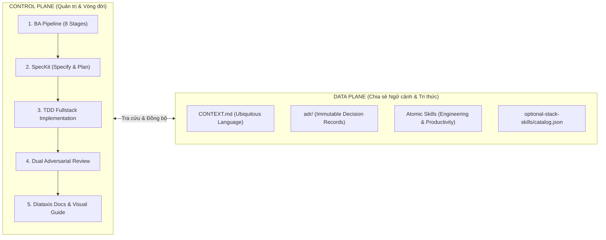
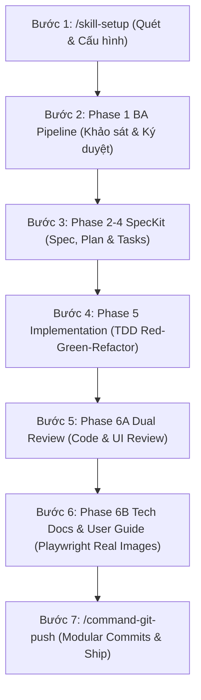
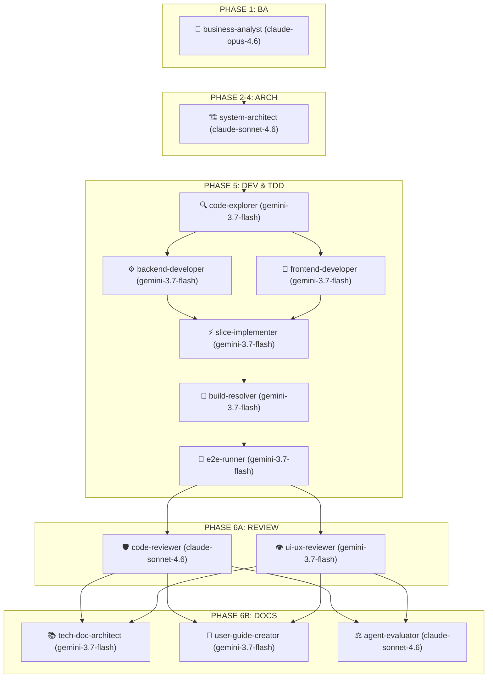

# 🌐 Universal Agentic Development Framework

> **Bộ khung quy trình Multi-Agent & Kỹ năng AI dùng chung cho mọi dự án, mọi ngôn ngữ lập trình (Language & Framework Agnostic).**  
> Kết hợp hoàn hảo giữa **Control Plane** (Quản trị quy trình BA 8 bước, TDD và Vòng đời Multi-Agent nghiêm ngặt) và **Data Plane** (Ngôn ngữ chung `CONTEXT.md`, Architecture Decision Records `adr/`, cùng bộ danh mục kỹ năng chuẩn hóa `optional-stack-skills/catalog.json`).

---

## 📑 Mục lục

1. [Điểm Nổi Bật Cốt Lõi](#-1-điểm-nổi-bật-cốt-lõi)
2. [Triết lý Kiến trúc: Hai Mặt Phẳng (Two-Plane Architecture)](#-2-triết-lý-kiến-trúc-hai-mặt-phẳng-two-plane-architecture)
3. [Hướng dẫn Bắt đầu Nhanh (Getting Started)](#-3-hướng-dẫn-bắt-đầu-nhanh-getting-started)
   - [Phương án A: Khởi tạo Dự án Mới Toanh (Greenfield)](#phương-án-a-khởi-tạo-dự-án-mới-toanh-greenfield)
   - [Phương án B: Tích hợp vào Dự án ĐANG CÓ SẴN (Brownfield / Existing Codebase)](#phương-án-b-tích-hợp-vào-dự-án-đang-có-sẵn-brownfield--existing-codebase)
4. [Hướng dẫn Vận hành Từ Đầu Đến Cuối (End-to-End Workflow: A đến Z)](#-4-hướng-dẫn-vận-hành-từ-đầu-đến-cuối-end-to-end-workflow-a-đến-z)
   - [Bước 1: Quét & Tự động Cấu hình (`/skill-setup`)](#bước-1-quét--tự-động-cấu-hình-skill-setup)
   - [Bước 2: Khảo sát Nghiệp vụ & Ký duyệt Baseline (Phase 1 BA Pipeline)](#bước-2-khảo-sát-nghiệp-vụ--ký-duyệt-baseline-phase-1-ba-pipeline)
   - [Bước 3: Đặc tả Kỹ thuật & Kế hoạch Thực thi (Phase 2–4 SpecKit)](#bước-3-đặc-tả-kỹ-thuật--kế-hoạch-thực-thi-phase-24-speckit)
   - [Bước 4: Lập trình Fullstack & Kiểm thử TDD (Phase 5 Implementation)](#bước-4-lập-trình-fullstack--kiểm-thử-tdd-phase-5-implementation)
   - [Bước 5: Phản biện Kép Độc lập (Phase 6A Dual-Pass Review)](#bước-5-phản-biện-kép-độc-lập-phase-6a-dual-pass-review)
   - [Bước 6: Tài liệu hóa Diataxis & User Guide Hình Ảnh Thật (Phase 6B Docs)](#bước-6-tài-liệu-hóa-diataxis--user-guide-hình-ảnh-thật-phase-6b-docs)
   - [Bước 7: Đóng gói Modular Commit & Đẩy Mã Nguồn (`/command-git-push`)](#bước-7-đóng-gói-modular-commit--đẩy-mã-nguồn-command-git-push)
5. [Các Kịch bản Vận hành Bổ trợ](#-5-các-kịch-bản-vận-hành-bổ-trợ)
   - [Kịch bản 1: Xử lý nhanh lỗi nhỏ (Micro-Task Fast-Track)](#kịch-bản-1-xử-lý-nhanh-lỗi-nhỏ-micro-task-fast-track)
   - [Kịch bản 2: Tiếp tục dự án từ Roadmap (`/command-continue-project`)](#kịch-bản-2-tiếp-tục-dự-án-từ-roadmap-command-continue-project)
   - [Kịch bản 3: Thám hiểm dự án lớn trong sương mù (`wayfinder`)](#kịch-bản-3-thám-hiểm-dự-án-lớn-trong-sương-mù-wayfinder)
   - [Kịch bản 4: Hồi cứu & nén ngữ cảnh ca làm việc (`/retro` & `/handoff`)](#kịch-bản-4-hồi-cứu--nén-ngữ-cảnh-ca-làm-việc-retro--handoff)
6. [Bảng Tra Cứu Lệnh Nhanh (Cheatsheet Slash Commands)](#-6-bảng-tra-cứu-lệnh-nhanh-cheatsheet-slash-commands)
7. [Danh mục 13 Subagents Chuyên Trách](#-7-danh-mục-13-subagents-chuyên-trách)
8. [Khóa Bảo Vệ Cơ Học & Git Guardrails](#-8-khóa-bảo-vệ-cơ-học--git-guardrails)
9. [Bảng Tra Cứu Xử Lý Sự Cố (Failure-Mode Index)](#-9-bảng-tra-cứu-xử-lý-sự-cố-failure-mode-index)

---

## ✨ 1. Điểm Nổi Bật Cốt Lõi

- 🌍 **100% Đa Ngôn Ngữ (Polyglot & Language-Agnostic)**: Hoạt động trơn tru trên Go, Rust, Python, TypeScript/JavaScript, Java/Kotlin, C# .NET, PHP, Ruby. Tự động nhận diện stack qua manifest (`go.mod`, `Cargo.toml`, `pyproject.toml`, `package.json`, `pom.xml`).
- 🎯 **Onboarding Thích Ứng Thông Minh (`/skill-setup`)**: Tự động nhận diện dự án, tra cứu danh mục chuẩn [optional-stack-skills/catalog.json](file:///optional-stack-skills/catalog.json) và hiển thị bảng đề xuất kỹ năng kèm **mô tả nội dung ngắn gọn** trước khi kích hoạt.
- 🕸️ **Tích hợp MCP Code Intelligence (`code-review-graph`)**: Hỗ trợ kết nối MCP server Tree-sitter + SQLite cục bộ, cho phép agent tra cứu quan hệ gọi hàm/class và blast-radius với chi phí token giảm tới 26x.
- 🛡️ **Zero Hallucination & Zero Silent Assumptions**: Bắt buộc phỏng vấn tương tác 6 trụ cột nghiệp vụ (`grilling`) theo chuẩn IREB/BABOK trước khi viết dòng code nào.
- ⚡ **Quy Chế Fast-Track Cho Micro-Task**: Xử lý các thay đổi nhỏ (< 30 dòng, fix bug hiển nhiên, đổi biến, sửa typo) nhanh chóng, bỏ qua thủ tục BA nặng nề, đi thẳng vào chu trình TDD.
- 🧱 **Kiến Trúc Deep Modules & Seams**: Tuân thủ triết lý của John Ousterhout (_A Philosophy of Software Design_): module sâu, giao diện tối giản, che giấu độ phức tạp, và kiểm soát ranh giới import tự động bằng linter (`depguard`, `import-linter`, `dependency-cruiser`).
- 🎨 **Tiêu Chuẩn Anti-AI-Slop**: Nói không với gradient neon tùy tiện, hiệu ứng hào nhoáng rẻ tiền, hay dark-mode giả tạo; tuân thủ canvas tinh giản, 1px hairline border và hệ thống design token nhất quán.
- 🔒 **Khóa Cứng Git Guardrails**: Hook cơ học tự động chặn đứng `git push --force`, `git reset --hard`, `git clean -fd`, bảo vệ mã nguồn tuyệt đối.

---

## 📌 2. Triết lý Kiến trúc: Hai Mặt Phẳng (Two-Plane Architecture)



| Mặt phẳng                               | Triết lý                      | Thành phần chính                                                                                                                                                                                                         |
| :-------------------------------------- | :---------------------------- | :----------------------------------------------------------------------------------------------------------------------------------------------------------------------------------------------------------------------- |
| **Control Plane** (Quản trị & Vòng đời) | **Nghiêm ngặt, có kiểm định** | 8-Stage BA Pipeline (IEEE 29148), Vòng đời 13 Subagents chuyên trách, Ma trận phân bổ Model (Opus cho BA, Sonnet cho Kiến trúc/Review, Flash cho Thực thi/Test), TDD-first, Bàn giao qua Gate ký duyệt.                  |
| **Data Plane** (Ngữ cảnh & Tri thức)    | **Tinh gọn, On-Demand**       | `CONTEXT.md` (Ubiquitous Language tránh nhầm lẫn), `adr/` (Lưu vết quyết định kiến trúc dài hạn), Atomic Skills chia theo `engineering/` và `productivity/`, bộ kỹ năng tùy chọn theo stack `optional-stack-skills/`.    |
| **Giao điểm**                           | **Cầu nối 2 mặt phẳng**       | `domain-modeling` tự động cập nhật `CONTEXT.md` inline & đề xuất ADR; `elicitation-interview` ủy quyền cho `grilling`; `code-reviewer` chạy 2 pass độc lập (Standards vs Spec); `AGENTS.md` cung cấp Failure-Mode Index. |

---

## 🚀 3. Hướng dẫn Bắt đầu Nhanh (Getting Started)

### Phương án A: Khởi tạo Dự án Mới Toanh (Greenfield)

Nếu bạn bắt đầu một repository hoàn toàn mới từ đầu:

1. **Clone repository về máy**:
   ```bash
   git clone https://github.com/ahauy/universal-agents-workflow.git my-new-project
   cd my-new-project
   ```
2. **Khởi tạo Git và xóa lịch sử git cũ (nếu muốn bắt đầu sạch)**:
   ```bash
   rm -rf .git
   git init
   git branch -M main
   ```
3. **Chạy lệnh thiết lập thích ứng**:
   Mở dự án trong AI Editor (Antigravity IDE, Cursor, Claude Code, Codex) và gõ:
   > _`/skill-setup`_

---

### Phương án B: Tích hợp vào Dự án ĐANG CÓ SẴN (Brownfield / Existing Codebase)

Nếu bạn đã có sẵn một dự án (ví dụ: dự án Go, Python, NestJS, React, Java, Rust...) và muốn đưa toàn bộ sức mạnh quy trình Universal Agents Workflow vào mà **không làm xáo trộn mã nguồn hiện tại**:

#### Cách 1: Sao chép thư mục cấu hình (Khuyên dùng - Nhanh gọn nhất)

Đứng tại thư mục gốc của dự án hiện tại của bạn:

```bash
# Giả sử thư mục Universal-Agents-Workflow nằm cạnh thư mục dự án của bạn:
cp -r ../Universal-Agents-Workflow/.agents ./
cp -r ../Universal-Agents-Workflow/.specify ./
cp -r ../Universal-Agents-Workflow/adr ./
cp -r ../Universal-Agents-Workflow/optional-stack-skills ./
cp ../Universal-Agents-Workflow/CONTEXT.md ./
cp ../Universal-Agents-Workflow/GEMINI.md ./
```

#### Cách 2: Tích hợp dưới dạng Git Submodule (Dễ cập nhật bản mới)

Nếu bạn muốn giữ liên kết để nhận các cập nhật mới nhất từ `Universal-Agents-Workflow`:

```bash
# Thêm submodule vào thư mục .workflow-core
git submodule add https://github.com/ahauy/universal-agents-workflow.git .workflow-core

# Tạo symbolic link hoặc sao chép các thành phần cần thiết vào root
cp -r .workflow-core/.agents ./
cp -r .workflow-core/.specify ./
cp -r .workflow-core/adr ./
cp -r .workflow-core/optional-stack-skills ./
cp .workflow-core/CONTEXT.md ./
cp .workflow-core/GEMINI.md ./
```

#### Bước tiếp theo sau khi copy vào dự án có sẵn:

1. **Kiểm tra `.gitignore` của dự án**: Đảm bảo không bỏ qua `.agents/`, `.specify/`, `adr/`, `CONTEXT.md`. Thêm các file tạm nếu cần:
   ```gitignore
   # Agent temporary logs
   .agents/scripts/hooks/*.log
   ```
2. **Kích hoạt lệnh `/skill-setup`**:
   Gõ trong khung chat của Agent:

   > _`/skill-setup`_

   Agent sẽ tự động:
   - Quét toàn bộ codebase hiện có của bạn (nhận diện chính xác ngôn ngữ, framework, database, test runner).
   - Đọc [optional-stack-skills/catalog.json](file:///optional-stack-skills/catalog.json) và hiển thị bảng gợi ý kỹ năng kèm **mô tả ngắn gọn**.
   - Hỏi bạn có muốn bật **`code-review-graph` MCP Server** để lập chỉ mục AST cho codebase có sẵn (giúp review và code explorer siêu tiết kiệm token) không.
   - Tự động điền các dịch vụ, package hiện có của bạn vào bảng **Components & Services Overview** trong [CONTEXT.md](file:///CONTEXT.md).

---

## 🔄 4. Hướng dẫn Vận hành Từ Đầu Đến Cuối (End-to-End Workflow: A đến Z)

Toàn bộ chu trình phát triển một tính năng hoặc một sản phẩm được vận hành qua 7 bước chuẩn mực:



---

### Bước 1: Quét & Tự động Cấu hình (`/skill-setup`)

- **Mục tiêu**: Chuẩn bị môi trường, nạp đúng kỹ năng dự án cần, loại bỏ "Context Bloat".
- **Cách thực hiện**: Gõ `/skill-setup`.
- **Đầu ra**:
  - Bảng danh mục kỹ năng tương thích hiển thị kèm mô tả ngắn gọn (Concise Summary).
  - Tự động copy skill/rules vào `.agents/skills/engineering/` và `.agents/rules/`.
  - Cập nhật [CONTEXT.md](file:///CONTEXT.md) và cấu hình `code-review-graph` MCP (nếu chọn).

---

### Bước 2: Khảo sát Nghiệp vụ & Ký duyệt Baseline (Phase 1 BA Pipeline)

- **Mục tiêu**: **Zero Hallucination & Zero Silent Assumptions** — Không một dòng code nào được viết khi chưa rõ nghiệp vụ.
- **Cách thực hiện**: Gửi yêu cầu tính năng cho Agent (ví dụ: _"Tôi muốn xây dựng tính năng nạp tiền ví điện tử qua cổng thanh toán"_).
- **Quy trình con 8 giai đoạn**:
  1. `intake-classifier`: Nhận diện độ phức tạp (Micro-task, Bounded Task, hay Full Feature).
  2. **🛑 STAGE 2 INTERACTIVE INTERVIEW GATE (BẮT BUỘC DỪNG ĐỂ HỎI)**: Agent dùng kỹ thuật `grilling`, đặt 2–3 câu hỏi trắc nghiệm kèm phân tích trade-off xoay quanh 6 trụ cột: RBAC, State Machine, Business Rules/Formulas, Edge Cases, Data/Privacy, UX/NFRs. Bạn chỉ cần trả lời A/B hoặc gõ ngắn gọn.
  3. `gap-analysis`: Tự quét code hiện tại, lập bảng AS-IS vs TO-BE.
  4. `domain-modeling`: Vẽ sơ đồ State Machine Mermaid, lập ma trận RBAC, đặt mã quy tắc `BR-<SLUG>-###`.
  5. `risk-contradiction-scanner`: Quét mâu thuẫn logic, khóa scope MoSCoW.
  6. `spec-writer`: Biên soạn PRD, User Stories `US-<SLUG>-###` chuẩn Given-When-Then.
  7. `spec-validator`: Kiểm định chất lượng IEEE 29148 độc lập.
  8. `handover`: Xuất bản tài liệu `.specify/features/<slug>/baseline.md` đạt trạng thái `SIGNED-OFF v1.0`.
- **🛑 Cổng kiểm soát 1 (Gate 1)**: Bạn ký duyệt bản tóm tắt Baseline trước khi chuyển sang thiết kế kỹ thuật.

---

### Bước 3: Đặc tả Kỹ thuật & Kế hoạch Thực thi (Phase 2–4 SpecKit)

- **Mục tiêu**: Thiết kế kiến trúc Deep Modules, giao diện tối giản, DTO hợp đồng rõ ràng.
- **Agent phụ trách**: `system-architect` (sử dụng model chất lượng cao: `claude-sonnet-4.6`).
- **Đầu ra**:
  - `spec.md`: Đặc tả giải pháp kỹ thuật, API DTO contracts.
  - `plan.md`: Kế hoạch kiến trúc và chiến lược di chuyển dữ liệu (Data migrations).
  - `data-model.md`: Thiết kế thực thể, quan hệ cơ sở dữ liệu, indexing strategy.
  - `contracts/`: Hợp đồng schema định kiểu (Zod, Pydantic, protobuf, DTOs).
  - `tasks.md`: Đồ thị nhiệm vụ lập trình được đánh số thứ tự phụ thuộc độc lập.
- **🛑 Cổng kiểm soát 2 (Gate 2)**: Bạn duyệt kế hoạch kỹ thuật và danh sách nhiệm vụ.

---

### Bước 4: Lập trình Fullstack & Kiểm thử TDD (Phase 5 Implementation)

- **Mục tiêu**: Lập trình từng lát cắt dọc (Vertical Slice: Data $\rightarrow$ Logic $\rightarrow$ API $\rightarrow$ UI) theo kỷ luật TDD nghiêm ngặt.
- **Phân rã Subagent tự động**:
  - `code-explorer`: Đọc hiểu cấu trúc code hiện có hoặc dùng `code-review-graph` MCP để tra cứu call-graph.
  - `backend-developer`: Lập trình API, model, migrations đa ngôn ngữ (Go, Rust, Python, TS...).
  - `frontend-developer`: Lập trình UI components, design tokens, xử lý đủ 4 trạng thái UX (Loading, Empty, Error, Success).
  - `slice-implementer`: Ráp nối tích hợp End-to-End.
  - `build-resolver`: Tự động sửa nhanh lỗi typecheck, lint, build errors.
  - `e2e-runner`: Chạy kiểm thử Playwright.
- **Kỷ luật TDD Bắt buộc**:
  1. Viết `test-plan.md` trước từ User Stories.
  2. Viết test thất bại (Red).
  3. Viết code tối thiểu để test vượt qua (Green).
  4. Tối ưu cấu trúc mã nguồn (Refactor).

---

### Bước 5: Phản biện Kép Độc lập (Phase 6A Dual-Pass Review)

- **Mục tiêu**: Ngăn chặn hoàn toàn lỗi bảo mật, code smells và AI-slop giao diện.
- **Cơ chế 2 Chuyên gia Phản biện Độc lập**:
  - **`code-reviewer`** (`claude-sonnet-4.6`):
    - _Pass A (Standards & Security)_: Rà soát Fowler smells, SQL Injection, memory leaks, OWASP Top 10.
    - _Pass B (Spec Fidelity)_: Đối chiếu từng dòng code với tiêu chí chấp nhận trong `spec.md`.
  - **`ui-ux-reviewer`** (`gemini-3.7-flash`):
    - _Pass A (Anti-AI-Slop & Design Tokens)_: Kiểm tra 1px hairline border, loại bỏ neon gradient lòe loẹt, kiểm tra anchor ổn định chống rung lắc hover 60Hz.
    - _Pass B (UX & a11y)_: Kiểm định độ tương phản WCAG AA, điều hướng bàn phím.
- **Quy tắc chặn nghiêm ngặt**: Nếu phát hiện lỗi mức `Critical`, quy trình **BỊ KHÓA** — bắt buộc sửa dứt điểm trước khi đóng phase.

---

### Bước 6: Tài liệu hóa Diataxis & User Guide Hình Ảnh Thật (Phase 6B Docs)

- **Mục tiêu**: Tài liệu hóa bài bản, có hướng dẫn sử dụng kèm hình ảnh chụp thực tế từ ứng dụng đang chạy.
- **Thực hiện**:
  1. **`tech-doc-architect`**: Tạo `docs/features/<slug>/README.md` theo cấu trúc 4 góc phần tư Diataxis (Tutorial, How-To, Reference, Explanation).
  2. **`user-guide-creator`**: Chạy ứng dụng, dùng Playwright mở trình duyệt và chụp **ảnh màn hình thật 100%** (kèm hộp vẽ viền đỏ đánh dấu vị trí thao tác), lưu vào `docs/user-guides/<slug>.md` và thư mục ảnh `docs/user-guides/images/<slug>/`.
  3. **`agent-evaluator`**: Chấm điểm hoàn tất Definition of Done (DoD Scorecard).

---

### Bước 7: Đóng gói Modular Commit & Đẩy Mã Nguồn (`/command-git-push`)

- **Mục tiêu**: Tuân thủ nguyên tắc **Strict Human-In-The-Loop** — AI không tự ý commit bừa bãi.
- **Cách thực hiện**: Gõ `/command-git-push` (hoặc `/ship`, `/push`).
- **Quy trình đóng gói**:
  1. **Kiểm tra cổng ảnh chụp User Guide**: Nếu có thay đổi giao diện ở `apps/web/` mà chưa có ảnh chụp thật trong `docs/user-guides/`, lệnh push sẽ **chặn đứng** để bảo vệ chất lượng.
  2. **Chia nhỏ thành Modular Commits** (tuyệt đối không gom thành 1 commit khổng lồ):
     - `docs(spec): add specification and test plan for <feature>`
     - `feat(shared-types): define DTOs and contracts for <feature>`
     - `feat(api): implement <feature> service and endpoints`
     - `feat(web): implement <feature> UI components and views`
     - `docs: update feature documentation and user guide`
  3. **Tự động xử lý xung đột Rebase**: Nếu remote có commit mới, tự động fetch và rebase ngữ nghĩa thông minh.
  4. **Tạo sẵn nội dung Pull Request**: Cung cấp mẫu PR Title và Body bằng tiếng Anh sẵn sàng để bạn dán vào GitHub/GitLab.

---

## ⚡ 5. Các Kịch bản Vận hành Bổ trợ

### Kịch bản 1: Xử lý nhanh lỗi nhỏ (Micro-Task Fast-Track)

Dành cho sửa lỗi hiển nhiên, sửa typo, chỉnh CSS nhỏ, đổi biến (< 30 dòng code):

- Bạn chỉ cần nói: _"Fix bug validation số âm ở file checkout.ts"_
- `intake-classifier` nhận diện Micro-Task $\rightarrow$ Bỏ qua toàn bộ 8 bước BA $\rightarrow$ Tái hiện lỗi $\rightarrow$ Viết test fail $\rightarrow$ Sửa code $\rightarrow$ Xác minh $\rightarrow$ 1 Conventional Commit.

### Kịch bản 2: Tiếp tục dự án từ Roadmap (`/command-continue-project`)

Khi bạn quay lại dự án và muốn tiếp tục công việc đang dang dở:

- Gõ `/command-continue-project` (hoặc `/continue`, `/next`).
- Hệ thống tự động đọc backlog/roadmap, tìm User Story tiếp theo chưa hoàn thành và khởi động quy trình phát triển.

### Kịch bản 3: Thám hiểm dự án lớn trong sương mù (`wayfinder`)

Khi có mục tiêu rất lớn, nhiều nhánh rẽ chưa rõ ràng:

- Gõ: _"Hãy dùng wayfinder để lập bản đồ quyết định cho dự án này"_.
- Agent phân rã thành các **Decision Tickets** (phân biệt rõ vé cần con người quyết định `HITL` và vé AI tự nghiên cứu `AFK`).

### Kịch bản 4: Hồi cứu & nén ngữ cảnh ca làm việc (`/retro` & `/handoff`)

- **Kết thúc phiên làm việc**: Chạy `/retro` để rà soát luật thừa, tối ưu tool và linter.
- **Context window sắp đầy**: Chạy `/handoff` để nén toàn bộ tiến độ vào bản tóm tắt tinh gọn cho phiên làm việc tiếp theo.

---

## ⌨️ 6. Bảng Tra Cứu Lệnh Nhanh (Cheatsheet Slash Commands)

| Lệnh / Phím tắt                 | Vai trò & Tác dụng                                                    | Khi nào nên dùng?                                           |
| :------------------------------ | :-------------------------------------------------------------------- | :---------------------------------------------------------- |
| **`/skill-setup`**              | Quét dự án, hiển thị bảng kỹ năng kèm mô tả ngắn gọn, cấu hình MCP.   | Khi mới clone repo hoặc tích hợp vào dự án có sẵn.          |
| **`/command-continue-project`** | Tự động đọc roadmap và triển khai user story tiếp theo.               | Khi bắt đầu ngày làm việc mới hoặc tiếp tục task dang dở.   |
| **`/command-git-push`**         | Kiểm tra cổng user guide, chia modular commits và push an toàn.       | Khi hoàn thành xong một tính năng hoặc một lát cắt.         |
| **`/command-user-guide`**       | Mở Playwright chụp ảnh màn hình thật và xuất file hướng dẫn markdown. | Khi muốn tạo tài liệu hướng dẫn trực quan cho tính năng UI. |
| **`/setup-deep-modules`**       | Tự động cài đặt boundary linter (`depguard`, `import-linter`...).     | Khi muốn khóa cứng ranh giới kiến trúc, chống rò rỉ import. |
| **`/route`**                    | Định tuyến thông minh khi không biết nên dùng skill nào tiếp theo.    | Khi bị phân vân giữa các bước trong quy trình.              |
| **`/wait-what`**                | Giải thích lại đề xuất kỹ thuật phức tạp bằng ngôn ngữ bình dân.      | Khi AI nói quá nhiều thuật ngữ khó hiểu.                    |
| **`/retro`**                    | Hồi cứu phiên làm việc, loại bỏ rule bloat và tinh chỉnh prompt.      | Cuối ngày làm việc hoặc sau khi ship xong 1 milestone lớn.  |
| **`/handoff`**                  | Nén bộ nhớ ngữ cảnh hiện tại để bàn giao cho agent phiên sau.         | Khi context window đạt trên 70% dung lượng.                 |

---

## 🤖 7. Danh mục 13 Subagents Chuyên Trách



| Subagent                 | Vai trò chính                                                            |      Giai đoạn      | Model Khuyến nghị             |
| :----------------------- | :----------------------------------------------------------------------- | :-----------------: | :---------------------------- |
| **`business-analyst`**   | 8-Stage BA Pipeline, phỏng vấn `grilling`, IEEE 29148, ký duyệt Baseline |     **Phase 1**     | `claude-opus-4.6` / inherit   |
| **`system-architect`**   | Speckit Specify/Plan/Tasks, API DTO Contracts, Database migrations, ADRs |    **Phase 2–4**    | `claude-sonnet-4.6` / inherit |
| **`code-explorer`**      | Thám hiểm mã nguồn có sẵn, vẽ call graph và phân tích dependency         |     **Phase 5**     | `gemini-3.7-flash`            |
| **`backend-developer`**  | Backend đa ngôn ngữ (Go, Rust, Python, TS, Java), TDD, Deep Modules      |     **Phase 5**     | `gemini-3.7-flash`            |
| **`frontend-developer`** | Frontend đa nền tảng, Design Tokens, 4 UX states, WCAG AA, Anti-Slop     |     **Phase 5**     | `gemini-3.7-flash`            |
| **`slice-implementer`**  | Điều phối lát cắt dọc Fullstack tích hợp TDD Red-Green-Refactor          |     **Phase 5**     | `gemini-3.7-flash`            |
| **`build-resolver`**     | Sửa lỗi compiler/typecheck/linkage đa ngôn ngữ với can thiệp tối giản    |     **Phase 5**     | `gemini-3.7-flash`            |
| **`e2e-runner`**         | Kiểm thử Playwright E2E mô phỏng luồng người dùng thực tế                |     **Phase 5**     | `gemini-3.7-flash`            |
| **`code-reviewer`**      | Phản biện code độc lập 2-Pass (Pass A: Standards & Pass B: Spec)         |    **Phase 6A**     | `claude-sonnet-4.6` / inherit |
| **`ui-ux-reviewer`**     | Phản biện UI độc lập 2-Pass (Pass A: Anti-AI-Slop & Pass B: UX Flow)     |    **Phase 6A**     | `gemini-3.7-flash`            |
| **`tech-doc-architect`** | Biên soạn tài liệu kỹ thuật theo 4 góc phần tư Diataxis                  |    **Phase 6B**     | `gemini-3.7-flash`            |
| **`user-guide-creator`** | Tạo hướng dẫn sử dụng kèm ảnh chụp thật Playwright có viền hộp đỏ        |    **Phase 6B**     | `gemini-3.7-flash`            |
| **`agent-evaluator`**    | Đánh giá chất lượng 5 trục (Accuracy, Completeness, Clarity, DoD)        | **Phase 6B / Meta** | `claude-sonnet-4.6` / inherit |

---

## 🛡️ 8. Khóa Bảo Vệ Cơ Học & Git Guardrails

Hệ thống tích hợp các cơ chế khóa cứng (Mechanical Hooks) trong `.agents/hooks.json`:

1. **Git Guardrails (`git-guardrails.js`)**: Chặn đứng các lệnh hủy diệt: `git push --force`, `git reset --hard`, `git clean -fd`, `git branch -D`, `git checkout .`. _(Mở khóa tạm thời khi cần: `ALLOW_DESTRUCTIVE_GIT=1`)_.
2. **Ngăn Commit Trực Tiếp Main (`prevent-direct-main-commit.js`)**: Bắt buộc phát triển trên nhánh feature, cấm commit thẳng vào `main`/`master` _(Mở khóa khi cần: `ALLOW_MAIN_COMMIT=1`)_.
3. **Bảo Vệ Lockfile Đa Ngôn Ngữ (`package-install-guardian.js`)**: Tự động nhận diện lockfile của dự án (`Cargo.lock`, `poetry.lock`, `pnpm-lock.yaml`, `package-lock.json`, `yarn.lock`) để chặn việc dùng nhầm tool quản lý gói gây lệch lockfile.
4. **Kiểm Thử Trước Khi Push (`pre-push-test.js`)**: Tự động chạy test suite tương ứng (`cargo test`, `go test`, `pytest`, `pnpm test`) trước khi cho phép đẩy mã nguồn lên remote.

---

## 🔍 9. Bảng Tra Cứu Xử Lý Sự Cố (Failure-Mode Index)

| Triệu chứng / Cảm giác bế tắc                                    | Nguyên nhân cốt lõi         | Kỹ năng cần gọi                                                        |
| :--------------------------------------------------------------- | :-------------------------- | :--------------------------------------------------------------------- |
| _"Không hiểu vừa đề xuất gì / Thuật ngữ quá dày đặc"_            | Bất đồng danh pháp          | `wait-what` (`productivity/wait-what`)                                 |
| _"Không biết nên chạy skill nào hoặc làm bước gì tiếp theo"_     | Do dự điều hướng            | `route` (`productivity/route`)                                         |
| _"Yêu cầu quá mơ hồ; có quá nhiều nhánh thiết kế ngầm"_          | Thiếu khảo sát sâu          | `grilling` (`productivity/grilling`)                                   |
| _"Dự án quá lớn; mờ mịt không biết đi đâu trong 1 phiên"_        | Sương mù dự án (Fog of War) | `wayfinder` (`engineering/wayfinder`)                                  |
| _"Cần quyết định phụ thuộc vào ý kiến phòng ban khác"_           | Phụ thuộc stakeholder       | `to-questionnaire` (`productivity/to-questionnaire`)                   |
| _"Đang tranh cãi giữa 2 phương án layout hoặc state machine"_    | Suy đoán trừu tượng         | `prototype` (`engineering/prototype`)                                  |
| _"Git merge / rebase bị xung đột lộn xộn"_                       | Phân kỳ nhánh Git           | `resolving-merge-conflicts` (`engineering/resolving-merge-conflicts`)  |
| _"Tái hiện được bug nhưng không rõ nguyên nhân gốc rễ"_          | Debug đoán mò               | `diagnosing-bugs` (`engineering/diagnosing-bugs`)                      |
| _"Module bị nông, rò rỉ import lung tung hoặc circular imports"_ | Xói mòn kiến trúc           | `setup-deep-modules` (`engineering/setup-deep-modules`)                |
| _"Phiên làm việc kết thúc; muốn tối ưu lại rules và môi trường"_ | Thiếu vòng phản hồi         | `retro` (`productivity/retro`)                                         |
| _"Context window sắp đầy hoặc cần đổi ca làm việc"_              | Trôi dạt bộ nhớ             | `handoff` (`productivity/handoff`)                                     |
| _"Khởi tạo repo mới hoặc đưa dự án mới vào quy trình"_           | Cấu hình thủ công           | `/skill-setup` (`engineering/command-skill-setup` / `setup-workspace`) |
| _"Cần review code chặt chẽ trước khi merge PR"_                  | Review thiếu cấu trúc       | `code-reviewer` (Dual Pass: Standards + Spec)                          |

---

## 📜 Giấy phép & Tuyên bố Bản quyền

Dự án này được phát triển dưới giấy phép mã nguồn mở **MIT License**. Tương thích hoàn toàn với hệ sinh thái AI coding agent hiện đại (Antigravity IDE, Claude Code, OpenAI Codex, Cursor, Windsurf).
