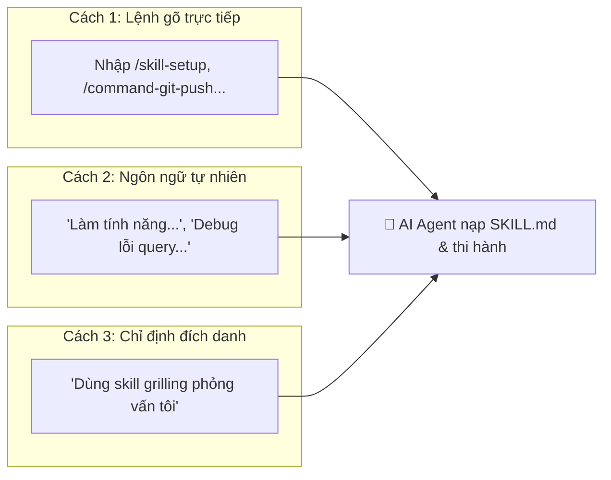
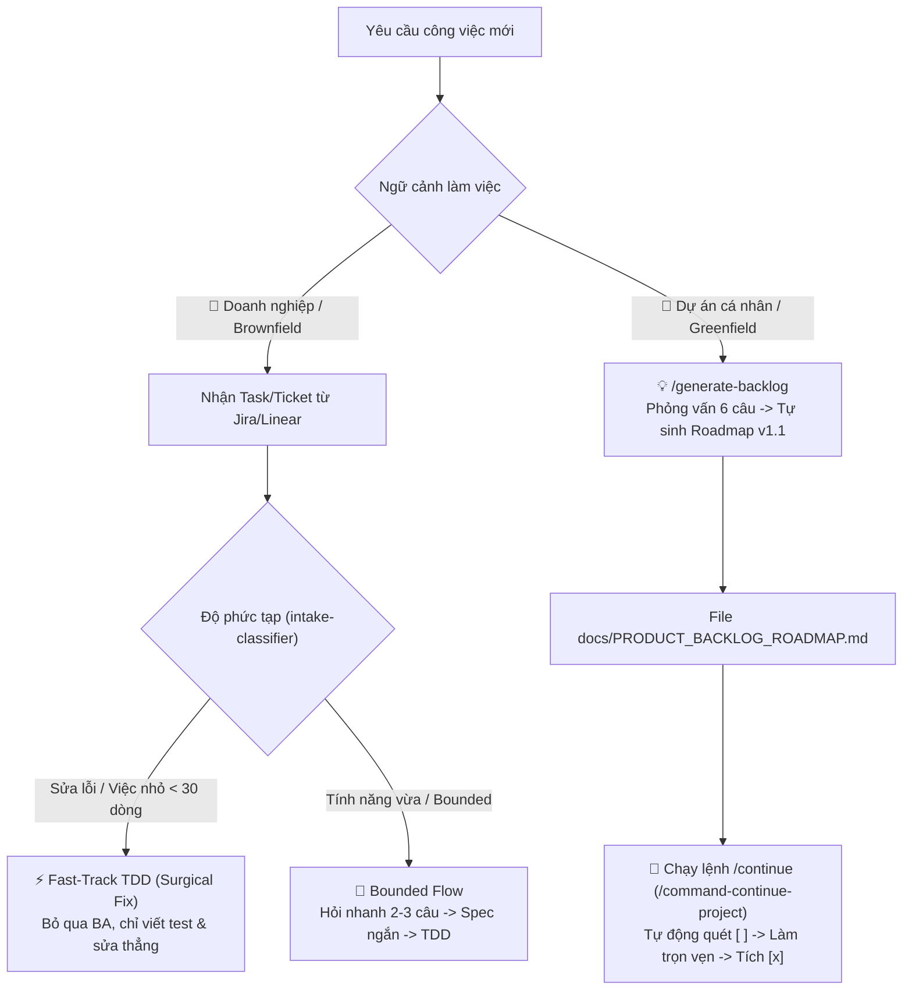
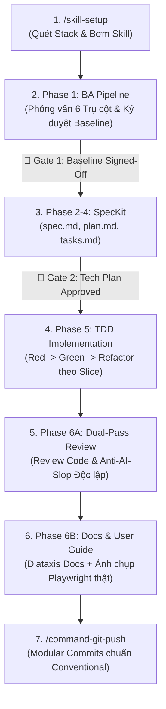

# 🌐 Universal Agentic Development Framework

[](#-ý-nghĩa-cốt-lõi-của-dự-án)
[](#-tính-tương-thích-đa-nền-tảng-ai-multi-ai-universal-support)
[](#-chuẩn-hóa-gói-mở-rộng-ngôn-ngữ-language-pack-standard)
[](#-vòng-đời-phát-triển-chuẩn-7-bước-end-to-end-pipeline)
[](#-vòng-đời-phát-triển-chuẩn-7-bước-end-to-end-pipeline)
[](#-vòng-đời-phát-triển-chuẩn-7-bước-end-to-end-pipeline)
[](#-khóa-bảo-vệ-git-guardrails)

> **Bộ khung quy trình Multi-Agent & Kỹ năng AI cấp doanh nghiệp, hoạt động độc lập với mọi ngôn ngữ lập trình và tương thích với toàn bộ AI Editor hiện đại (Antigravity IDE, Cursor, Claude Code, Windsurf, Copilot).**

---

## 📑 Mục Lục (Table of Contents)

- [🎯 Ý Nghĩa Cốt Lõi Của Dự Án](#-ý-nghĩa-cốt-lõi-của-dự-án)
- [🚀 Hướng Dẫn Bắt Đầu Nhanh (Quickstart)](#-hướng-dẫn-bắt-đầu-nhanh-quickstart)
  - [Phương Án 1: Tích Hợp Vào Dự Án Đang Có (Brownfield)](#phương-án-1-tích-hợp-vào-dự-án-đang-có-brownfield---khuyên-dùng)
  - [Phương Án 2: Khởi Tạo Dự Án Mới Toanh (Greenfield)](#phương-án-2-khởi-tạo-dự-án-mới-toanh-greenfield)
- [🎮 Cách Sử Dụng Bộ Kỹ Năng Trong AI Editor](#-cách-sử-dụng-bộ-kỹ-năng-trong-ai-editor)
- [🎯 2 Kịch Bản Vận Hành Thực Tế: Doanh Nghiệp vs Dự Án Cá Nhân](#-2-kịch-bản-vận-hành-thực-tế-doanh-nghiệp-vs-dự-án-cá-nhân)
- [🌐 Tính Tương Thích Đa Nền Tảng AI (Multi-AI Universal Support)](#-tính-tương-thích-đa-nền-tảng-ai-multi-ai-universal-support)
- [🧩 Chuẩn Hóa Gói Mở Rộng Ngôn Ngữ (Language Pack Standard)](#-chuẩn-hóa-gói-mở-rộng-ngôn-ngữ-language-pack-standard)
- [🔄 Vòng Đời Phát Triển Chuẩn 7 Bước (End-to-End Pipeline)](#-vòng-đời-phát-triển-chuẩn-7-bước-end-to-end-pipeline)
- [⚡ Các Lệnh Tự Động Hóa Hay Dùng (Essential Commands)](#-các-lệnh-tự-động-hóa-hay-dùng-essential-commands)
- [🔒 Khóa Bảo Vệ Git (Guardrails)](#-khóa-bảo-vệ-git-guardrails)
- [🔄 Cập Nhật & Nâng Cấp Thông Minh (Smart Update & 3-Way Hash Engine)](#-cập-nhật--nâng-cấp-thông-minh-smart-update--3-way-hash-engine)
- [📁 Cấu Trúc Thư Mục Chuẩn](#-cấu-trúc-thư-mục-chuẩn)
- [🤝 Đóng Góp & Giấy Phép](#-đóng-góp--giấy-phép)

---

## 🎯 Ý Nghĩa Cốt Lõi Của Dự Án

Trong phát triển phần mềm với AI, các lập trình viên thường đối mặt với 4 vấn đề lớn:

1. **AI Ảo Tưởng (Hallucination)**: Tự biên tự diễn quy tắc nghiệp vụ và phỏng đoán sai yêu cầu.
2. **Kiến Trúc Rác (AI Slop & Shallow Code)**: Viết code chắp vá, phá vỡ ranh giới module, tạo giao diện màu mè rẻ tiền.
3. **Mất Ngữ Cảnh Dài Hạn**: Quên kiến trúc sau vài lượt chat, không lưu lại vết quyết định kỹ thuật.
4. **Ô Nhiễm Git Repo**: Đẩy hàng trăm file prompt, cấu hình AI cá nhân lên repo chung của công ty.

**Universal Agents Workflow** giải quyết triệt để các vấn đề trên bằng mô hình **Hai Mặt Phẳng (Two-Plane Architecture)**:

- **Control Plane (Quản trị Vòng đời)**: Ép AI tuân thủ quy trình công nghiệp nghiêm ngặt: _Khảo sát nghiệp vụ IREB (BA Pipeline) → Đặc tả kỹ thuật (SpecKit) → Lập trình kiểm thử trước (TDD) → Phản biện độc lập kép (Dual-Pass Review) → Đóng gói Modular Commit_.
- **Data Plane (Ngữ cảnh & Tri thức)**: Duy trì từ điển thuật ngữ nhất quán ([CONTEXT.md](CONTEXT.md)), ghi vết quyết định kiến trúc bất biến ([adr/](adr/)), và cơ chế **Scan First** — tự động quét tech stack để chỉ nạp đúng kỹ năng cần thiết, tuyệt đối không làm rác dự án.

---

## 🚀 Hướng Dẫn Bắt Đầu Nhanh (Quickstart)

### Phương Án 1: Tích Hợp Vào Dự Án Đang Có (Brownfield - Khuyên dùng)

Mở terminal ngay tại thư mục dự án bạn đang làm và chạy 1 dòng lệnh duy nhất:

- **🍎 macOS / 🐧 Linux / 🪟 Windows (Git Bash)**:
  ```bash
  curl -fsSL https://raw.githubusercontent.com/ahauy/universal-agents-workflow/main/install.sh | bash
  ```
- **🪟 Windows (PowerShell)**:
  ```powershell
  irm https://raw.githubusercontent.com/ahauy/universal-agents-workflow/main/install.ps1 | iex
  ```

Script sẽ quét Tech Stack, hiển thị menu chọn **Chế độ Quản lý Git** và tích hợp sạch sẽ vào dự án:

| Chế độ Git                        | Khi nào nên dùng?                                             | Ảnh hưởng đến Git Repo                                                       |
| :-------------------------------- | :------------------------------------------------------------ | :--------------------------------------------------------------------------- |
| **🔒 Local-Only** _(Khuyên dùng)_ | Bạn dùng cá nhân, **không muốn đồng nghiệp thấy file AI**.    | Tự động thêm toàn bộ `.agents/`, `.specify/`, `CONTEXT.md` vào `.gitignore`. |
| **🕶️ Stealth Mode**               | Repo công ty khắt khe **cấm sửa cả file `.gitignore` chung**. | Ghi quy tắc ignore vào `.git/info/exclude` cục bộ trên máy.                  |
| **🌐 Team Mode**                  | Cả team đồng thuận cùng dùng AI framework.                    | Theo dõi toàn bộ trên Git để chia sẻ quy chuẩn cho cả đội ngũ.               |
| **⚖️ Hybrid Mode**                | Chia sẻ tài liệu (`CONTEXT.md`, `adr/`), **giấu engine AI**.  | Theo dõi tài liệu trên Git; tự động ignore `.agents/`, prompts, rules.       |

> [!TIP]
> **Đã tích hợp và muốn cập nhật lên bản mới nhất?**
> Bạn không cần cài lại từ đầu! Xem hướng dẫn nâng cấp an toàn bằng 3-Way Hash tại [🔄 Cập Nhật & Nâng Cấp Thông Minh](#-cập-nhật--nâng-cấp-thông-minh-smart-update--3-way-hash-engine).

---

### Phương Án 2: Khởi Tạo Dự Án Mới Toanh (Greenfield)

```bash
git clone https://github.com/ahauy/universal-agents-workflow.git my-new-project
cd my-new-project
rm -rf .git && git init && git branch -M main
```

Sau đó mở dự án trong AI Editor (Antigravity IDE, Cursor, Claude Code, Windsurf) và bắt đầu làm việc.

---

## 🎮 Cách Sử Dụng Bộ Kỹ Năng Trong AI Editor

Bạn có thể kích hoạt các kỹ năng theo 3 cách cực kỳ trực quan:



1. **Gõ lệnh trực tiếp vào khung chat**:
   - `/skill-setup` → Quét Tech Stack và nạp bộ kỹ năng phù hợp.
   - `/generate-backlog` → Phỏng vấn 6 câu và tự sinh Roadmap chuẩn v1.1 từ ý tưởng thô.
   - `/command-continue-project` → Quét Roadmap và tự động làm tiếp User Story kế tiếp.
   - `/command-git-push` → Tự động kiểm tra chất lượng, chia Modular Commits và push an toàn.
   - `/update` → Nâng cấp framework an toàn với động cơ 3-Way Hash.
2. **Kích hoạt tự nhiên (Model-Invoked)**:
   - _"Thiết kế API thanh toán qua Stripe"_ → Tự nạp `api-design`.
   - _"Hàm này bị crash khi concurrency, tìm nguyên nhân"_ → Tự nạp `diagnosing-bugs`.
   - _"Giao diện này nhìn ổn chưa?"_ → Tự nạp `ui-design-review`.
3. **Gọi đích danh kỹ năng**:
   - _"Dùng skill `grilling` để phỏng vấn sâu tôi về tính năng này trước khi code."_
   - _"Chạy `setup-deep-modules` để thiết lập linter ranh giới module."_

---

## 🎯 2 Kịch Bản Vận Hành Thực Tế: Doanh Nghiệp vs Dự Án Cá Nhân

Framework tự động điều chỉnh độ sâu quy trình dựa trên ngữ cảnh làm việc của bạn:



| Tiêu Chí           | 🏢 Doanh Nghiệp (Task Lẻ)                                       | 🚀 Dự Án Cá Nhân (Roadmap)                              |
| :----------------- | :-------------------------------------------------------------- | :------------------------------------------------------ |
| **Nguồn yêu cầu**  | Ticket từ Jira / Linear / Redmine / Asana.                      | File `docs/PRODUCT_BACKLOG_ROADMAP.md`.                 |
| **Cách kích hoạt** | Paste nội dung Ticket vào chat kèm mã task.                     | 1. `/generate-backlog` → 2. `/continue` → 3. `/push`.   |
| **Thủ tục**        | Tối giản, ưu tiên **Fast-Track** để giải quyết nhanh.           | Đầy đủ từ A đến Z (BA → Spec → TDD → Guide).            |
| **Chế độ Git**     | Dùng **`local`** hoặc **`stealth`** (giấu sạch file AI).        | Dùng **`team`** (theo dõi cả roadmap & spec trên Git).  |
| **Commit Message** | Gắn Ticket ID: `fix(invoice): handle null customer (JIRA-892)`. | Gắn Story ID: `feat(auth): implement US-002 login JWT`. |

---

## 🌐 Tính Tương Thích Đa Nền Tảng AI (Multi-AI Universal Support)

Universal Agents Workflow sử dụng tệp **`AGENTS.md` tại thư mục gốc** làm **Single Source of Truth** theo chuẩn mở công nghiệp, kèm theo hệ thống cầu nối tự động:

```
Thư mục dự án đích
├── AGENTS.md                          # ⭐️ Chuẩn mở công nghiệp (Single Source of Truth)
├── CLAUDE.md                          # Cầu nối tự động cho Claude Code
├── .cursorrules                       # Cầu nối tự động cho Cursor IDE
├── .windsurfrules                     # Cầu nối tự động cho Windsurf IDE
├── .github/copilot-instructions.md    # Cầu nối tự động cho GitHub Copilot
└── GEMINI.md                          # Đồng bộ trọn vẹn cho Google Antigravity / Gemini CLI
```

### 🛡️ Chuẩn Hóa Hợp Đồng Gọi Tool & Tương Thích Mọi Dòng LLM

Framework áp dụng bộ chuẩn hóa 3 tầng theo [docs/architecture/MODEL_AND_TOOLCALL_CONTRACT.md](docs/architecture/MODEL_AND_TOOLCALL_CONTRACT.md):

- **Tương thích 100% LLMs**: Hoạt động mượt mà từ Frontier Models (Claude 3.7 Sonnet/Opus, GPT-4o, Gemini 2.0/3.7) đến các Open-Source / Local LLMs (Qwen 2.5 Coder, GLM-4, DeepSeek-V3/R1).
- **Quyền hạn Tools rõ ràng**: Khai báo minh bạch `tools:` (Read-only vs Read-write) ở từng agent để ngăn chặn triệt để tình trạng subagent báo hoàn thành ảo mà không tạo file.
- **Two-Strike Dispatch Fallback**: Tự động chuyển sang thực thi inline an toàn nếu việc điều phối subagent gặp lỗi cú pháp 2 lần, chặn đứng nguy cơ deadlock/retry loop.
- **Đồng bộ Hooks Đa Nền Tảng**: Tự động nhận diện và chuyển đổi hooks tương thích cả **Google Antigravity** (`.agents/hooks.json`) và **Claude Code** (`.claude/settings.json`).

---

## 🧩 Chuẩn Hóa Gói Mở Rộng Ngôn Ngữ (Language Pack Standard)

Mọi ngôn ngữ mở rộng đều tuân thủ nghiêm ngặt **The Language Quad (Bộ Tứ Thành Phần)** theo đặc tả kiến trúc [docs/architecture/LANGUAGE_PACK_SPEC.md](docs/architecture/LANGUAGE_PACK_SPEC.md):

1. **`skills/`**: Hướng dẫn mẫu kiến trúc Deep Modules, Concurrency và Testing đặc thù.
2. **`rules/`**: Tiêu chuẩn cú pháp, an toàn bộ nhớ và phòng chống Anti-Patterns.
3. **`agents/`**: Bộ đôi Subagents chuyên môn hóa (`<lang>-reviewer` và `<lang>-build-resolver`).
4. **`linters/`**: Cấu hình kiểm soát ranh giới module tĩnh (Depguard, SwiftLint, Import-Linter...).

---

## 🔄 Vòng Đời Phát Triển Chuẩn 7 Bước (End-to-End Pipeline)

Mọi tính năng quan trọng đều được vận hành qua 7 bước chuẩn công nghiệp với các cổng kiểm soát (Gates) nghiêm ngặt:



| Bước  | Tên Giai Đoạn               | Kỹ Năng / Subagent Đảm Nhiệm                               | Đầu Ra Bắt Buộc (Artifacts)                                                  |
| :---: | :-------------------------- | :--------------------------------------------------------- | :--------------------------------------------------------------------------- |
| **1** | **Onboarding Stack**        | `/skill-setup`, `setup-workspace`                          | `.agents/catalog.json`, skills, rules & subagents theo stack.                |
| **2** | **Nghiệp Vụ (BA Pipeline)** | `intake-classifier`, `elicitation-interview`, `grilling`   | `.specify/features/<slug>/baseline.md` (**Ký duyệt v1.0**).                  |
| **3** | **Đặc Tả & Thiết Kế**       | `speckit-specify`, `speckit-plan`, `speckit-tasks`         | `spec.md`, `plan.md`, `data-model.md`, `tasks.md`.                           |
| **4** | **Lập Trình TDD**           | `code-explorer`, `backend-developer`, `frontend-developer` | `test-plan.md`, Unit Tests đỏ → xanh, Code tối giản.                         |
| **5** | **Phản Biện Độc Lập**       | `code-reviewer`, `ui-design-review`                        | Báo cáo kiểm tra chuẩn bảo mật, spec fidelity & Anti-AI-Slop.                |
| **6** | **Tài Liệu Hóa**            | `tech-doc-architect`, `command-user-guide`, `archify`      | `docs/features/<slug>/README.md`, `docs/user-guides/<slug>.md`, Share Cards. |
| **7** | **Đóng Gói & Đẩy Mã**       | `/command-git-push`                                        | Tự động chia Modular Commits theo tầng và push an toàn.                      |

> 📖 **Xem hướng dẫn thao tác chi tiết từng bước 1 tại**: [📘 .agents/docs/workflow-step-by-step.md](.agents/docs/workflow-step-by-step.md)

---

## ⚡ Các Lệnh Tự Động Hóa Hay Dùng (Essential Commands)

| Lệnh / Trigger            | Bí Danh           | Mục Đích Sử Dụng                                                         |
| :------------------------ | :---------------- | :----------------------------------------------------------------------- |
| **`/skill-setup`**        | `/setup`          | Quét manifest dự án và tự động cấu hình bộ kỹ năng phù hợp.              |
| **`/generate-backlog`**   | `/create-roadmap` | Phỏng vấn 6 câu và tự sinh roadmap chuẩn chống hallucination.            |
| **`/continue`**           | `/next`           | Quét roadmap, phỏng vấn gỡ blocker `[!]` và kích hoạt làm story kế tiếp. |
| **`/command-git-push`**   | `/push`, `/ship`  | Kiểm tra cổng tài liệu, phân tách Modular Commits và push an toàn.       |
| **`/command-user-guide`** | `/guide`          | Mở Playwright chụp ảnh giao diện thật và viết hướng dẫn sử dụng.         |
| **`/update`**             | `/upgrade`        | Cập nhật framework an toàn với động cơ 3-Way Hash.                       |
| **`/route`**              | `bước tiếp theo?` | Trợ lý thông minh định hướng bước đi hoặc lệnh cần chạy tiếp theo.       |
| **`/wait-what`**          | `nói dễ hiểu hơn` | Yêu cầu AI giải thích lại thuật ngữ bằng ngôn ngữ đời thường.            |

> 📋 **Xem bảng tra cứu đầy đủ toàn bộ 25+ kỹ năng tại**: [📑 .agents/docs/skills-cheatsheet.md](.agents/docs/skills-cheatsheet.md)

---

## 🔒 Khóa Bảo Vệ Git (Guardrails)

Framework tích hợp các script hook kiểm soát cơ học tại [.agents/scripts/hooks/](.agents/scripts/hooks/), bảo vệ dự án khỏi các thao tác nguy hiểm của AI:

- ❌ **Chặn đứng `git push --force` & `git push -f`**: Không thể ghi đè lịch sử nhánh từ xa.
- ❌ **Chặn đứng `git reset --hard` & `git clean -fd`**: Không thể xóa sạch mã nguồn ngoài ý muốn.
- ❌ **Chặn commit trực tiếp vào `main`/`master`**: Bắt buộc tạo nhánh tính năng (`feat/*`, `chore/*`).
- ❌ **Chặn commit chứa mã độc/Secret**: Quét tự động private keys, `.env`, tokens trước khi commit.
- ❌ **Bảo vệ Lockfile đa ngôn ngữ**: Ngăn chặn AI cài nhầm package manager làm lệch lockfile.

---

## 🔄 Cập Nhật & Nâng Cấp Thông Minh (Smart Update & 3-Way Hash Engine)

Hệ thống cập nhật thông minh giải quyết triệt để bài toán **nâng cấp framework mà không làm mất dữ liệu dự án hoặc custom code của người dùng**:

### 3 Cách Kích Hoạt Cập Nhật Nhanh Chóng:

1. **Trực tiếp trong AI Editor (Khuyên dùng)**: Gõ `/update` trong ô chat.
2. **Terminal One-Liner (macOS / Linux / Git Bash)**:
   ```bash
   curl -fsSL https://raw.githubusercontent.com/ahauy/universal-agents-workflow/main/install.sh | bash -s -- --update
   ```
3. **PowerShell (Windows)**:
   ```powershell
   irm https://raw.githubusercontent.com/ahauy/universal-agents-workflow/main/install.ps1 | iex -ArgumentList "-Update"
   ```

> 🛡️ **Xem sơ đồ chi tiết động cơ 3-Way Hash & bảng phân định bảo vệ dữ liệu tại**: [🔄 .agents/docs/smart-update-guide.md](.agents/docs/smart-update-guide.md)

---

## 📁 Cấu Trúc Thư Mục Chuẩn

```text
Thư mục dự án:
├── docs/                               # 🟢 100% TÀI LIỆU HỆ THỐNG DỰ ÁN CỦA BẠN (Diataxis)
│   ├── architecture/                   # Kiến trúc hệ thống, ERD, Language Pack & Model Contracts
│   ├── features/                       # Tài liệu kỹ thuật từng tính năng sản phẩm
│   ├── user-guides/                    # Hướng dẫn sử dụng app có ảnh chụp thật
│   └── PRODUCT_BACKLOG_ROADMAP.md      # Roadmap phát triển sản phẩm (dự án cá nhân)
│
├── .agents/                            # 🤖 BỘ NÃO & ĐỘNG CƠ CỦA AI FRAMEWORK
│   ├── docs/                           # 📚 Hướng dẫn nội bộ của AI Framework
│   │   ├── workflow-step-by-step.md    # Chi tiết 7 bước thực hành
│   │   ├── skills-cheatsheet.md        # Bảng tra cứu toàn bộ kỹ năng
│   │   └── smart-update-guide.md       # Cơ chế nâng cấp 3-Way Hash
│   ├── catalog.json                    # Kho đăng ký động kỹ năng theo stack
│   ├── skills/                         # Kỹ năng Engineering & Productivity
│   ├── agents/                         # Danh mục subagents chuyên môn hóa
│   ├── rules/                          # Quy chuẩn coding style theo ngôn ngữ
│   ├── hooks.json                      # Cấu hình khóa bảo vệ Git & an toàn dữ liệu
│   └── scripts/                        # Bộ công cụ validation, harness adapter & hooks
│       ├── validate-agents.py          # Kiểm định chuẩn hóa tool-call & model contract
│       ├── install-hooks.js            # Tự động đăng ký hooks cho Antigravity & Claude Code
│       ├── update-engine.py            # Động cơ nâng cấp an toàn 3-Way Hash
│       └── hooks/                      # Các khóa bảo vệ cơ học
│
├── .specify/                           # Thư mục chứa đặc tả & hồ sơ BA của các tính năng
├── adr/                                # Hồ sơ lưu vết các quyết định kiến trúc bất biến
├── CONTEXT.md                          # Từ điển thuật ngữ chung (Ubiquitous Language)
├── AGENTS.md                           # ⭐️ Single Source of Truth cho AI Agents
├── GEMINI.md / CLAUDE.md               # Cầu nối đồng bộ cho các AI Editor
├── version.json                        # Nguồn sự thật duy nhất về phiên bản (v1.2.0)
└── install.sh / install.ps1            # Bộ cài đặt & cập nhật tự động (Registry-Driven)
```

---

## 🤝 Đóng Góp & Giấy Phép

Framework được thiết kế theo triết lý mở, trung lập với mọi nền tảng và ngôn ngữ. Mọi đóng góp cải tiến kỹ năng, luật kiểm tra ranh giới kiến trúc hay tối ưu hóa prompt đều được hoan nghênh qua Pull Request!

Phát triển với ❤️ bởi cộng đồng AI Engineer Việt Nam. Giấy phép **MIT License**.
