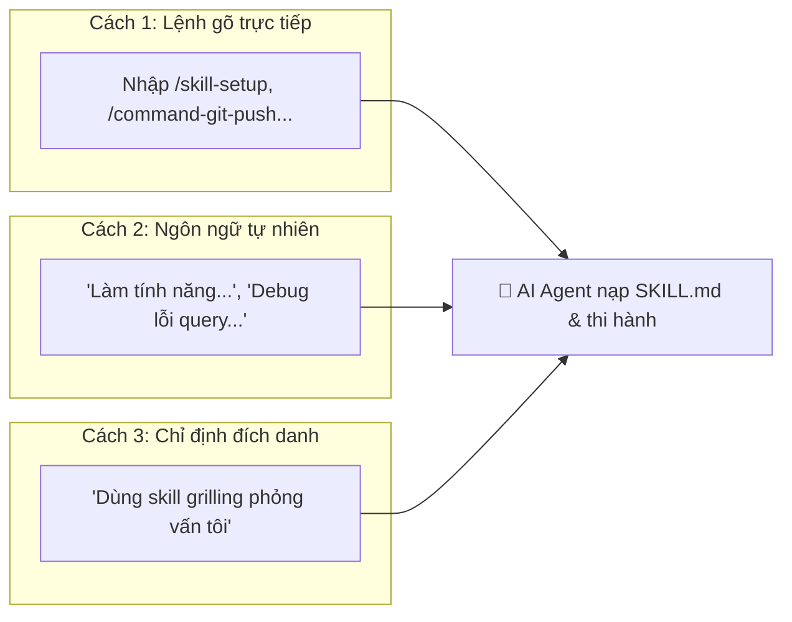
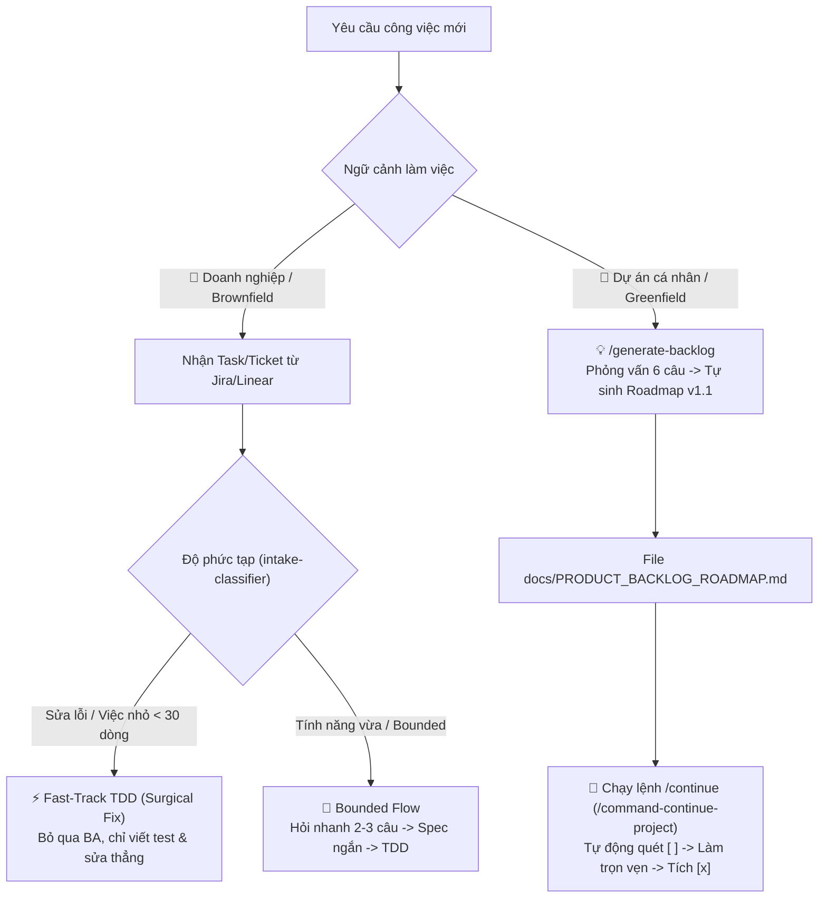
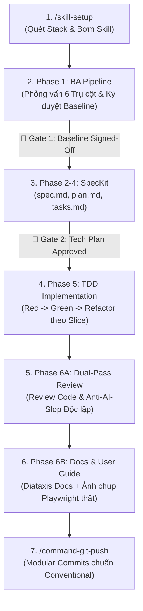
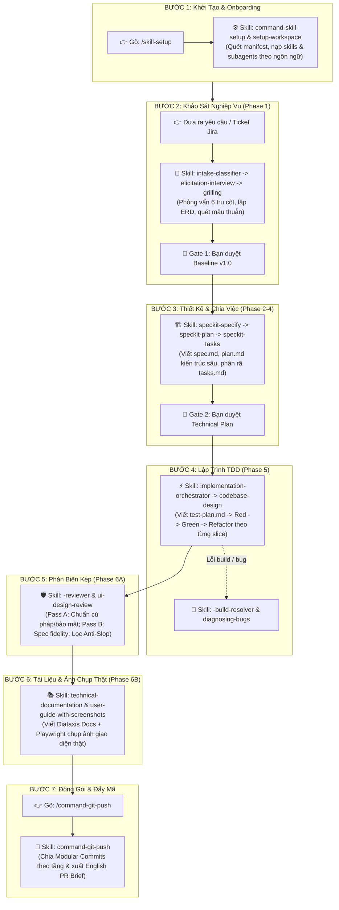

# 🌐 Universal Agentic Development Framework

[](#-ý-nghĩa-cốt-lõi-của-dự-án)
[](#-tính-tương-thích-đa-nền-tảng-ai-multi-ai-universal-support)
[](#-chuẩn-hóa-gói-mở-rộng-ngôn-ngữ-language-pack-standard)
[](#-vòng-đời-phát-triển-chuẩn-7-bước-end-to-end-pipeline)
[](#-4-thực-thi-mã-nguồn-kiến-trúc-sâu--gỡ-lỗi-phase-5-implementation)
[](#-5-thiết-kế-uiux--tiêu-chuẩn-anti-ai-slop-frontend-design)
[](#-khóa-bảo-vệ-git-guardrails)

> **Bộ khung quy trình Multi-Agent & Kỹ năng AI cấp doanh nghiệp, hoạt động độc lập với mọi ngôn ngữ lập trình và tương thích với toàn bộ AI Editor hiện đại (Antigravity IDE, Cursor, Claude Code, Windsurf, Copilot).**

---

## 📑 Mục Lục (Table of Contents)

- [🎯 Ý Nghĩa Cốt Lõi Của Dự Án](#-ý-nghĩa-cốt-lõi-của-dự-án)
- [🚀 Hướng Dẫn Bắt Đầu Nhanh (Quickstart)](#-hướng-dẫn-bắt-đầu-nhanh-quickstart)
  - [Phương Án 1: Tích Hợp Vào Dự Án Đang Có (Brownfield)](#phương-án-1-tích-hợp-vào-dự-án-đang-có-brownfield---khuyên-dùng)
  - [🔄 Cập Nhật Bộ Khung Lên Bản Mới Nhất (Update / Upgrade)](#-cập-nhật-bộ-khung-lên-bản-mới-nhất-update--upgrade)
  - [Phương Án 2: Khởi Tạo Dự Án Mới Toanh (Greenfield)](#phương-án-2-khởi-tạo-dự-án-mới-toanh-greenfield)
- [🎮 Cách Sử Dụng Bộ Kỹ Năng Trong AI Editor](#-cách-sử-dụng-bộ-kỹ-năng-trong-ai-editor)
- [🎯 2 Kịch Bản Vận Hành Thực Tế: Doanh Nghiệp vs Dự Án Cá Nhân](#-2-kịch-bản-vận-hành-thực-tế-doanh-nghiệp-vs-dự-án-cá-nhân)
  - [🏢 Kịch Bản 1: Doanh Nghiệp (Task Lẻ từ Jira/Linear)](#-kịch-bản-1-doanh-nghiệp-nhận-từng-taskticket-lẻ-từ-jira-linear)
  - [🚀 Kịch Bản 2: Dự Án Cá Nhân (Xây dựng theo Roadmap)](#-kịch-bản-2-dự-án-cá-nhân-xây-dựng-từ-đầu-theo-roadmap)
- [🌐 Tính Tương Thích Đa Nền Tảng AI (Multi-AI Universal Support)](#-tính-tương-thích-đa-nền-tảng-ai-multi-ai-universal-support)
- [🧩 Chuẩn Hóa Gói Mở Rộng Ngôn Ngữ (Language Pack Standard)](#-chuẩn-hóa-gói-mở-rộng-ngôn-ngữ-language-pack-standard)
- [🔄 Vòng Đời Phát Triển Chuẩn 7 Bước (End-to-End Pipeline)](#-vòng-đời-phát-triển-chuẩn-7-bước-end-to-end-pipeline)
- [🛠️ Quy Trình Làm Việc Từng Bước 1 Một Với Các Skill](#️-quy-trình-làm-việc-từng-bước-1-một-với-các-skill-step-by-step-practical-workflow)
  - [🔹 Bước 1: Khởi Tạo & Onboarding Dự Án](#-bước-1-khởi-tạo--onboarding-dự-án-onboard--detect-stack)
  - [🔹 Bước 2: Khảo Sát & Phỏng Vấn Nghiệp Vụ (Phase 1)](#-bước-2-khảo-sát--phỏng-vấn-nghiệp-vụ-phase-1-ba-pipeline)
  - [🔹 Bước 3: Đặc Tả Kỹ Thuật & Lập Kế Hoạch (Phase 2-4)](#-bước-3-đặc-tả-kỹ-thuật--lập-kế-hoạch-phase-2-4-speckit-planning)
  - [🔹 Bước 3.5: Dựng Khung Kiến Trúc Hệ Thống (P3→P5 Bridge)](#-bước-35-dựng-khung-kiến-trúc-hệ-thống-p3p5-bridge-scaffold-architecture)
  - [🔹 Bước 4: Lập Trình Chuẩn TDD Theo Lát Cắt (Phase 5)](#-bước-4-lập-trình-chuẩn-tdd-theo-lát-cắt-phase-5-implementation)
  - [🔹 Bước 5: Phản Biện Chất Lượng Độc Lập (Phase 6A)](#-bước-5-phản-biện-chất-lượng-độc-lập-phase-6a-dual-pass-review)
  - [🔹 Bước 6: Biên Soạn Tài Liệu & Hướng Dẫn Kèm Ảnh Thật (Phase 6B)](#-bước-6-biên-soạn-tài-liệu--hướng-dẫn-kèm-ảnh-thật-phase-6b-delivery)
  - [🔹 Bước 7: Đóng Gói Modular Commits & Đẩy Lên Git](#-bước-7-đóng-gói-modular-commits--đẩy-lên-git-ship-it)
  - [💡 Hộp Công Cụ Hỗ Trợ & Cứu Hộ Khi Gặp Khúc Mắc](#-hộp-công-cụ-hỗ-trợ--cứu-hộ-khi-gặp-khúc-mắc)
- [📋 Bảng Tra Cứu Toàn Bộ Kỹ Năng Mặc Định (Cheatsheet)](#-bảng-tra-cứu-toàn-bộ-kỹ-năng-mặc-định-default-skills-cheatsheet)
  - [⚡ 1. Lệnh Tự Động Hóa (Commands)](#-1-lệnh-tự-động-hóa-commands)
  - [🍉 2. Phân Tích Nghiệp Vụ (Phase 1: BA Skill Pack)](#-2-phân-tích-nghiệp-vụ-phase-1-ba-skill-pack)
  - [🏗️ 3. Đặc Tả Kỹ Thuật & Kiến Trúc (Phase 2-4: SpecKit Planning)](#️-3-đặc-tả-kỹ-thuật--kiến-trúc-phase-2-4-speckit-planning)
  - [⚡ 4. Thực Thi Mã Nguồn, Kiến Trúc Sâu & Gỡ Lỗi (Phase 5)](#-4-thực-thi-mã-nguồn-kiến-trúc-sâu--gỡ-lỗi-phase-5-implementation)
  - [🎨 5. Thiết Kế UI/UX & Tiêu Chuẩn Anti-AI-Slop (Frontend Design)](#-5-thiết-kế-uiux--tiêu-chuẩn-anti-ai-slop-frontend-design)
  - [📚 6. Phản Biện Chất Lượng, Tài Liệu & Đóng Gói (Phase 6)](#-6-phản-biện-chất-lượng-tài-liệu--đóng-gói-phase-6-delivery)
  - [🧠 7. Giao Tiếp, Phỏng Vấn & Năng Suất (Productivity)](#-7-giao-tiếp-phỏng-vấn--năng-suất-productivity--collaboration)
- [🔒 Khóa Bảo Vệ Git (Guardrails)](#-khóa-bảo-vệ-git-guardrails)
- [📁 Cấu Trúc Thư Mục Chuẩn](#-cấu-trúc-thư-mục-chuẩn)
- [🤝 Đóng Góp & Giấy Phép](#-đóng-góp--giấy-phép)

---

## 🎯 Ý Nghĩa Cốt Lõi Của Dự Án

Trong phát triển phần mềm với AI, các lập trình viên thường đối mặt với 4 vấn đề lớn:

1. **AI Ảo Tưởng (Hallucination)**: Tự biên tự diễn quy tắc nghiệp vụ và phỏng đoán sai yêu cầu.
2. **Kiến Trúc Rác (AI Slop & Shallow Code)**: Viết code chắp vá, phá vỡ ranh giới module, tạo giao diện màu mè rẻ tiền.
3. **Mất Ngữ Cảnh Dài Hạn**: Quên kiến trúc sau vài lượt chat, không lưu lại vết quyết định kỹ thuật.
4. **Ô Nhiễm Git Repo**: Đẩy hàng trăm file prompt, cấu hình AI cá nhân lên repo chung của công ty.

**Universal Agents Workflow** giải quyết triệt để các vấn đề trên bằng mô hình **Hai Mặt Phẳng (Two-Plane Architecture)**:

- **Control Plane (Quản trị Vòng đời)**: Ép AI tuân thủ quy trình công nghiệp nghiêm ngặt: _Khảo sát nghiệp vụ IREB (BA Pipeline) $\rightarrow$ Đặc tả kỹ thuật (SpecKit) $\rightarrow$ Lập trình kiểm thử trước (TDD) $\rightarrow$ Phản biện độc lập kép (Dual-Pass Review) $\rightarrow$ Đóng gói Modular Commit_.
- **Data Plane (Ngữ cảnh & Tri thức)**: Duy trì từ điển thuật ngữ nhất quán ([CONTEXT.md](CONTEXT.md)), ghi vết quyết định kiến trúc bất biến ([adr/](adr/)), và cơ chế **Scan First** — tự động quét tech stack để chỉ nạp đúng kỹ năng cần thiết, tuyệt đối không làm rác dự án.

---

## 🚀 Hướng Dẫn Bắt Đầu Nhanh (Quickstart)

### Phương Án 1: Tích Hợp Vào Dự Án Đang Có (Brownfield - Khuyên dùng)

Bạn có 2 cách cực kỳ linh hoạt để tích hợp bộ khung vào dự án đang làm:

#### ⚡ Cách 1: Chạy trực tiếp trong dự án của bạn (Không cần clone repo trước)

Mở terminal ngay tại thư mục dự án bạn đang làm và chạy 1 dòng lệnh duy nhất tương ứng với hệ điều hành:

- **🍎 macOS / 🐧 Linux / 🪟 Windows (Git Bash)**:

  ```bash
  curl -fsSL https://raw.githubusercontent.com/ahauy/universal-agents-workflow/main/install.sh | bash
  ```

  _(Hoặc: `/bin/bash -c "$(curl -fsSL https://raw.githubusercontent.com/ahauy/universal-agents-workflow/main/install.sh)"`)_

- **🪟 Windows (PowerShell)**:
  ```powershell
  irm https://raw.githubusercontent.com/ahauy/universal-agents-workflow/main/install.ps1 | iex
  ```

> Script sẽ tự động kéo các thành phần cần thiết từ GitHub về thư mục tạm, quét Tech Stack, hiển thị menu chọn chế độ Git và tích hợp sạch sẽ vào dự án của bạn, sau đó tự động dọn dẹp sạch sẽ.

#### 💻 Cách 2: Chạy từ thư mục đã clone `Universal-Agents-Workflow`

Nếu bạn đã clone thư mục `Universal-Agents-Workflow` về máy:

- **macOS / Linux / Git Bash**:
  ```bash
  ./install.sh /duong-dan/toi/du-an-cua-ban
  ```
- **Windows PowerShell**:
  ```powershell
  .\install.ps1 -Target "D:\duong-dan\toi\du-an"
  ```

---

Cả 2 cách trên đều hiển thị menu tương tác để bạn chọn **Chế độ Quản lý Git**:

```text
? Chọn chế độ quản lý Git cho Universal Agents Workflow trong dự án đích:
  1) 🌐 Team Mode (Shared)                      - Đẩy toàn bộ lên Git, chia sẻ quy chuẩn cho cả team
  2) 🔒 Local-Only Mode (Private .gitignore)     - Thêm toàn bộ workflow vào .gitignore, repo 100% sạch
  3) 🕶️ Stealth Mode (Private .git/info/exclude) - Thêm vào exclude cục bộ, không sửa cả .gitignore repo
  4) ⚖️ Hybrid Mode (Docs on Git, Engine Ignore) - Đẩy CONTEXT/adr/specs, giấu engine AI & skills
```

> [!TIP]
> **Tự động hóa hoàn toàn (Non-interactive cho CI/CD hoặc chạy nhanh)**:
>
> ```bash
> # macOS / Linux / Git Bash:
> curl -fsSL https://raw.githubusercontent.com/ahauy/universal-agents-workflow/main/install.sh | bash -s -- --mode=local -y
>
> # Windows PowerShell:
> .\install.ps1 -Mode local -Yes
> ```

#### 🛡️ Bảng So Sánh 4 Chế Độ Git:

| Chế độ                            | Khi nào nên dùng?                                                                         | Ảnh hưởng đến Git Repo                                                                                 |
| :-------------------------------- | :---------------------------------------------------------------------------------------- | :----------------------------------------------------------------------------------------------------- |
| **🌐 Team Mode**                  | Cả team đồng thuận cùng dùng AI framework.                                                | Theo dõi toàn bộ trên Git (chỉ ignore log tạm).                                                        |
| **🔒 Local-Only** _(Khuyên dùng)_ | Bạn dùng cá nhân, **không muốn đồng nghiệp/khách hàng thấy file AI**.                     | Tự động thêm toàn bộ `.agents/`, `.specify/`, `CONTEXT.md`, `GEMINI.md` vào `.gitignore`.              |
| **🕶️ Stealth Mode**               | Repo công ty khắt khe **cấm sửa cả file `.gitignore` chung**.                             | Ghi quy tắc ignore vào `.git/info/exclude` cục bộ trên máy. File `.gitignore` chung không bị chạm vào. |
| **⚖️ Hybrid Mode**                | Chia sẻ tài liệu nghiệp vụ (`CONTEXT.md`, `adr/`, `.specify/`), nhưng **giấu engine AI**. | Theo dõi tài liệu trên Git; tự động ignore `.agents/`, `GEMINI.md`, `CLAUDE.md`.                       |

> [!IMPORTANT]
> **Nguyên tắc "Scan First - Zero Clutter"**: Bộ khung **KHÔNG BAO GIỜ** copy thư mục chứa toàn bộ ngôn ngữ thừa (`optional-stack-skills`) vào dự án của bạn. Script sẽ quét codebase trước, nếu là dự án Swift/iOS thì giữ sạch 100%; nếu là Go/Python/TypeScript thì chỉ copy duy nhất kỹ năng của ngôn ngữ đó vào `.agents/skills/engineering/`!

---

### 🔄 Cập Nhật Bộ Khung Lên Bản Mới Nhất (Update / Upgrade)

Khi **Universal Agents Workflow** có bản cập nhật mới (ví dụ: thêm kỹ năng mới `scaffold-architecture`, gói ngôn ngữ Flutter, cải tiến prompt agent, cập nhật catalog...), bạn có thể cập nhật cho dự án đang làm chỉ trong vài giây:

#### ⚡ 1. Mở Terminal ngay tại thư mục dự án và chạy lại lệnh One-Liner:

- **🍎 macOS / 🐧 Linux / 🪟 Windows (Git Bash)**:
  ```bash
  curl -fsSL https://raw.githubusercontent.com/ahauy/universal-agents-workflow/main/install.sh | bash
  ```
- **🪟 Windows (PowerShell)**:
  ```powershell
  irm https://raw.githubusercontent.com/ahauy/universal-agents-workflow/main/install.ps1 | iex
  ```

> **🛡️ Cơ chế cập nhật an toàn:**
>
> 1. Tự động đồng bộ và làm mới toàn bộ động cơ `.agents/` (chứa các Agent system prompts, catalog, và kỹ năng mới nhất).
> 2. Chạy lại **Smart Stack Scan** để tự động nhận diện và đề xuất nạp thêm các gói kỹ năng mới phù hợp với codebase hiện tại của bạn.
> 3. Giữ nguyên 100% mã nguồn dự án (`src/`, `lib/`, `tests/`...) và bảo toàn chế độ Git Tracking (`local`, `team`, `stealth`, `hybrid`) bạn đã cấu hình trước đó.

#### 🎮 2. Kích hoạt kỹ năng mới trong AI Editor:

Sau khi script hoàn tất, mở AI Editor và gõ vào ô chat:

```text
/skill-setup
```

AI Agent sẽ tự động nạp các quy tắc và kỹ năng tương thích mới nhất vào phiên làm việc!

---

### Phương Án 2: Khởi Tạo Dự Án Mới Toanh (Greenfield)

```bash
git clone https://github.com/ahauy/universal-agents-workflow.git my-new-project
cd my-new-project
rm -rf .git && git init && git branch -M main
```

Sau đó mở dự án trong AI Editor (Antigravity IDE, Cursor, Claude Code, Windsurf) và bắt đầu làm việc.

---

## 🎮 Cách Sử Dụng Bộ Kỹ Năng Trong AI Editor

Bạn có thể kích hoạt các kỹ năng theo 3 cách cực kỳ trực quan:



1. **Gõ lệnh trực tiếp vào khung chat (Khuyên dùng)**:
   - Gõ `/skill-setup` $\rightarrow$ Quét Tech Stack và kích hoạt bộ kỹ năng tương thích.
   - Gõ `/generate-backlog` $\rightarrow$ Phỏng vấn nghiệp vụ 6 câu và tự sinh Roadmap chuẩn v1.1 từ ý tưởng thô.
   - Gõ `/command-continue-project` $\rightarrow$ Tự động quét Roadmap và làm tiếp User Story kế tiếp.
   - Gõ `/command-git-push` $\rightarrow$ Tự động kiểm tra chất lượng, chia Modular Commits và push an toàn.
   - Gõ `/route` $\rightarrow$ Hỏi Agent xem trong tình huống hiện tại nên đi bước nào tiếp theo.
   - Gõ `/wait-what` $\rightarrow$ Yêu cầu Agent giải thích lại thuật ngữ bằng ngôn ngữ đời thường.
2. **Kích hoạt tự nhiên (Model-Invoked - Không cần nhớ lệnh)**:
   - _"Thiết kế API thanh toán qua Stripe"_ $\rightarrow$ Agent tự nạp `api-design`.
   - _"Hàm này bị crash khi chạy concurrency, tìm nguyên nhân"_ $\rightarrow$ Agent tự nạp `diagnosing-bugs`.
   - _"Giao diện này nhìn ổn chưa?"_ $\rightarrow$ Agent tự nạp `ui-design-review`.
3. **Gọi đích danh kỹ năng**:
   - _"Dùng skill `grilling` để phỏng vấn sâu tôi về tính năng này trước khi code."_
   - _"Chạy `setup-deep-modules` để thiết lập linter ranh giới module."_

---

## 🎯 2 Kịch Bản Vận Hành Thực Tế: Doanh Nghiệp vs Dự Án Cá Nhân

Framework tự động điều chỉnh độ sâu của quy trình dựa trên ngữ cảnh làm việc của bạn:



### 🏢 Kịch Bản 1: Doanh Nghiệp (Nhận từng Task/Ticket lẻ từ Jira, Linear...)

Trong môi trường công ty, bạn **không cần và không nên** tạo file roadmap trong repo vì công ty đã quản lý tiến độ trên Jira/Linear.

1. **Cách giao việc**: Dán trực tiếp nội dung/mã Ticket vào khung chat:
   - _Fix bug nhỏ_: `"Fix bug JIRA-892: Hàm export invoice bị crash khi customer_id = null."`
   - _Task tính năng_: `"Làm task JIRA-405: Thêm trường tax_code vào form checkout và validate định dạng MST Việt Nam."`
2. **Cơ chế xử lý tự động**:
   - **Với Micro-Task / Bug Fix (< 30 dòng - chiếm 70% công việc)**: AI kích hoạt **Fast-Track**, bỏ qua mọi thủ tục BA, đi thẳng vào TDD: _Viết test đỏ $\rightarrow$ Sửa đúng dòng code cần sửa $\rightarrow$ Test xanh $\rightarrow$ Tạo 1 single-line commit_.
   - **Với Bounded Task (30–200 dòng)**: AI chỉ hỏi bạn 2–3 câu làm rõ edge case, tạo spec ngắn rồi code.
3. **Bảo vệ Repo công ty (100% Clean PR)**:
   - Chọn chế độ Git **`local`** hoặc **`stealth`** khi cài đặt. Toàn bộ file của framework (`.agents/`, `.specify/`, prompts) đều được ẩn hoàn toàn.
   - Khi bạn tạo Pull Request, repo công ty **chỉ chứa code sản phẩm và unit test sạch sẽ chuẩn senior**, tuyệt đối không có "rác" AI.

---

### 🚀 Kịch Bản 2: Dự Án Cá Nhân (Xây dựng từ đầu theo Roadmap)

Khi xây dựng sản phẩm cá nhân hoặc MVP từ đầu, bạn làm chủ toàn bộ sản phẩm và có quy trình tự động hóa khép kín từ ý tưởng đến mã nguồn:

1. **Khởi tạo Roadmap từ ý tưởng thô**: Gõ lệnh `/generate-backlog` (hoặc `/create-roadmap`):

   ```bash
   /generate-backlog "Ứng dụng flashcard học từ vựng SRS có AI chấm phát âm"
   ```
   - AI thực hiện phỏng vấn nhanh 6 câu qua 2 đợt (Platform, Auth, Content, Scale, Scope).
   - Tự động sinh file `docs/PRODUCT_BACKLOG_ROADMAP.md` chuẩn schema v1.2 với YAML frontmatter tech-stack, danh mục Won't-Have (scope fence), ma trận MoSCoW & RICE Score, sơ đồ ASCII roadmap, phân rã `Tasks: Backend / Frontend`, chuỗi phụ thuộc (`Depends-on`), độ phức tạp (`Effort: S/M/L/XL`), và Pre-Deploy Hardening checklist.

2. **Kích hoạt tự động hóa toàn diện**: Gõ lệnh `/command-continue-project` (hoặc `/continue`, `/next`).
3. **AI tự động vận hành trọn gói**:
   - Quét roadmap, nạp `$TECH_CONTEXT`, kiểm tra Blocked Gate (`[!]`) và Dependency Gate để bảo đảm không làm tính năng bị khóa/vướng mắc. Nếu gặp story bị chặn `[!]`, AI chủ động đề xuất kích hoạt phiên phỏng vấn `grilling` để tháo gỡ điểm nghẽn ngay.
   - Tự động định tuyến (Auto-routing): Story nhỏ chạy Fast-Track, Story vừa chạy Bounded BA, Story lớn kích hoạt `wayfinder`.
   - Vận hành quy trình phỏng vấn chuẩn `grilling` lấy Acceptance Criteria (AC) trong roadmap làm anchor để đào sâu 6 trụ cột (không hỏi lại những gì đã chốt) $\rightarrow$ Đặc tả SpecKit $\rightarrow$ TDD Implementation $\rightarrow$ Khởi chạy Playwright chụp ảnh màn hình thật lưu vào `docs/user-guides/`.
   - Tự động đánh dấu `[x]` vào User Story vừa hoàn tất và thông báo kết quả.
4. **Đẩy mã nguồn an toàn**: Gõ lệnh `/command-git-push` (hoặc `/push`) để tự động tách modular commits (Spec $\rightarrow$ Backend $\rightarrow$ Frontend $\rightarrow$ Docs) và đẩy lên remote.

---

| Tiêu Chí           | 🏢 Doanh Nghiệp (Task Lẻ)                                           | 🚀 Dự Án Cá Nhân (Roadmap)                                                                                                           |
| :----------------- | :------------------------------------------------------------------ | :----------------------------------------------------------------------------------------------------------------------------------- |
| **Nguồn yêu cầu**  | Ticket từ Jira / Linear / Redmine / Asana.                          | File `docs/PRODUCT_BACKLOG_ROADMAP.md`.                                                                                              |
| **Cách kích hoạt** | Paste nội dung Ticket vào chat kèm mã task.                         | 1. `/generate-backlog` (lập roadmap từ ý tưởng)<br/>2. `/continue` (thực thi từng story)<br/>3. `/push` (commit & đẩy code lên Git). |
| **Thủ tục**        | Tối giản, ưu tiên **Fast-Track** để giải quyết nhanh.               | Đầy đủ từ A đến Z (BA $\rightarrow$ Spec $\rightarrow$ TDD $\rightarrow$ Guide).                                                     |
| **Chế độ Git**     | Dùng **`local`** hoặc **`stealth`** (giấu sạch file AI).            | Dùng **`team`** (theo dõi cả roadmap & spec trên Git).                                                                               |
| **Commit Message** | Gắn kèm Ticket ID: `fix(invoice): handle null customer (JIRA-892)`. | Gắn kèm Story ID: `feat(auth): implement US-002 login JWT`.                                                                          |

---

## 🌐 Tính Tương Thích Đa Nền Tảng AI (Multi-AI Universal Support)

Universal Agents Workflow được thiết kế độc lập hoàn toàn với bất kỳ nhà cung cấp AI nào. Hệ thống sử dụng tệp **`AGENTS.md` tại thư mục gốc** làm **Single Source of Truth** (Chân lý duy nhất) theo chuẩn mở công nghiệp, kèm theo hệ thống cầu nối tự động:

```
Thư mục dự án đích
├── AGENTS.md                          # ⭐️ Chuẩn mở công nghiệp (Single Source of Truth)
├── CLAUDE.md                          # Cầu nối tự động cho Claude Code
├── .cursorrules                       # Cầu nối tự động cho Cursor IDE
├── .windsurfrules                     # Cầu nối tự động cho Windsurf IDE
├── .github/copilot-instructions.md    # Cầu nối tự động cho GitHub Copilot
└── GEMINI.md                          # Đồng bộ trọn vẹn cho Google Antigravity / Gemini CLI
```

> Bất kể bạn hoặc đồng nghiệp mở dự án bằng công cụ AI nào, tất cả đều tuân thủ chung 100% quy trình 7 bước, tiêu chuẩn Anti-AI-Slop và kỷ luật kiểm thử TDD.

---

## 🧩 Chuẩn Hóa Gói Mở Rộng Ngôn Ngữ (Language Pack Standard)

Mọi ngôn ngữ được đưa vào hệ sinh thái đều tuân thủ nghiêm ngặt **The Language Quad (Bộ Tứ Thành Phần)** theo đặc tả kiến trúc [docs/architecture/LANGUAGE_PACK_SPEC.md](docs/architecture/LANGUAGE_PACK_SPEC.md):

1. **`skills/`**: Hướng dẫn mẫu kiến trúc Deep Modules, Concurrency và Testing đặc thù.
2. **`rules/`**: Tiêu chuẩn cú pháp, an toàn bộ nhớ và phòng chống Anti-Patterns.
3. **`agents/`**: Bộ đôi Subagents chuyên môn hóa động (**`<lang>-reviewer`** ở Phase 6A và **`<lang>-build-resolver`** ở Phase 5).
4. **`linters/`**: Cấu hình kiểm soát ranh giới module (Depguard, SwiftLint, Import-Linter...).

Bộ cài đặt `install.sh` và `install.ps1` vận hành theo cơ chế **Universal Registry-Driven Engine** đọc trực tiếp từ `catalog.json` — tự động nhận diện ngôn ngữ dự án đích và nạp chính xác các thành phần cần thiết mà không có file rác.

---

## 🔄 Vòng Đời Phát Triển Chuẩn 7 Bước (End-to-End Pipeline)

Mọi tính năng quan trọng đều được vận hành qua 7 bước chuẩn công nghiệp với các cổng kiểm soát (Gates) nghiêm ngặt:



| Bước  | Tên Giai Đoạn               | Kỹ Năng / Subagent Đảm Nhiệm                               | Đầu Ra Bắt Buộc (Artifacts)                                                                                           |
| :---: | :-------------------------- | :--------------------------------------------------------- | :-------------------------------------------------------------------------------------------------------------------- |
| **1** | **Onboarding Stack**        | `/skill-setup`, `setup-workspace`                          | `.agents/catalog.json`, skills, rules & subagents (`<lang>-reviewer`, `<lang>-build-resolver`) chuyên biệt cho stack. |
| **2** | **Nghiệp Vụ (BA Pipeline)** | `intake-classifier`, `elicitation-interview`, `grilling`   | `.specify/features/<slug>/baseline.md` (**Ký duyệt v1.0**).                                                           |
| **3** | **Đặc Tả & Thiết Kế**       | `speckit-specify`, `speckit-plan`, `speckit-tasks`         | `spec.md`, `plan.md`, `data-model.md`, `tasks.md`.                                                                    |
| **4** | **Lập Trình TDD**           | `code-explorer`, `backend-developer`, `frontend-developer` | `test-plan.md`, Unit Tests đỏ $\rightarrow$ xanh, Code tối giản.                                                      |
| **5** | **Phản Biện Độc Lập**       | `code-reviewer`, `ui-design-review`                        | Báo cáo kiểm tra chuẩn bảo mật, spec fidelity & Anti-AI-Slop.                                                         |
| **6** | **Tài Liệu Hóa**            | `tech-doc-architect`, `command-user-guide`                 | `docs/features/<slug>/README.md`, `docs/user-guides/<slug>.md` (Ảnh thật).                                            |
| **7** | **Đóng Gói & Đẩy Mã**       | `/command-git-push`                                        | Tự động chia Modular Commits theo tầng và push an toàn.                                                               |

> [!TIP]
> **Quy chế Fast-Track cho Micro-Task**: Với các thay đổi nhỏ (< 30 dòng, sửa bug hiển nhiên, đổi biến, sửa typo), `intake-classifier` sẽ tự động chuyển sang luồng **Fast-Track**, bỏ qua toàn bộ hồ sơ BA nặng nề để đi thẳng vào chu trình TDD: _Reproduce $\rightarrow$ Failing Test $\rightarrow$ Fix $\rightarrow$ Verify $\rightarrow$ 1-Line Commit_.

---

## 🛠️ Quy Trình Làm Việc Từng Bước 1 Một Với Các Skill (Step-by-Step Practical Workflow)

Dưới đây là cẩm nang hướng dẫn thao tác thực tế từng bước trong suốt vòng đời dự án: bạn cần gõ lệnh gì, AI sẽ tự động kích hoạt những kỹ năng nào, hành động cụ thể ra sao và cổng kiểm soát ở đâu:



---

### 🔹 Bước 1: Khởi Tạo & Onboarding Dự Án (Onboard & Detect Stack)

- **Thao tác của bạn**: Mở terminal/chat và gõ lệnh:
  ```bash
  /skill-setup
  ```
- **Kỹ năng AI kích hoạt**: [`command-skill-setup`](.agents/skills/engineering/command-skill-setup/SKILL.md) $\rightarrow$ [`setup-workspace`](.agents/skills/productivity/setup-workspace/SKILL.md).
- **Hành động cụ thể của AI**:
  1. Tự động quét các tệp manifest trong dự án (`Package.swift`, `go.mod`, `pyproject.toml`, `package.json`, `Cargo.toml`).
  2. Đối chiếu với `.agents/catalog.json` và hiển thị danh mục các kỹ năng, quy tắc cú pháp và subagents chuyên biệt cần nạp.
  3. Hỏi bạn về chế độ quản lý Git (`local`, `stealth`, `team`, `hybrid`) để cấu hình `.gitignore` tự động.
- **Kết quả đầu ra**: Thư mục `.agents/` được cấu hình đầy đủ, không có tệp thừa.

---

### 🔹 Bước 2: Khảo Sát & Phỏng Vấn Nghiệp Vụ (Phase 1: BA Pipeline)

- **Thao tác của bạn**: Cung cấp mô tả tính năng mới (ví dụ: paste nội dung Ticket Jira, Linear hoặc ý tưởng của bạn).
- **Kỹ năng AI kích hoạt**: [`intake-classifier`](.agents/skills/engineering/intake-classifier/SKILL.md) $\rightarrow$ [`elicitation-interview`](.agents/skills/engineering/elicitation-interview/SKILL.md) (kèm [`grilling`](.agents/skills/productivity/grilling/SKILL.md)) $\rightarrow$ [`domain-modeling`](.agents/skills/engineering/domain-modeling/SKILL.md) $\rightarrow$ [`spec-writer`](.agents/skills/engineering/spec-writer/SKILL.md) $\rightarrow$ [`spec-validator`](.agents/skills/engineering/spec-validator/SKILL.md) $\rightarrow$ [`handover`](.agents/skills/engineering/handover/SKILL.md).
- **Hành động cụ thể của AI**:
  1. **`intake-classifier`** phân loại:
     - Nếu là task nhỏ (< 30 dòng, sửa bug/typo): Chuyển thẳng sang **Fast-Track** (đi thẳng tới Bước 4 TDD).
     - Nếu là tính năng chuẩn/epic: Tạo thư mục `.specify/features/<slug>/`.
  2. **`elicitation-interview`** (🛑 **Customer Gate Bắt Buộc**): AI **dừng lại phỏng vấn bạn** 2-3 câu hỏi mỗi đợt xoay quanh 6 trụ cột nghiệp vụ: Phân quyền RBAC, Máy trạng thái, Luật tính toán/nghiệp vụ, Kịch bản biên (Edge cases), Dữ liệu & Phi chức năng NFRs. _(AI tuyệt đối không được tự ý bịa đặt luật)_.
  3. **`domain-modeling`**: Xây dựng ma trận RBAC, biểu đồ Mermaid, đặt mã luật `BR-###`.
  4. **`spec-writer`** & **`spec-validator`**: Biên soạn User Stories chuẩn `Given-When-Then` và kiểm định theo chuẩn IEEE 29148.
- **🛑 Cổng kiểm soát (Gate 1 — Baseline Signed-Off)**: AI trình bản tóm tắt Baseline và yêu cầu bạn duyệt: _"Đồng ý ký duyệt Baseline v1.0"_.

---

### 🔹 Bước 3: Đặc Tả Kỹ Thuật & Lập Kế Hoạch (Phase 2-4: SpecKit Planning)

- **Thao tác của bạn**: Sau khi ký duyệt Baseline, ra lệnh: _"Tiến hành thiết kế kỹ thuật và lập kế hoạch tasks"_.
- **Kỹ năng AI kích hoạt**: [`speckit-specify`](.agents/skills/engineering/speckit-specify/SKILL.md) $\rightarrow$ [`speckit-plan`](.agents/skills/engineering/speckit-plan/SKILL.md) (kèm [`codebase-design`](.agents/skills/engineering/codebase-design/SKILL.md)) $\rightarrow$ [`speckit-tasks`](.agents/skills/engineering/speckit-tasks/SKILL.md) $\rightarrow$ [`speckit-analyze`](.agents/skills/engineering/speckit-analyze/SKILL.md).
- **Hành động cụ thể của AI**:
  1. **`speckit-specify`**: Chuyển đổi yêu cầu thành `spec.md` chứa định dạng DTOs, API contracts và data schema.
  2. **`speckit-plan`**: Tạo `plan.md`, áp dụng nguyên lý Deep Modules (giao diện đơn giản, che giấu chi tiết phức tạp).
  3. **`speckit-tasks`**: Phân rã công việc thành `tasks.md` theo thứ tự độc lập có thể kiểm thử riêng biệt (Seam Discipline).
  4. **`speckit-analyze`**: Quét đối chiếu chéo đảm bảo kế hoạch khớp 100% với spec.
- **🛑 Cổng kiểm soát (Gate 2 — Tech Plan Approved)**: Bạn xem lại và phê duyệt `plan.md` cùng `tasks.md`.

---

### 🔹 Bước 3.5: Dựng Khung Kiến Trúc Hệ Thống (P3→P5 Bridge: Scaffold Architecture)

- **Thao tác của bạn**: Sau khi phê duyệt `plan.md`, ra lệnh: _"Dựng khung thư mục và kiến trúc cho feature này"_.
- **Kỹ năng AI kích hoạt**: [`scaffold-architecture`](.agents/skills/engineering/scaffold-architecture/SKILL.md).
- **Hành động cụ thể của AI**:
  1. Đọc `CONTEXT.md`, `plan.md`, `data-model.md` để hiểu stack và domain.
  2. **🛑 Hỏi user xác nhận blueprint** — luôn hỏi, không tự chọn:
     - **A — C4 Layered** (`controllers/ → services/ → repositories/`): REST APIs, backend TypeScript/Go/Python.
     - **B — Hexagonal / Ports & Adapters** (`domain/ → ports/ → adapters/`): Microservices, domain-first, Rust/Java.
     - **C — Feature-Based Modules** (`features/<name>/`): Flutter, React Native, fullstack apps.
  3. Sinh thư mục và seed các file nền (`shared/types/`, `shared/errors/`, entry index).
  4. Ghi `adr/ADR-ARCH-001-architecture-blueprint.md` (nếu chưa tồn tại).
  5. Cập nhật **Module Map** trong `CONTEXT.md`.
- **Kết quả**: `backend-developer` và `frontend-developer` có sẵn scaffold để điền code — không bắt đầu từ màn hình trắng.

---

### 🔹 Bước 4: Lập Trình Chuẩn TDD Theo Lát Cắt (Phase 5: Implementation)

- **Thao tác của bạn**: Ra lệnh: _"Bắt đầu code theo task"_ (hoặc gõ `/command-continue-project` nếu làm theo roadmap).
- **Kỹ năng AI kích hoạt**: [`implementation-orchestrator`](.agents/skills/engineering/implementation-orchestrator/SKILL.md) $\rightarrow$ [`api-design`](.agents/skills/engineering/api-design/SKILL.md) / [`frontend-design`](.agents/skills/engineering/frontend-design/SKILL.md) $\rightarrow$ `<lang>-build-resolver`.
- **Hành vi cụ thể của AI**:
  1. Tự động chia việc thành các lát cắt dọc: **Data $\rightarrow$ Logic $\rightarrow$ API $\rightarrow$ UI**.
  2. Triển khai theo chu trình **TDD (Test-Driven Development)**:
     - Tạo `test-plan.md` ánh xạ từng kịch bản User Story sang Test Case (`TC-###`).
     - **🔴 Red**: Viết kiểm thử trước (chạy fail).
     - **🟢 Green**: Viết lượng mã tối thiểu để kiểm thử chuyển sang màu xanh (pass).
     - **🔵 Refactor**: Tối ưu hóa mã nguồn mà không làm gãy test.
  3. **Khi gặp lỗi biên dịch / build**: AI tự động gọi **`<lang>-build-resolver`** (ví dụ `swift-build-resolver`, `go-build-resolver`) chẩn đoán đúng lệnh và sửa lỗi tối thiểu.
  4. **Khi gặp bug hóc búa / flaky test**: Tự động kích hoạt [`diagnosing-bugs`](.agents/skills/engineering/diagnosing-bugs/SKILL.md) theo chu trình 6 pha tìm root cause khoa học.

---

### 🔹 Bước 5: Phản Biện Chất Lượng Độc Lập (Phase 6A: Dual-Pass Review)

- **Thao tác của bạn**: AI tự động chuyển sang bước này ngay khi toàn bộ test của Phase 5 vượt qua.
- **Kỹ năng AI kích hoạt**: `<lang>-reviewer` (hoặc `code-reviewer`) & [`ui-design-review`](.agents/skills/engineering/ui-design-review/SKILL.md) (kèm [`ui-taste-pro`](.agents/skills/engineering/ui-taste-pro/SKILL.md)).
- **Hành vi cụ thể của AI**:
  1. **Code Review Độc Lập (2 Lượt)**:
     - _Pass A_: Kiểm tra quy chuẩn cú pháp, bảo mật, memory leak (`[weak self]`, unwrap `!`, race conditions).
     - _Pass B_: Đối chiếu độ khớp mã nguồn với User Stories ban đầu.
  2. **UI Review Độc Lập (Nếu có giao diện)**:
     - Kích hoạt **`ui-taste-pro`**: Quét sạch AI-slop (cấm gradient neon, chỉ dùng 1px hairline border, hover physics ổn định).
     - Đảm bảo đạt chuẩn tiếp cận quốc tế [`frontend-a11y`](.agents/skills/engineering/frontend-a11y/SKILL.md) (WCAG 2.1 AA).
- **🛑 Cổng chất lượng (Bug Severity Gate)**: Nghiêm cấm merge hoặc bàn giao nếu còn tồn tại lỗi mức `Critical`.

---

### 🔹 Bước 6: Biên Soạn Tài Liệu & Hướng Dẫn Kèm Ảnh Thật (Phase 6B: Delivery)

- **Thao tác của bạn**: Gõ `/command-user-guide <slug>` (hoặc AI tự động kích hoạt sau review).
- **Kỹ năng AI kích hoạt**: [`technical-documentation`](.agents/skills/engineering/technical-documentation/SKILL.md) $\rightarrow$ [`user-guide-with-screenshots`](.agents/skills/engineering/user-guide-with-screenshots/SKILL.md) $\rightarrow$ [`verification-before-completion`](.agents/skills/engineering/verification-before-completion/SKILL.md).
- **Hành vi cụ thể của AI**:
  1. **`technical-documentation`**: Tạo tài liệu kỹ thuật chuẩn Diataxis tại `docs/features/<slug>/README.md`.
  2. **`user-guide-with-screenshots`**: Tự động mở trình duyệt Playwright, chụp ảnh màn hình thật của giao diện và xuất tài liệu tại `docs/user-guides/<slug>.md`.
  3. **`verification-before-completion`**: Lưu vết kết quả kiểm thử thực tế và cập nhật `CHANGELOG.md`.

---

### 🔹 Bước 7: Đóng Gói Modular Commits & Đẩy Lên Git (Ship It)

- **Thao tác của bạn**: Gõ lệnh:
  ```bash
  /command-git-push
  ```
  _(hoặc `/push`, `/ship`)_
- **Kỹ năng AI kích hoạt**: [`command-git-push`](.agents/skills/engineering/command-git-push/SKILL.md).
- **Hành vi cụ thể của AI**:
  1. Kiểm tra cổng tài liệu (User Guide Gate) đối với các thay đổi UI.
  2. Tự động chia nhỏ thay đổi thành các **Modular Commits** theo tầng:
     - `docs(spec)`: Hồ sơ BA & đặc tả
     - `feat(shared-types)`: Contracts & DTOs
     - `feat(api)`: Backend & Logic
     - `feat(ui)`: Frontend giao diện
     - `docs`: Tài liệu kỹ thuật & User Guide
  3. Đẩy an toàn lên remote branch (`git push origin <branch>`), tự động xử lý rebase conflict nếu có.
  4. Xuất sẵn bản mô tả **Pull Request bằng tiếng Anh** để bạn copy thẳng lên GitHub.

---

### 💡 Hộp Công Cụ Hỗ Trợ & Cứu Hộ Khi Gặp Khúc Mắc

| Tình Huống / Khúc Mắc                            | Bạn Nên Gõ Gì?                        | Kỹ Năng Kích Hoạt                                                           | Giá Trị Thực Tế                                                                   |
| :----------------------------------------------- | :------------------------------------ | :-------------------------------------------------------------------------- | :-------------------------------------------------------------------------------- |
| **Không biết bước tiếp theo nên làm gì?**        | `/route` (hoặc `bước tiếp theo?`)     | [`route`](.agents/skills/productivity/route/SKILL.md)                       | Trợ lý định hướng gợi ý chính xác lệnh hoặc skill cần chạy kế tiếp.               |
| **AI giải thích quá hàn lâm, khó hiểu?**         | `/wait-what` (hoặc `nói dễ hiểu hơn`) | [`wait-what`](.agents/skills/productivity/wait-what/SKILL.md)               | Ép AI diễn giải lại bằng ngôn ngữ đời thường, lược bỏ jargon.                     |
| **Cần lấy ý kiến từ khách hàng/stakeholder?**    | `tạo khảo sát cho client`             | [`to-questionnaire`](.agents/skills/productivity/to-questionnaire/SKILL.md) | Xuất bảng câu hỏi cấu trúc rõ ràng để gửi bất đồng bộ.                            |
| **Bài toán quá lớn, mờ mịt chưa biết bắt đầu?**  | `lập bản đồ quyết định`               | [`wayfinder`](.agents/skills/engineering/wayfinder/SKILL.md)                | Phân rã mục tiêu lớn thành Decision Tickets giải quyết từng phần.                 |
| **Sắp hết giờ làm việc / đầy context window?**   | `/handoff` (hoặc `bàn giao ca`)       | [`handoff`](.agents/skills/productivity/handoff/SKILL.md)                   | Nén và đóng gói toàn bộ trạng thái phiên làm việc để phiên sau tiếp quản mượt mà. |
| **Xong một tính năng muốn tối ưu hóa workflow?** | `/retro` (hoặc `hồi cứu`)             | [`retro`](.agents/skills/productivity/retro/SKILL.md)                       | Phân tích những điểm chưa mượt để tự động tinh chỉnh rules và skills.             |

---

## 📋 Bảng Tra Cứu Toàn Bộ Kỹ Năng Mặc Định (Default Skills Cheatsheet)

Để dễ dàng theo dõi và kích hoạt đúng thời điểm, toàn bộ các kỹ năng mặc định được phân nhóm theo từng giai đoạn trong vòng đời phát triển:

### ⚡ 1. Lệnh Tự Động Hóa (Commands)

| Lệnh / Trigger                  | Bí Danh (Aliases)                      | Ý Nghĩa & Giá Trị Thực Tế                                                                                                | Khi Nào Sử Dụng?                                         |
| :------------------------------ | :------------------------------------- | :----------------------------------------------------------------------------------------------------------------------- | :------------------------------------------------------- |
| **`/skill-setup`**              | `/setup`, `/setup-workspace`           | Quét manifest dự án, đối chiếu `catalog.json` và tự động nạp kỹ năng phù hợp.                                            | Khi mới tích hợp workflow vào dự án hoặc đổi tech stack. |
| **`/command-generate-backlog`** | `/generate-backlog`, `/create-roadmap` | Phỏng vấn nghiệp vụ 6 câu và tự sinh roadmap chuẩn schema v1.1 chống hallucination.                                      | Bắt đầu dự án mới hoặc khi có ý tưởng sản phẩm từ đầu.   |
| **`/command-continue-project`** | `/continue`, `/next`                   | Quét `PRODUCT_BACKLOG_ROADMAP.md`, phỏng vấn `grilling` gỡ blocker `[!]` và kích hoạt chu trình làm tính năng tiếp theo. | Trong dự án cá nhân/greenfield phát triển theo roadmap.  |
| **`/command-git-push`**         | `/push`, `/ship`                       | Kiểm tra cổng tài liệu, phân tách commit theo tầng (Modular Commit) và push an toàn.                                     | Khi hoàn thành tính năng hoặc sửa lỗi cần đẩy lên Git.   |
| **`/command-user-guide`**       | `/user-guide`, `/guide`                | Khởi chạy Playwright chụp ảnh giao diện thực tế và viết tài liệu hướng dẫn.                                              | Sau khi hoàn thiện giao diện người dùng.                 |

---

### 🍉 2. Phân Tích Nghiệp Vụ (Phase 1: BA Skill Pack)

| Kỹ Năng                          | Ý Nghĩa Ngắn Gọn & Giá Trị Thực Tế                                                                       | Khi Nào Sử Dụng?                                       |
| :------------------------------- | :------------------------------------------------------------------------------------------------------- | :----------------------------------------------------- |
| **`intake-classifier`**          | Đo lường độ phức tạp yêu cầu; phân luồng **Fast-Track** (cho task nhỏ < 30 dòng) hoặc **Full Pipeline**. | Điểm khởi đầu bắt buộc cho mọi yêu cầu mới.            |
| **`elicitation-interview`**      | Phỏng vấn trực tiếp 6 trụ cột nghiệp vụ (RBAC, State, Rules, Flows, Data, NFRs); cấm AI tự bịa đặt.      | Giai đoạn 2 của BA Pipeline khi làm tính năng mới.     |
| **`gap-analysis`**               | Phân tích mã nguồn và schema hiện tại; đối chiếu hiện trạng AS-IS với mục tiêu tương lai TO-BE.          | Khi làm tính năng lớn cần hiểu rõ mã nguồn cũ.         |
| **`domain-modeling`**            | Thiết kế ERD dữ liệu, ma trận phân quyền RBAC, biểu đồ trạng thái Mermaid và bộ luật `BR-###`.           | Xác lập mô hình nghiệp vụ trước khi thiết kế kỹ thuật. |
| **`risk-contradiction-scanner`** | Quét mâu thuẫn logic, rà soát bế tắc trạng thái, lập bảng rủi ro và chốt phạm vi theo MoSCoW.            | Kiểm toán an toàn nghiệp vụ trước khi viết spec.       |
| **`spec-writer`**                | Biên soạn hồ sơ nghiệp vụ BRD, PRD, SRS và các User Stories chuẩn `Given-When-Then`.                     | Xuất tài liệu đặc tả nghiệp vụ chính thức.             |
| **`spec-validator`**             | Thẩm định chất lượng yêu cầu đối chiếu theo 8 tiêu chí chuẩn công nghiệp IEEE 29148.                     | Cổng kiểm định chất lượng spec trước khi bàn giao.     |
| **`handover`**                   | Rà soát toàn bộ điều kiện nghiệm thu, ký duyệt `baseline.md v1.0` và bàn giao cho System Architect.      | Cổng kết thúc Phase 1, chuyển giao sang SpecKit.       |

---

### 🏗️ 3. Đặc Tả Kỹ Thuật & Kiến Trúc (Phase 2-4: SpecKit Planning)

| Kỹ Năng                     | Ý Nghĩa Ngắn Gọn & Giá Trị Thực Tế                                                                           | Khi Nào Sử Dụng?                                                            |
| :-------------------------- | :----------------------------------------------------------------------------------------------------------- | :-------------------------------------------------------------------------- |
| **`speckit-specify`**       | Chuyển đổi baseline nghiệp vụ đã ký duyệt thành đặc tả kỹ thuật chi tiết (`spec.md`).                        | Phase 2: Xác định rõ ràng các API contracts và luồng dữ liệu.               |
| **`speckit-plan`**          | Lập kế hoạch kiến trúc sâu (`plan.md` với **C4 diagrams + Module Boundary Map**), DTO contracts, data model. | Phase 3: Thiết kế cấu trúc hệ thống và visual architecture trước khi code.  |
| **`speckit-tasks`**         | Phân rã kế hoạch thành danh sách tác vụ (`tasks.md`) theo thứ tự độc lập và ranh giới seam.                  | Phase 4: Lập danh sách công việc sẵn sàng để thực thi TDD.                  |
| **`scaffold-architecture`** | Dựng khung thư mục, seed base files, ghi ADR-ARCH-001, cập nhật Module Map. Luôn hỏi user chọn blueprint.    | **Phase 3.5 (P3→P5 Bridge)**: Sau plan, trước code — tạo nền cho subagents. |
| **`speckit-analyze`**       | Đối chiếu chéo spec, plan và tasks để đảm bảo không sót yêu cầu nào từ baseline.                             | Trước khi bắt đầu viết mã để loại bỏ rủi ro sai lệch.                       |

---

### ⚡ 4. Thực Thi Mã Nguồn, Kiến Trúc Sâu & Gỡ Lỗi (Phase 5: Implementation)

| Kỹ Năng                             | Ý Nghĩa Ngắn Gọn & Giá Trị Thực Tế                                                                            | Khi Nào Sử Dụng?                                             |
| :---------------------------------- | :------------------------------------------------------------------------------------------------------------ | :----------------------------------------------------------- |
| **`implementation-orchestrator`**   | Điều phối lập trình theo từng lát cắt độc lập (Data $\rightarrow$ Logic $\rightarrow$ API $\rightarrow$ UI).  | Phase 5: Quản lý các subagent thực thi theo TDD.             |
| **`codebase-design`**               | Thiết kế Deep Modules theo John Ousterhout: giao diện đơn giản, giấu chi tiết cài đặt, làm lộ ranh giới sạch. | Khi tạo module mới, thiết kế service hoặc refactor.          |
| **`api-design`**                    | Thiết kế REST API chuẩn mực (HTTP verbs, status codes, query pagination, versioning `/api/v1/`).              | Khi xây dựng hoặc sửa đổi endpoints backend.                 |
| **`setup-deep-modules`**            | Tự động cài đặt và cấu hình linter kiểm soát ranh giới import tĩnh (`depguard`, `import-linter`, `cruiser`).  | Khóa ranh giới kiến trúc tự động, cấm import chéo.           |
| **`improve-codebase-architecture`** | Quét các điểm nóng mã nguồn (hotspots, churn), sinh báo cáo HTML trực quan và ghi nhận ADR.                   | Khi audit kiến trúc hoặc chuẩn bị cho đợt tái cấu trúc lớn.  |
| **`diagnosing-bugs`**               | Quy trình 6 bước chẩn đoán lỗi phức tạp, flaky test hoặc crash mà không bao giờ đoán mò.                      | Khi gặp lỗi khó tái hiện hoặc nghi ngờ có regression.        |
| **`prototype`**                     | Dựng bản nháp throwaway HTML độc lập để thử nghiệm luồng/giao diện trước khi viết mã production.              | Khi phương án UI hoặc máy trạng thái chưa chắc chắn.         |
| **`e2e-testing`**                   | Thiết kế và vận hành bộ kiểm thử tự động End-to-End toàn diện với Playwright.                                 | Kiểm thử tích hợp luồng người dùng từ giao diện đến backend. |
| **`resolving-merge-conflicts`**     | Giải quyết xung đột Git từng khối (hunk-by-hunk) dựa trên chủ đích mã nguồn, không làm mất code.              | Khi merge hoặc rebase nhánh bị xung đột.                     |
| **`wizard`**                        | Hướng dẫn tự động hóa thiết lập môi trường, biến môi trường `.env` và cấu hình cloud an toàn.                 | Khi cấu hình dự án mới hoặc deploy hạ tầng.                  |

---

### 🎨 5. Thiết Kế UI/UX & Tiêu Chuẩn Anti-AI-Slop (Frontend Design)

| Kỹ Năng                     | Ý Nghĩa Ngắn Gọn & Giá Trị Thực Tế                                                                         | Khi Nào Sử Dụng?                                            |
| :-------------------------- | :--------------------------------------------------------------------------------------------------------- | :---------------------------------------------------------- |
| **`ui-taste-pro`**          | Bộ quy chuẩn Anti-AI-Slop: cấm gradient neon tùy tiện, chỉ dùng viền hairline 1px, typography có phân cấp. | Bộ lọc bắt buộc cho mọi mã nguồn giao diện.                 |
| **`design-taste-frontend`** | Tiêu chuẩn thẩm mỹ thị giác hiện đại dành cho Landing Page, Marketing Page và Public Surfaces.             | Khi thiết kế trang công cộng cần gây ấn tượng mạnh.         |
| **`design-taste-product`**  | Tiêu chuẩn thiết kế giao diện ứng dụng chuyên sâu: Dashboard, Bảng dữ liệu, Form nhập liệu phức tạp.       | Khi xây dựng in-app UI, admin portal, ứng dụng web/desktop. |
| **`motion-design`**         | Tiêu chuẩn hiệu ứng chuyển động, easing curves, tương tác vi mô và hỗ trợ `prefers-reduced-motion`.        | Khi tạo animations, transitions mượt mà không gây giật lag. |
| **`frontend-a11y`**         | Tiêu chuẩn tiếp cận người dùng khuyết tật đạt chuẩn quốc tế WCAG 2.1 AA (ARIA, phím tắt, tương phản màu).  | Kiểm tra tính tiếp cận cho ứng dụng web/mobile.             |
| **`ui-design-review`**      | Quy trình phản biện giao diện kép (Pass A: Anti-Slop & Design System; Pass B: Spec & UX Fidelity).         | Phase 6A: Audit visual giao diện trước khi bàn giao.        |

---

### 📚 6. Phản Biện Chất Lượng, Tài Liệu & Đóng Gói (Phase 6: Delivery)

| Kỹ Năng                              | Ý Nghĩa Ngắn Gọn & Giá Trị Thực Tế                                                                          | Khi Nào Sử Dụng?                                        |
| :----------------------------------- | :---------------------------------------------------------------------------------------------------------- | :------------------------------------------------------ |
| **`verification-before-completion`** | Thu thập bằng chứng kiểm thử thực tế (test output, log) chứng minh code hoạt động trước khi chốt task.      | Bước cuối cùng của Phase 6 trước khi tạo commit.        |
| **`technical-documentation`**        | Soạn thảo tài liệu kỹ thuật tính năng theo chuẩn 4 góc Diataxis (Tutorial, How-To, Reference, Explanation). | Phase 6B: Lưu vào `docs/features/<slug>/README.md`.     |
| **`user-guide-with-screenshots`**    | Khởi chạy Playwright chụp ảnh màn hình thật và viết tài liệu hướng dẫn cho người dùng cuối.                 | Phase 6B: Lưu vào `docs/user-guides/<slug>.md`.         |
| **`writing-for-agents`**             | Kỹ thuật viết tài liệu, rules và hướng dẫn được tối ưu hóa cho AI Agents dễ hiểu và làm theo.               | Khi bổ sung kỹ năng mới hoặc viết prompts cho subagent. |

---

### 🧠 7. Giao Tiếp, Phỏng Vấn & Năng Suất (Productivity & Collaboration)

| Kỹ Năng                | Ý Nghĩa Ngắn Gọn & Giá Trị Thực Tế                                                                           | Khi Nào Sử Dụng?                                                 |
| :--------------------- | :----------------------------------------------------------------------------------------------------------- | :--------------------------------------------------------------- |
| **`grilling`**         | Kỹ thuật phỏng vấn đào sâu, liên tục đặt câu hỏi sắc bén để lột trần mọi giả định ngầm.                      | Sử dụng trong Phase 1 Elicitation hoặc khi làm rõ yêu cầu mơ hồ. |
| **`wait-what`**        | Yêu cầu AI diễn giải lại các đề xuất hoặc thuật ngữ phức tạp bằng ngôn ngữ đời thường, dễ hiểu.              | Khi người dùng thấy AI dùng quá nhiều thuật ngữ khó hiểu.        |
| **`to-questionnaire`** | Chuyển đổi các thắc mắc nghiệp vụ thành bảng khảo sát có cấu trúc để gửi bất đồng bộ cho stakeholders.       | Khi cần ý kiến từ khách hàng, Product Owner hoặc bên thứ ba.     |
| **`route`**            | Trợ lý định hướng: gợi ý chính xác kỹ năng, lệnh hoặc giai đoạn tiếp theo cần chạy dựa trên tình huống.      | Khi không chắc chắn bước tiếp theo nên làm gì.                   |
| **`handoff`**          | Nén và tổng kết toàn bộ ngữ cảnh quan trọng của phiên làm việc để bàn giao cho phiên làm việc mới.           | Khi sắp hết context window hoặc kết thúc ca làm việc.            |
| **`retro`**            | Hồi cứu phiên làm việc, phân tích những điểm chưa tối ưu để tự động đề xuất tinh chỉnh rules và skills.      | Sau khi hoàn thành một milestone lớn.                            |
| **`wayfinder`**        | Phân rã mục tiêu lớn thành bản đồ quyết định (Decision Tickets) khi đối mặt với bài toán mơ hồ (Fog of War). | Khi bắt đầu một dự án lớn hoặc bài toán kiến trúc mới toanh.     |

---

## 🔒 Khóa Bảo Vệ Git (Guardrails)

Framework tích hợp các script hook kiểm soát cơ học tại [.agents/scripts/hooks/](.agents/scripts/hooks/), bảo vệ dự án khỏi các thao tác nguy hiểm của AI:

- ❌ **Chặn đứng `git push --force` & `git push -f`**: Không thể ghi đè lịch sử nhánh từ xa.
- ❌ **Chặn đứng `git reset --hard` & `git clean -fd`**: Không thể xóa sạch mã nguồn ngoài ý muốn.
- ❌ **Chặn commit trực tiếp vào `main`/`master`**: Bắt buộc tạo nhánh tính năng (`feat/*`, `chore/*`).
- ❌ **Chặn commit chứa mã độc/Secret**: Quét tự động private keys, `.env`, tokens trước khi commit.
- ❌ **Bảo vệ Lockfile đa ngôn ngữ**: Ngăn chặn AI cài nhầm package manager làm lệch lockfile (`pnpm`, `npm`, `yarn`, `poetry`, `cargo`).

---

## 📁 Cấu Trúc Thư Mục Chuẩn

```text
Universal-Agents-Workflow/
├── install.sh                          # Script cài đặt tự động cho macOS/Linux (Registry-Driven)
├── install.ps1                         # Script cài đặt tự động cho Windows PowerShell (Registry-Driven)
├── AGENTS.md                           # ⭐️ Single Source of Truth (Chuẩn mở công nghiệp cho AI Agents)
├── CLAUDE.md                           # Cầu nối tự động cho Anthropic Claude Code
├── GEMINI.md                           # Chỉ dẫn vận hành chuyên biệt cho Google Antigravity / Gemini CLI
├── .cursorrules                        # Cầu nối tự động cho Cursor IDE
├── .windsurfrules                      # Cầu nối tự động cho Windsurf / Cascade IDE
├── .github/
│   └── copilot-instructions.md         # Cầu nối tự động cho GitHub Copilot
├── CONTEXT.md                          # Từ điển thuật ngữ chung (Ubiquitous Language)
├── adr/                                # Hồ sơ lưu vết các quyết định kiến trúc bất biến
│   ├── adr-template.md
│   └── 0001-record-architecture-decisions.md
├── docs/                               # Tài liệu dự án theo chuẩn Diataxis
│   ├── architecture/                   # Đặc tả kiến trúc (LANGUAGE_PACK_SPEC.md...)
│   ├── features/                       # Tài liệu kỹ thuật các tính năng
│   └── user-guides/                    # Hướng dẫn sử dụng kèm ảnh chụp màn hình thật
├── .specify/                           # Thư mục chứa đặc tả & hồ sơ BA của các tính năng
│   ├── features/                       # Mỗi tính năng có 1 thư mục riêng (<slug>/)
│   └── templates/                      # Mẫu tài liệu chuẩn IEEE 29148
├── .agents/                            # Bộ não & công cụ vận hành của AI Agent
│   ├── catalog.json                    # Kho đăng ký động kỹ năng & module theo stack
│   ├── skills.json                     # Khai báo đường dẫn nạp kỹ năng cho AI
│   ├── mcp_config.json                 # Cấu hình máy chủ MCP (Playwright, Code-Review-Graph)
│   ├── agents/                         # Danh mục subagents chuyên môn hóa
│   ├── rules/                          # Quy chuẩn coding style theo ngôn ngữ
│   ├── scripts/hooks/                  # Các khóa bảo vệ Git cơ học
│   └── skills/
│       ├── engineering/                # Kỹ năng kỹ thuật, BA, TDD, Review & Commands
│       └── productivity/               # Kỹ năng giao tiếp, phỏng vấn & định tuyến
└── optional-stack-skills/              # Kho gói mở rộng ngôn ngữ chuẩn (The Language Quad)
    ├── catalog.json                    # Single Source of Truth của toàn bộ hệ sinh thái
    ├── languages/                      # Flutter/Dart, Swift, Go, Python, Rust, TypeScript...
    └── frameworks/                     # React, NestJS, Prisma...
```

---

## 🤝 Đóng Góp & Giấy Phép

Framework được thiết kế theo triết lý mở, trung lập với mọi nền tảng và ngôn ngữ. Mọi đóng góp cải tiến kỹ năng, luật kiểm tra ranh giới kiến trúc hay tối ưu hóa prompt đều được hoan nghênh qua Pull Request!

Phát triển với ❤️ bởi cộng đồng AI Engineer Việt Nam. Giấy phép **MIT License**.
